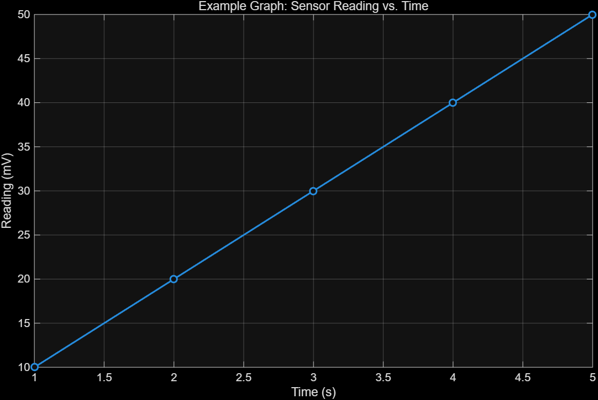

# 2.2 MATLAB Windows

MATLAB은 여러 개의 표시 창을 사용한다. 각 창은 크기 조절, 도킹/언도킹, 겹쳐 쌓기가 가능하며
개인 취향과 작업 내용에 따라 배치를 바꿀 수 있다. 툴스트립(toolstrip)의 **Layout**에서 배치를
실험해 볼 수 있다.

| 창 | 역할 |
| --- | --- |
| Command Window | 명령 입력·실행 |
| Workspace Window | 정의된 변수 목록 |
| Current Folder Window | 현재 디렉터리 파일 목록 |
| Command History Window | 입력한 명령 기록 |
| Document Windows | 변수 값을 표 형태로 보여줌(Variable Editor) |
| Graphics Windows | 그래프 출력 |
| Editing Windows | 스크립트/Live Script 작성 |
| Help/Tutorial | 도움말 |

## 2.2.1 Command Window

- 메모장이자 계산기처럼 동작하는 환경이다.
- 계산한 **값**은 저장되지만, 그 값을 만든 **과정(명령들)**은 저장되지 않는다.
- 과정까지 저장하려면 스크립트(M-file)나 Live Script(MLX-file)로 프로그램을 작성해야 한다
  ([2.5 Saving Variables and Scripts](2.5-saving-and-scripts.md) 참고).
- 3단 레이아웃에서는 보통 가운데 패널에 위치한다(개인 설정에 따라 다름).

## 2.2.2 Command History

- Command Window에 입력한 모든 명령이 기록되며, 세션이 끝나도 남아 있다.
- 기본 화면에는 열려 있지 않다. **Layout**에서 추가할 수 있다.
- 기록된 명령을 더블클릭하면 Command Window로 복사되어 바로 실행되고, 드래그로도 옮길 수 있다.

## 2.2.3 Workspace Window

- Command Window에서 실행한 명령으로 정의된 변수를 추적해서 보여준다.
- 기본 변수 이름은 `ans`이고, 기본 타입은 double precision 부동소수점 배열이다.
- 값이 하나뿐인 변수(스칼라)도 MATLAB에서는 여전히 배열이다 — 그냥 1×1 배열일 뿐이다.

변수는 이름과 대입 연산자(`=`)로 정의한다.

```matlab
A = 5;
B = [1, 2, 3, 4];                        % 1차원 배열, 쉼표/공백으로 구분
C = [1 2 3 4; 10 20 30 40; 5 10 15 20];  % 세미콜론으로 새 행 구분 -> 2차원 배열
```

> 실행 파일: [`ex0202_vars_and_plot.m`](../../example/ch02/ex0202_vars_and_plot.m)

### clc vs clear

| 명령 | 지우는 대상 | 변수 값 |
| --- | --- | --- |
| `clc` | Command Window 화면만 | 그대로 남아 있어 이름으로 다시 불러올 수 있다 |
| `clear` | Workspace(메모리의 변수) | 삭제되어 이름으로 더 이상 불러올 수 없다 |

## 2.2.4 Current Folder Window

- 활성 디렉터리(현재 폴더)에 있는 모든 파일을 나열한다.
- MATLAB이 파일을 읽거나 쓸 때, 다른 경로를 지정하지 않는 한 현재 폴더를 사용한다.
- 현재 폴더 경로는 MATLAB 메인 창 상단에 표시된다.

## 2.2.5 Document Window (Variable Editor)

- Workspace에서 변수를 더블클릭하면 자동으로 열린다.
- 변수 값을 스프레드시트 형태로 보여주며, 값을 직접 수정하거나 추가할 수 있다.
- 도킹 아이콘으로 메인 Desktop에 도킹할 수 있다.
- Workspace 창 제목줄을 우클릭 → New를 선택하면 `unnamed`라는 새 변수를 만들 수 있고,
  우클릭 → Rename으로 이름을 바꿀 수 있다. (Variable/Array Editor로 새 배열을 직접 만드는 방법)

## 2.2.6 Graphics Window

그래프를 요청하면 자동으로 열리는 창이다.

```matlab
x = [1 2 3 4 5];
y = [10, 20, 30, 40, 50];   % 세미콜론으로 출력 억제
plot(x, y)
```

- x-y 그래프를 그리는 명령은 `plot`이다.
- 제목, 축 라벨, 여러 선 동시 표시 등을 추가하는 명령도 함께 제공된다.
- Graphics Window는 Desktop 위에 자동으로 열리지만 도킹할 수 있다.

### 예제 그래프 (라벨 포함)

> 엔지니어는 라벨(제목 + 단위를 포함한 축 라벨) 없는 그래프를 **절대** 제출하지 않는다.
> MATLAB에서는 `title`, `xlabel`, `ylabel`로 쉽게 라벨을 붙일 수 있다.

```matlab
figure
plot(x, y, "-o", LineWidth=1.5, MarkerFaceColor="auto")
title("Example Graph: Sensor Reading vs. Time")
xlabel("Time (s)")
ylabel("Reading (mV)")
grid on
```



> 실행 파일: [`ex0202_vars_and_plot.m`](../../example/ch02/ex0202_vars_and_plot.m)

각주: 구버전 문법에서는 `'LineWidth', 1.5`처럼 이름과 값을 따옴표+쉼표로 나눠 썼다.
R2026a부터는 `LineWidth=1.5`처럼 `Name=Value` 문법을 바로 쓸 수 있다.

## 2.2.7 Edit Window

- 명령을 실행하지 않고 저장만 하는 편집기. 실행하지 않는 "프로그램"을 작성하는 공간이다.
- 두 종류의 편집기가 있다.
  - **Script** — `.m` 파일(M-file)로 저장. MATLAB 코드만 담을 수 있다.
  - **Live Script** — `.mlx` 파일로 저장. 코드와 서식 있는 텍스트를 함께 담을 수 있다.
- 두 편집기 모두 툴스트립에서 열 수 있으며, **작성하는 코드 자체는 완전히 동일**하다. 차이는 편집기뿐이다.

## ⚠️ 함정

- `clc`는 화면만 지우고 `clear`는 메모리에서 변수를 지운다. 시험에서 자주 헷갈리는 짝이다.
- 스칼라도 1×1 배열이라는 점 — "배열이 아니다"라고 답하면 오답이다.
- Command Window에서 계산한 값은 세션을 닫으면 사라진다. **명령 자체**를 남기려면 스크립트로 저장해야 한다.

## 연습문제

1. `clc`와 `clear`의 차이를 설명하시오.
2. 변수 `p = [2 4 6; 1 3 5]`를 만들고, Workspace Window에 표시되는 크기(dimension)를 쓰시오.
3. `x = 0:1:10`, `y = x.^2`을 만들어 제목과 축 라벨이 있는 그래프를 그리는 코드를 작성하시오.

해답: [solutions.md](solutions.md)
