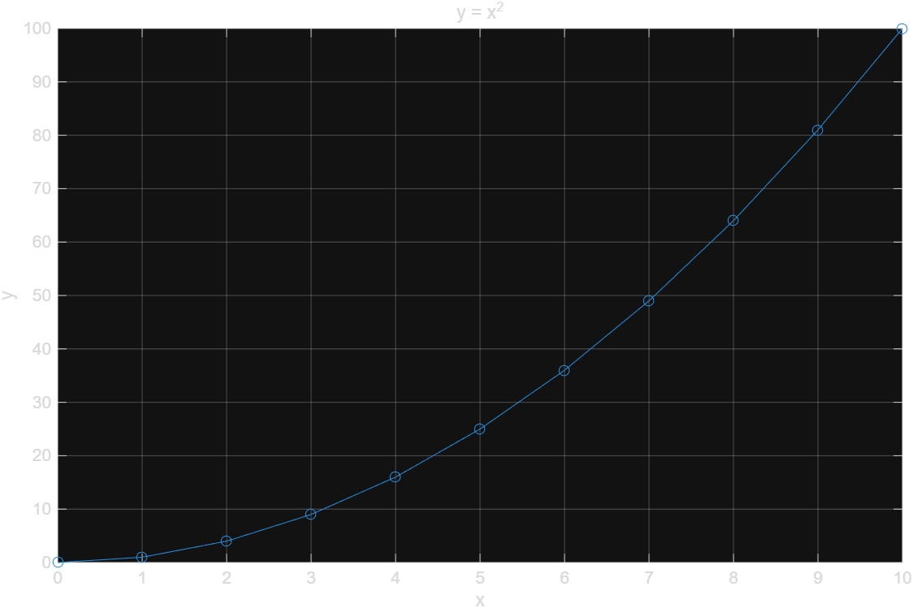

# Chapter 2 연습문제 해답

## [2.1 Getting Started](2.1-getting-started.md)

**1.** MATLAB Desktop이 처음 열릴 때 기본으로 표시되는 창 세 가지를 쓰시오.

> Command Window, Workspace Window, Current Folder Window.

**2.** Command History 창은 기본 화면에 열리는가?

> 아니다. 기본 화면에는 열려 있지 않으며, 툴스트립의 **Layout** 메뉴에서 추가해야 한다.

## [2.2 MATLAB Windows](2.2-matlab-windows.md)

**1.** `clc`와 `clear`의 차이를 설명하시오.

> `clc`는 Command Window의 화면만 지운다 — 변수 값은 Workspace에 그대로 남아 이름으로 다시
> 불러올 수 있다. `clear`는 Workspace에서 변수 자체를 메모리에서 삭제한다 — 삭제 후에는 이름을
> 입력해도 값을 되찾을 수 없다.

**2.** `p = [2 4 6; 1 3 5]`의 Workspace 표시 크기는?

> `2×3` (2행 3열).

**3.** 라벨이 있는 그래프 코드.

> [`sol0202_3.m`](../../example/ch02/sol0202_3.m) 참고.
> ```matlab
> x = 0:1:10;
> y = x.^2;
> plot(x, y, "-o")
> title("y = x^2")
> xlabel("x")
> ylabel("y")
> grid on
> ```
>
> 

## [2.3 변수 이름 규칙과 데이터 타입](2.3-variables-and-types.md)

**1.** 유효한 변수 이름 고르기: `2result`, `result_2`, `for`, `Result`, `result-2`.

> 유효한 것은 `result_2`와 `Result`뿐이다. `2result`는 숫자로 시작해서 안 되고, `for`는
> 예약어라서 안 되고, `result-2`는 하이픈을 포함해서 안 된다.

**2.** `iskeyword`와 `isvarname` 비교 코드.

> [`sol0203_2.m`](../../example/ch02/sol0203_2.m) 참고. `iskeyword`는 MATLAB이 정해둔 예약어
> 목록 자체를 반환하고, `isvarname`은 이름 형식이 유효하며 예약어가 아닌지까지 함께 검사해
> 최종적으로 변수 이름으로 쓸 수 있는지 참/거짓으로 알려준다.

**3.** `sum`을 변수로 덮어썼을 때 되돌리는 명령.

> `clear sum`

## [2.4 스칼라·배열 연산](2.4-array-calculations.md)

**1.** `v/2`와 `v./2` 비교, `A/2`와 `A./2`도 항상 같은지.

> [`sol0204_1.m`](../../example/ch02/sol0204_1.m) 참고. 오른쪽 피연산자가 스칼라이면 `/`와
> `./`는 항상 같은 결과를 낸다. 스칼라 나눗셈에는 역행렬 규칙이 개입할 여지가 없기 때문이다.
> 다만 오른쪽 피연산자가 배열/행렬로 바뀌면 `/`는 역행렬 기반 연산으로 바뀌어 `./`와 값이
> 달라질 수 있다.

**2.** `logspace(0, 2, 5)` 손 계산.

> [`sol0204_2.m`](../../example/ch02/sol0204_2.m) 참고. 지수가 0, 0.5, 1, 1.5, 2로 균등
> 분할되므로 결과는 `[1, 10^0.5, 10, 10^1.5, 100]` ≈ `[1, 3.1623, 10, 31.6228, 100]`이다.

**3.** 반지름 4, 높이 10인 원기둥의 부피·겉넓이.

> [`sol0204_3.m`](../../example/ch02/sol0204_3.m) 참고. `V = pi*4^2*10 ≈ 502.6548`,
> `S = 2*pi*4*(4+10) ≈ 351.8584`.

## [2.5 파일 저장·불러오기, 스크립트, Live Script, Section 모드](2.5-saving-and-scripts.md)

**1.** `.mat`와 ASCII(`.dat`) 저장의 차이.

> `.mat` 파일은 저장할 때 사용한 변수 이름 그대로, 서로 다른 크기·타입의 여러 변수를 정확히
> 복원한다. ASCII(`.dat`) 파일은 불러올 때 파일 이름과 같은 이름의 **단일 변수**로 들어오며,
> 그 안에서 필요한 값을 직접 잘라내야 한다.

**2.** 섹션으로 나눈 변환 스크립트.

> [`sol0205_2.m`](../../example/ch02/sol0205_2.m) 참고.

**3.** 스크립트와 Live Script의 공통점·차이점.

> 공통점: 작성하는 MATLAB **코드 자체는 완전히 동일**하다. 차이점: 스크립트(`.m`)는 코드만
> 담을 수 있는 반면, Live Script(`.mlx`)는 코드와 함께 서식 있는 텍스트·이미지·수식·그래픽
> 출력까지 한 문서 안에 담을 수 있다.
