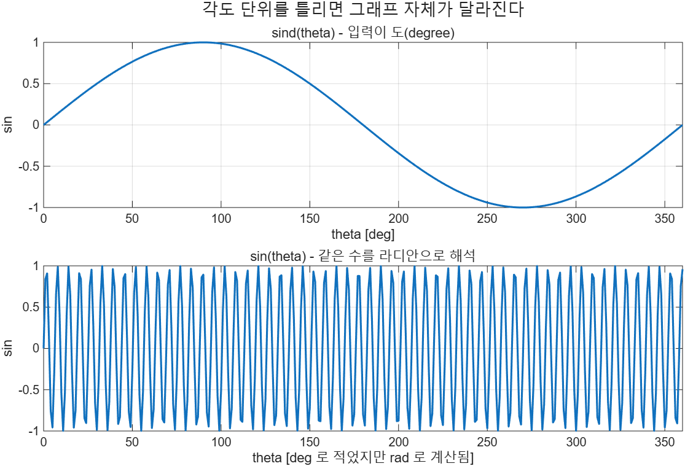

# 3.4 삼각함수

## 라디안이 기본이다

MATLAB의 표준 삼각함수 `sin`, `cos`, `tan`은 **입력 각도를 라디안으로 해석한다.**
도(degree)를 넣고 싶으면 두 가지 방법이 있다.

1. 이름 끝에 `d`가 붙은 전용 함수를 쓴다: `sind`, `cosd`, `tand`, `asind`, …
2. `deg2rad`로 변환해서 넣는다. 반대 방향은 `rad2deg`.

| 함수 | 뜻 | 예 |
|------|-----|-----|
| `deg2rad(x)` | 도 → 라디안 | `deg2rad(90)` → `1.5708` |
| `rad2deg(x)` | 라디안 → 도 | `rad2deg(pi)` → `180` |
| `sin(x)` `cos(x)` `tan(x)` | 라디안 입력 | `cos(pi)` → `-1` |
| `sind(x)` `cosd(x)` `tand(x)` | 도 입력 | `sind(90)` → `1` |
| `asin(x)` `acos(x)` `atan(x)` | 역삼각함수, 결과는 라디안 | `asin(-1)` → `-1.5708` |
| `asind(x)` 등 | 역삼각함수, 결과는 도 | `asind(1)` → `90` |
| `sinh(x)` `cosh(x)` `tanh(x)` | 쌍곡선 함수 | `sinh(pi)` → `11.5487` |
| `asinh(x)` 등 | 역쌍곡선 함수 | `asinh(1)` → `0.8814` |

`asin(x)`의 입력은 −1 이상 1 이하여야 하고, 반환값은 −π/2 ~ π/2 라디안이다.

전체 코드: [`ex0304_trig_basics.m`](../../example/ch03/ex0304_trig_basics.m)

```matlab
fprintf("sin(0)       = %g\n", sin(0))
fprintf("cos(pi)      = %g\n", cos(pi))
fprintf("tan(pi)      = %.4e   <- 정확히 0 이 아니다\n", tan(pi))
fprintf("sin(pi)      = %.4e   <- 정확히 0 이 아니다\n", sin(pi))

fprintf("sind(90)     = %g\n", sind(90))
fprintf("sin(90)      = %.4f   <- 90 라디안의 sin\n", sin(90))

fprintf("deg2rad(90)  = %.4f\n", deg2rad(90))
fprintf("rad2deg(pi)  = %g\n", rad2deg(pi))

fprintf("asin(-1)     = %.4f rad\n", asin(-1))
fprintf("asind(1)     = %g deg\n", asind(1))

fprintf("sinh(pi)     = %.4f\n", sinh(pi))
fprintf("asinh(1)     = %.4f\n", asinh(1))
```

`ex0304_trig_basics.m` 실행 결과 (일부 생략):
```text
sin(0)       = 0
cos(pi)      = -1
tan(pi)      = -1.2246e-16   <- 정확히 0 이 아니다
sin(pi)      = 1.2246e-16   <- 정확히 0 이 아니다
sind(90)     = 1
sin(90)      = 0.8940   <- 90 라디안의 sin
deg2rad(90)  = 1.5708
rad2deg(pi)  = 180
asin(-1)     = -1.5708 rad
asind(1)     = 90 deg
sinh(pi)     = 11.5487
asinh(1)     = 0.8814
```

## pi는 근삿값이다

상수 `pi`는 MATLAB에 내장되어 있다. 그런데 π는 유한한 부동소수점으로 정확히 표현할 수 없으므로,
`pi`는 π의 **근삿값**이다. 그래서 놀라운 결과가 나온다.

```matlab
sin(pi)
ans =
   1.2246e-16
```

수학적으로는 0이어야 하지만 실제로는 0이 아니다. `tan(pi)`도 마찬가지로 `-1.2246e-16`이다.
대개는 문제가 없지만, **같은지 비교할 때** 문제가 된다.

⚠️ **함정 — `sin(pi) == 0`은 거짓이다**
부동소수점 값을 `==`로 비교하지 않는다. 허용 오차를 두고 비교해야 한다.

```matlab
sin(pi) == 0            % 0 (거짓)
abs(sin(pi)) < 1e-12    % 1 (참)
```

⚠️ **함정 — `sin(90)`은 1이 아니다**
`sin(90)`은 "90도의 사인"이 아니라 "90 **라디안**의 사인"이라 `0.8940`이다.
도 단위를 쓰려면 `sind(90)` 또는 `sin(deg2rad(90))`이다.

⚠️ **함정 — `sin^-1(x)`는 MATLAB 문법이 아니다**
수학책의 sin⁻¹(x)는 아크사인이지 역수가 아니다. MATLAB에서는 `asin(x)`로 쓴다.
`sin^-1(x)`라고 쓰면 오류이고, `1/sin(x)`는 전혀 다른 값이다.

### 각도 단위를 틀리면 생기는 일

같은 숫자 0~360을 도로 해석했을 때와 라디안으로 해석했을 때의 그래프다.
아래 그림의 위아래가 얼마나 다른지 보라.



전체 코드: [`ex0304_trig_plot.m`](../../example/ch03/ex0304_trig_plot.m)

```matlab
theta_deg = 0:1:360;

f = figure(Visible="off");
theme(f, "light")
tl = tiledlayout(f, 2, 1, TileSpacing="compact");

nexttile
plot(theta_deg, sind(theta_deg), LineWidth=1.5)
title("sind(theta) - 입력이 도(degree)")
xlabel("theta [deg]"); ylabel("sin"); grid on
xlim([0 360])

nexttile
plot(theta_deg, sin(theta_deg), LineWidth=1.5)
title("sin(theta) - 같은 수를 라디안으로 해석")
xlabel("theta [deg 로 적었지만 rad 로 계산됨]"); ylabel("sin"); grid on
xlim([0 360])

title(tl, "각도 단위를 틀리면 그래프 자체가 달라진다")
exportgraphics(f, "../../textbook/ch03/img/ex0304_trig_plot.png", Resolution=150)
```

> **[보강]** R2025a부터 MATLAB 그래픽의 기본 테마가 어두운 색이라 `exportgraphics`로 저장한 PNG가
> 검은 배경으로 나온다. 인쇄용 흰 배경이 필요하면 `theme(f, "light")`를 호출한다.
> 구버전에서는 이 줄이 없어도 흰 배경이었다.

> **[보강] `atan`과 `atan2`.** 슬라이드에는 없지만 자주 쓰인다. `atan(y/x)`는 나눗셈을 먼저 하므로
> 부호 정보가 사라져 1사분면과 3사분면을 구분하지 못한다. `atan2(y,x)`는 y와 x를 따로 받아
> 사분면을 올바르게 판정한다. 좌표에서 편각을 구할 때는 항상 `atan2`를 쓴다.
>
> ```matlab
> atan(-1/-1)    % 0.7854 rad  (= 45도, 1사분면으로 오판)
> atan2(-1,-1)   % -2.3562 rad (= -135도, 3사분면. 정답)
> ```

---

## 연습문제

> **[보강]** 슬라이드에는 연습문제가 없다. 아래 문항은 전부 추가한 것이다.
>
> 1. 0도부터 360도까지 45도 간격의 각도에 대해 사인값을 구하라. `sind`를 쓴 결과와
>    `sin(deg2rad(...))`를 쓴 결과가 같은지 확인하라.
> 2. 직각삼각형의 두 변이 밑변 3, 높이 4일 때 빗변의 길이와 밑변과 빗변이 이루는 각을
>    도 단위로 구하라.
> 3. `cos(pi/2)`를 계산하고 왜 정확히 0이 아닌지 설명하라. 또 결과가 0인지 판정하는
>    올바른 코드를 한 줄로 쓰라.

해답은 [solutions.md](solutions.md#34-삼각함수) 참고.
