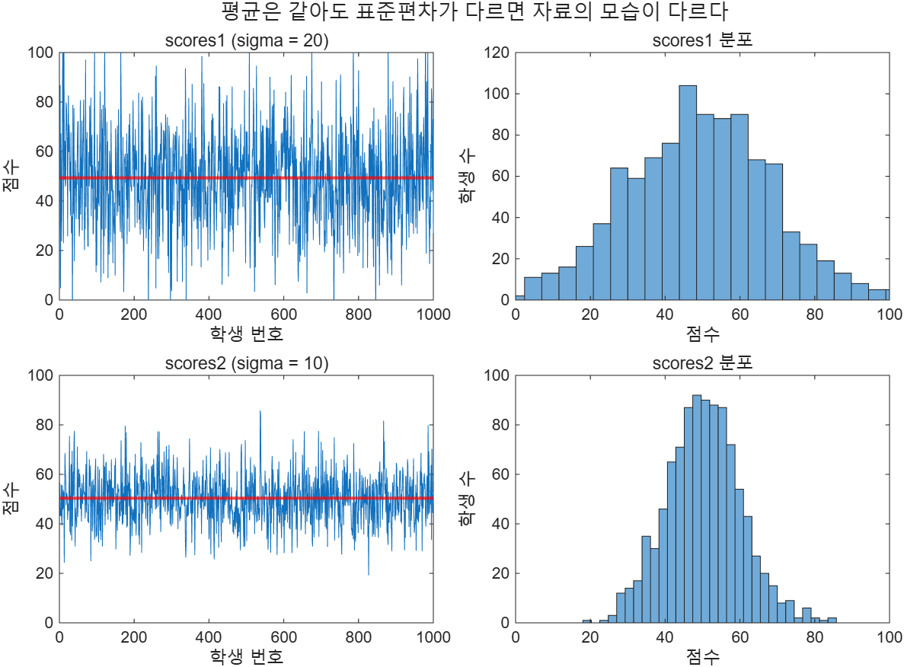

# 3.5 자료 분석 함수

MATLAB에서 통계 분석이 쉬운 이유는 두 가지다. 자료 집합 전체를 배열 하나로 표현할 수 있고,
그 배열을 바로 받는 내장 함수가 많다.

## 열 우선(column dominant)이라는 대원칙

이 절의 함수는 **2차원 배열에서 기본적으로 열(column)을 따라 동작한다.**
MATLAB은 선택의 여지가 있으면 언제나 열을 먼저 고른다. 이것을 **column dominant**라고 한다.

행 방향 결과가 필요하면 두 가지 방법이 있다.

1. 배열을 전치한다: `max(x')`
2. 차원을 지정한다: **1 = 열 방향, 2 = 행 방향**. `max(x,[],2)`, `mean(x,2)`

```matlab
x = [1 5 3
     2 4 6];

max(x)        % ans = 2 5 6      (열마다 최댓값)
max(x')       % ans = 5 6        (전치 후 열 = 원래의 행)
max(x,[],2)   % ans = 5; 6       (차원 2 = 행 방향)
```

## 3.5.1 최댓값과 최솟값 (Table 3.5)

| 호출 형태 | 뜻 |
|-----------|-----|
| `max(x)` | 벡터면 최댓값 하나, 행렬이면 열마다 최댓값 행벡터 |
| `[a,b] = max(x)` | `a`는 최댓값, `b`는 그 값이 있던 **위치(인덱스)** |
| `max(x,y)` | 같은 크기의 두 배열을 원소별로 비교해 큰 쪽 |
| `max(x,[],dim)` | 지정한 차원 방향의 최댓값 |
| `min(...)` | `max`와 문법이 같고 최솟값을 준다 |

전체 코드: [`ex0305_maxmin.m`](../../example/ch03/ex0305_maxmin.m)

```matlab
x = [1 5 3
     2 4 6];

[a, b] = max(x);
disp("값   a = " + join(string(a), "  "))
disp("위치 b = " + join(string(b), "  "))

y = [10 2 4
      1 8 7];
mxy = max(x,y);
```

`ex0305_maxmin.m` 전체 실행 결과:
```text
max(x)    = 2  5  6
min(x)    = 1  4  3
max(x')   = 5  6
max(x,[],2) = 5  6
값   a = 2  5  6
위치 b = 2  1  2
max(x,y) 1행 = 10  5  4
max(x,y) 2행 = 2  8  7
v 의 최댓값 5, 위치 2
```

⚠️ **함정 — `max(x,2)`와 `max(x,[],2)`는 완전히 다르다**
`max(x,2)`는 "x의 각 원소와 2를 비교"하고, `max(x,[],2)`는 "행 방향 최댓값"이다.
차원을 지정할 때 두 번째 자리에 `[]` **자리표시자(placeholder)** 를 반드시 넣어야 한다.

⚠️ **함정 — `max`를 변수 이름으로 쓰지 마라**
`max = max(x)`는 문법적으로 허용되지만, 그 순간 `max` 함수가 변수에 가려져 이후 호출이 전부 실패한다.
자세한 내용과 복구 방법은 [3.9절](3.9-special-values.md)에 있다.

## 3.5.2 평균 (Table 3.6)

"평균"이라 부르는 값은 셋이다.

- **mean(평균)**: 전부 더해서 개수로 나눈 값
- **median(중앙값)**: 크기순으로 줄 세웠을 때 가운데 값. 자기보다 크고 작은 값의 개수가 같다
- **mode(최빈값)**: 가장 자주 나오는 값

셋 다 열 우선이고, 다른 방향이 필요하면 두 번째 인수로 차원을 준다.

전체 코드: [`ex0305_average.m`](../../example/ch03/ex0305_average.m)

```matlab
x = [1 5 3
     2 4 6];

mean(x)          % 1.5  4.5  4.5   (열 평균)
mean(x,2)        % 3; 4            (행 평균)
mean(x, "all")   % 3.5             (전체 평균)
```

`ex0305_average.m` 전체 실행 결과:
```text
mean(x)    = 1.5  4.5  4.5
mean(x,2)  = 3  4
mean(x,'all') = 3.5000
median(y)  = 2  5  4
mode(z)    = 3
mean   = 258.2
median = 74.0   <- 이상치 1000 에 흔들리지 않는다
```

> **[보강] 평균과 중앙값 중 무엇을 볼 것인가.** `[70 72 75 74 1000]`처럼 이상치(outlier)가 하나 섞이면
> 평균은 258.2로 튀지만 중앙값은 74로 버틴다. 측정 오류가 섞인 실험 자료에서는 중앙값이 더 정직하다.

> **[보강]** `mean(x,"all")`은 차원과 무관하게 배열 전체의 평균을 준다(R2018b 이후).
> 구버전에서는 `mean(x(:))`로 썼다.

## 3.5.3 합과 곱, 누적 (Table 3.7)

| 함수 | 뜻 | `x = [1 5 3]` |
|------|-----|---------------|
| `sum(x)` | 합 | `9` |
| `prod(x)` | 곱 | `15` |
| `cumsum(x)` | **누적합**. 중간 합계를 모은 같은 크기 배열 | `1 6 9` |
| `cumprod(x)` | 누적곱 | `1 5 15` |

`sum`과 `prod`는 열마다 값 하나로 줄이지만, `cumsum`과 `cumprod`는 **크기가 그대로**다.
이 점이 급수(series)를 다룰 때 유용하다.

### 조화급수 예제

조화급수는 1 + 1/2 + 1/3 + 1/4 + … 이다. `cumsum`으로 부분합이 어떻게 자라는지 볼 수 있고,
`format rat` 명령을 쓰면 수열을 분수로 볼 수 있다.

전체 코드: [`ex0305_sumprod.m`](../../example/ch03/ex0305_sumprod.m)

```matlab
k = 1:5;
sequence = 1./k;
series = cumsum(sequence);

format rat
disp(sequence)
format short

disp("series = " + join(string(series), "  "))
```

`ex0305_sumprod.m` 실행 결과 (일부 생략):
```text
sequence (분수 표시)
       1              1/2            1/3            1/4            1/5
series = 1  1.5  1.8333  2.0833  2.2833
1000항까지의 합 = 7.4855
```

⚠️ **함정 — `format rat`는 표시 형식일 뿐이다**
`format rat`를 켜도 저장된 값은 여전히 double이다. 계산 정밀도는 바뀌지 않고 화면에 찍히는 모양만
바뀐다. 다시 `format short`로 돌려놓는 것을 잊지 말자.

⚠️ **함정 — `1./k`의 점을 빠뜨리지 마라**
`1/k`는 k가 벡터일 때 최소제곱 해를 구하는 우나눗셈 연산이 되어 전혀 다른 값이 나온다.
원소별 나눗셈은 `1./k`다.

## 3.5.4 정렬 (Table 3.8)

| 함수 | 뜻 |
|------|-----|
| `sort(x)` | 오름차순. **열마다 독립적으로** 정렬하므로 행 정보가 깨진다 |
| `sort(x,"descend")` | 내림차순 |
| `[s,idx] = sort(x)` | `idx`는 정렬 전 위치 |
| `sortrows(x)` | 1열 기준으로 **행을 통째로** 옮긴다 |
| `sortrows(x,n)` | n열 기준. n이 음수면 내림차순 |

문자·문자열 배열은 알파벳 오름차순이 기본이다.

전체 코드: [`ex0305_sorting.m`](../../example/ch03/ex0305_sorting.m)

```matlab
x = [ 1 3
     10 2
      3 1
     82 4
      5 5];

sort(x)          % 열마다 따로 정렬 -> 행 짝이 깨진다
sortrows(x, 1)   % 1열 기준, 행 짝을 유지
sortrows(x, 2)   % 2열 기준
sortrows(x, -1)  % 1열 기준 내림차순
```

`ex0305_sorting.m` 실행 결과 (일부 생략):
```text
sort(x) - 열마다 독립적으로 정렬되어 행 정보가 깨진다
     1     1
     3     2
     5     3
    10     4
    82     5

sortrows(x,1) - 1열 기준, 행을 통째로 옮긴다
     1     3
     3     1
     5     5
    10     2
    82     4

sortrows(x,2) - 2열 기준
     3     1
    10     2
     1     3
    82     4
     5     5
```

⚠️ **함정 — `sort`는 자료를 망가뜨릴 수 있다**
학번과 점수가 나란히 든 2열 배열에 `sort`를 걸면 학번과 점수가 **따로** 정렬되어
"누구의 점수인지"가 사라진다. 행이 하나의 레코드라면 반드시 `sortrows`를 써야 한다.

> **[보강]** `[sorted, idx] = sort(v)`의 두 번째 출력 `idx`는 "정렬된 값이 원래 몇 번째였는가"다.
> `v = [82 5 10 1 3]`이면 `idx = 4 5 2 3 1`이다. 다른 배열을 같은 순서로 재배열할 때
> `other(idx)`처럼 쓴다. `sortrows`가 없다면 이 방법으로 흉내낼 수 있다.

## 3.5.5 배열 크기 (Table 3.10)

| 함수 | 뜻 | `x`가 2×3일 때 |
|------|-----|----------------|
| `size(x)` | `[행 열]` | `2 3` |
| `[a,b] = size(x)` | 행과 열을 각각 | `a=2, b=3` |
| `height(x)` | 행 개수 (= `size(x,1)`) | `2` |
| `width(x)` | 열 개수 (= `size(x,2)`) | `3` |
| `length(x)` | **가장 큰 차원** | `3` |
| `numel(x)` | 전체 원소 개수 | `6` |

전체 코드: [`ex0305_arraysize.m`](../../example/ch03/ex0305_arraysize.m)

`ex0305_arraysize.m` 실행 결과 (일부 생략):
```text
size(x)   = 2  3
행 a = 2, 열 b = 3
height(x) = 2   (= size(x,1))
width(x)  = 3   (= size(x,2))
length(x) = 3   (가장 큰 차원)
numel(x)  = 6   (전체 원소 수)
```

⚠️ **함정 — `length`는 "길이"가 아니라 "가장 큰 차원"이다**
2×3 배열의 `length`는 6도 2도 아닌 **3**이다. 원소 개수를 원하면 `numel`, 행 개수를 원하면
`height` 또는 `size(x,1)`을 쓴다. 벡터에서만 `length`가 직관과 일치한다.

> **[보강]** `height`와 `width`는 R2020b에 추가되었다. 슬라이드 표에는 있지만 구버전 MATLAB에서는
> 오류가 나므로, 호환성이 필요하면 `size(x,1)`, `size(x,2)`로 쓴다.

## 3.5.6 분산과 표준편차 (Table 3.12)

표준편차와 분산은 자료가 서로 얼마나 **흩어져 있는지**를 나타낸다.
시험에서 평균만 알면 부족하고 최고점과 최저점도 알아야 내 위치를 짐작할 수 있는 것과 같다.

정규(가우시안) 분포를 따르는 큰 자료에서는 다음이 성립한다.

- 평균 ± 1σ 안에 약 **68%**
- 평균 ± 2σ 안에 약 **95%**
- 평균 ± 3σ 안에 **99% 이상**

분산의 정의는 다음과 같고, 표준편차는 분산의 제곱근이다.

```
variance = sigma^2 = sum((x_k - mu).^2) / (N - 1)
```

| 함수 | 뜻 | `x = [1 5 3]` |
|------|-----|---------------|
| `std(x)` | 표준편차 | `2` |
| `var(x)` | 분산 | `4` |

`std(x)^2 == var(x)`이다. 둘 다 열 우선이다.

전체 코드: [`ex0305_variance.m`](../../example/ch03/ex0305_variance.m)

```matlab
rng(0)
n = 1000;
scores1 = 50 + 20*randn(1, n);
scores2 = 50 + 10*randn(1, n);

fprintf("scores1: mean=%.2f, std=%.2f, var=%.2f\n", mean(scores1), std(scores1), var(scores1))
fprintf("scores2: mean=%.2f, std=%.2f, var=%.2f\n", mean(scores2), std(scores2), var(scores2))
```

`ex0305_variance.m` 실행 결과 (일부 생략):
```text
std(x) = 2,  var(x) = 4,  std^2 = 4
std(m) = 0.70711  0.70711  2.1213
scores1: mean=49.35, std=19.98, var=399.17
scores2: mean=50.37, std=9.99, var=99.72
```

평균은 둘 다 50 근처지만 퍼진 정도가 다르다. 그림으로 보면 분명하다.



> **[보강]** 이 그림도 R2026a의 어두운 기본 테마 때문에 `.m` 파일에 `theme(f, "light")`를 넣어
> 저장했다. 이유는 [3.4절](3.4-trigonometry.md)에 적어 두었다.

⚠️ **함정 — 분모가 N이 아니라 N−1이다**
MATLAB의 `std`와 `var`는 기본적으로 **표본(sample) 표준편차**, 즉 N−1로 나눈다.
모집단 전체를 다룰 때(N으로 나누고 싶을 때)는 `std(x,1)`, `var(x,1)`처럼 두 번째 인수에 1을 준다.
`std(x,1)`의 1은 차원이 아니라 정규화 방식이다.

> **[보강]** 슬라이드 표 3.12에도 적혀 있듯이, 원소가 3개뿐인 자료의 표준편차는 통계적으로
> 의미가 거의 없다. 함수 사용법을 보여주기 위한 예제일 뿐이다.

---

## 연습문제

> **[보강]** 슬라이드에는 연습문제가 없다. 아래 문항은 전부 추가한 것이다.
>
> 1. 다음 성적표에서 (a) 과목별 평균, (b) 학생별 평균, (c) 전체 최고점과 그 학생 번호를 구하라.
>    ```matlab
>    scores = [88 92 75
>              79 85 91
>              93 70 84
>              65 88 77];
>    ```
> 2. 위 `scores`의 1열(첫 과목) 점수를 기준으로 학생 전체를 **내림차순** 정렬하라.
>    행이 흐트러지면 안 된다.
> 3. 1부터 10까지의 역수의 누적합을 구하고, 그 값이 `log(10)`보다 큰지 확인하라.

해답은 [solutions.md](solutions.md#35-자료-분석-함수) 참고.
