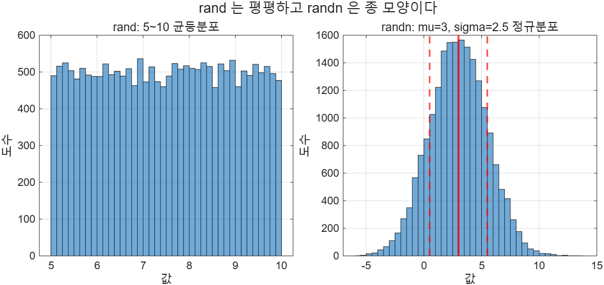

# 3.6 난수

난수는 공학 계산에서 측정 자료를 흉내낼 때 쓴다. 실제 측정값은 수학 모델이 예측한 대로 딱 떨어지지
않으므로, 이론값에 작은 난수를 더하면 모델이 실제 시스템처럼 거동한다. 확률 게임을 모의할 때도 쓴다.

MATLAB이 만드는 난수는 두 종류다.

- **균등(uniform) 난수** — `rand`. 구간 안에서 모든 값이 똑같이 잘 나온다.
- **정규(Gaussian, normal) 난수** — `randn`. 평균 근처가 잘 나오고 멀어질수록 드물어진다.

| 함수 | 뜻 |
|------|-----|
| `rand(n)` | n×n, 0~1 균등 난수 |
| `rand(m,n)` | m×n, 0~1 균등 난수 |
| `randn(n)` | n×n, 평균 0·분산 1 정규 난수 |
| `randn(m,n)` | m×n 정규 난수 |
| `randi(imax, sz)` | 1~imax 사이의 **정수** 난수. `sz`는 크기 배열 |

## 3.6.1 균등 난수 rand

`rand`는 0과 1 사이에 고르게 퍼진 값을 준다. 다른 구간이 필요하면 변환한다.

1. `rand`로 0~1 배열을 만든다
2. `x_max - x_min`을 곱한다 (폭을 늘린다)
3. `x_min`을 더한다 (시작점을 옮긴다)

```
x = (x_max - x_min) * rand(n,1) + x_min
```

전체 코드: [`ex0306_rand_uniform.m`](../../example/ch03/ex0306_rand_uniform.m)

```matlab
rng(0)

x_max = 10;
x_min = 5;

x100 = (x_max-x_min)*rand(100,1) + x_min;
fprintf("n=100   : mean=%.4f  max=%.4f  min=%.4f\n", mean(x100), max(x100), min(x100))

x10000 = (x_max-x_min)*rand(10000,1) + x_min;
fprintf("n=10000 : mean=%.4f  max=%.4f  min=%.4f\n", mean(x10000), max(x10000), min(x10000))
```

`ex0306_rand_uniform.m` 실행 결과 (일부 생략):
```text
rand(2) - 2x2, 0~1 균등 난수
    0.8147    0.1270
    0.9058    0.9134

n=100   : mean=7.5740  max=9.8530  min=5.0595
n=10000 : mean=7.4953  max=9.9990  min=5.0004
이론값  : mean=7.5000  max=10.0000  min=5.0000
```

표본이 100개일 때는 평균이 7.574, 최댓값이 9.853으로 이론값에서 제법 떨어져 있다.
10000개로 늘리면 7.4953, 9.9990으로 이론값에 바짝 붙는다. **표본이 커질수록 통계량이 이론값에
수렴한다**는 사실을 눈으로 확인하는 예제다.

## 3.6.2 정규 난수 randn

정규 난수에는 절대적인 상한·하한이 없다. 평균에서 멀어질수록 나올 확률이 낮아질 뿐이다.
`randn`이 만드는 값은 **평균 0, 분산 1**이다. 분산이 1이므로 표준편차도 1이다.

평균과 표준편차를 바꾸려면 기본 난수를 변환한다.

```
x = sigma * randn(...) + mu
```

곱셈이 퍼짐(표준편차)을, 덧셈이 중심(평균)을 정한다.

전체 코드: [`ex0306_randn_gaussian.m`](../../example/ch03/ex0306_randn_gaussian.m)

```matlab
rng(0)
sigma = 2.5;
average = 3;

x500 = sigma*randn(1,500) + average;
fprintf("n=500   : mean=%.4f  std=%.4f\n", mean(x500), std(x500))

x50000 = sigma*randn(1,50000) + average;
fprintf("n=50000 : mean=%.4f  std=%.4f\n", mean(x50000), std(x50000))
```

`ex0306_randn_gaussian.m` 전체 실행 결과:
```text
randn(1,500)  : mean=-0.0219  std=1.0039
n=500   : mean=2.8916  std=2.4872
n=50000 : mean=2.9938  std=2.4906
이론값  : mean=3.0000  std=2.5000
1 sigma 이내 68.42%, 2 sigma 이내 95.58%, 3 sigma 이내 99.71%
```

> **[보강]** 3.5.6절의 68-95-99.7 규칙을 난수로 직접 확인했다. 50000개 표본에서 1σ 이내가 68.42%,
> 2σ 이내가 95.58%, 3σ 이내가 99.71%로 나왔다.

### 두 분포의 모양 비교



> **[보강]** 이 그림도 R2026a의 어두운 기본 테마 때문에 `.m` 파일에 `theme(f, "light")`를 넣어
> 저장했다. 이유는 [3.4절](3.4-trigonometry.md)에 적어 두었다.

전체 코드: [`ex0306_random_hist.m`](../../example/ch03/ex0306_random_hist.m)

```matlab
n = 20000;
u = (10-5)*rand(1,n) + 5;      % 5~10 균등
g = 2.5*randn(1,n) + 3;        % 평균 3, 표준편차 2.5 정규

nexttile
histogram(u, 40)
nexttile
histogram(g, 40)
```

왼쪽은 5부터 10까지 평평하고 그 밖에는 값이 아예 없다. 오른쪽은 3을 중심으로 종 모양이고
양쪽 끝이 열려 있다.

⚠️ **함정 — 슬라이드 원문의 용어 오류**
원서 슬라이드 3.6.1절은 균등 난수를 "also called normal random numbers"라고 적었는데 이는 오기다.
**uniform(균등)** 과 **normal(정규)** 은 서로 다른 분포이며, normal은 `randn`이 만드는 쪽이다.

⚠️ **함정 — `randn(1,500)`과 `randn(500)`은 다르다**
`randn(500)`은 500×500짜리 25만 개 배열이다. 벡터를 원하면 행과 열을 모두 적어야 한다.

⚠️ **함정 — 실행할 때마다 결과가 달라진다**
난수를 쓴 코드는 재현되지 않는다. 과제 제출이나 시험 답안을 검증할 때는
`rng(0)`처럼 **시드를 고정**해야 같은 값이 다시 나온다.
`rng`를 부르지 않으면 MATLAB은 세션마다 다른 난수열을 쓴다.

> **[보강] `randi`.** 주사위나 카드처럼 정수 난수가 필요하면 `randi`를 쓴다.
> `randi(10, [2 3])`은 1~10 사이 정수로 2×3 배열을 만든다. `randi([3 8], 1, 5)`처럼
> 하한과 상한을 모두 지정할 수도 있다. `round(rand*10)`으로 흉내내면 0과 10이 절반 확률로만
> 나와 분포가 왜곡되므로 쓰지 않는다.

---

## 연습문제

> **[보강]** 슬라이드에는 연습문제가 없다. 아래 문항은 전부 추가한 것이다.
>
> 1. 공칭 저항 100Ω, 공차 ±5%인 저항 1000개를 균등 난수로 모의 생성하고 평균·최대·최소를 구하라.
>    시드는 `rng(1)`로 고정하라.
> 2. 평균 170cm, 표준편차 6cm인 정규분포를 따르는 키 자료 10000개를 만들고,
>    160cm 이상 180cm 이하인 사람의 비율을 구하라.
> 3. 주사위 두 개를 10000번 굴리는 상황을 `randi`로 모의하고, 두 눈의 합이 7이 나온 비율을 구하라.
>    이론값 1/6과 비교하라.

해답은 [solutions.md](solutions.md#36-난수) 참고.
