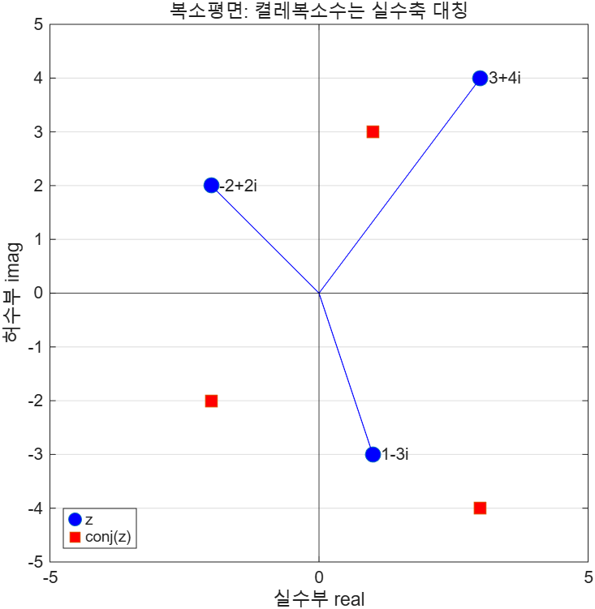

# 3.7 복소수

복소수는 **실수부(real)** 와 **허수부(imaginary)** 두 부분으로 이루어진다.
예를 들어 5 + 3i에서 실수부는 5, 허수부는 3이다.

## 입력 방법

```matlab
A = 5 + 3i      % 곱셈 기호 없이 붙여 쓴다
A = 5 + 3*i     % i를 변수처럼 곱해도 된다
A = 5 + 3*j     % j도 허수 단위다
A = complex(5,3)  % complex 함수
```

`complex`의 입력은 스칼라 두 개여도, 배열 두 개여도 된다. 배열을 주면 복소수 배열이 나온다.

```matlab
x = 1:3;
y = [-1 5 12];
complex(x,y)
% ans = 1.0000 - 1.0000i   2.0000 + 5.0000i   3.0000 +12.0000i
```

## 복소수 함수 (Table 3.14)

| 함수 | 뜻 | `x = 3 + 4i` |
|------|-----|--------------|
| `abs(x)` | 크기(절댓값). 극좌표의 반지름 = √(3²+4²) | `5` |
| `angle(x)` | 편각(라디안). 극좌표의 각 | `0.9273` |
| `complex(x,y)` | 실수부 x, 허수부 y인 복소수 생성 | |
| `real(x)` | 실수부 | `3` |
| `imag(x)` | 허수부 | `4` |
| `isreal(x)` | 실수면 1, 복소수면 0 | `0` |
| `conj(x)` | 켤레복소수 | `3 - 4i` |

전체 코드: [`ex0307_complex_basics.m`](../../example/ch03/ex0307_complex_basics.m)

```matlab
A = 5 + 3i;
fprintf("real(A)   = %g\n", real(A))
fprintf("imag(A)   = %g\n", imag(A))
fprintf("isreal(A) = %d   (0 이면 복소수)\n", isreal(A))

fprintf("abs(3+4i)   = %g\n", abs(3+4i))
fprintf("angle(3+4i) = %.4f rad = %.2f deg\n", angle(3+4i), rad2deg(angle(3+4i)))
```

`ex0307_complex_basics.m` 전체 실행 결과:
```text
A = 5 +3i
A == B == C : 1
complex(x,y) = 1-1i   2+5i   3+12i
real(A)   = 5
imag(A)   = 3
isreal(A) = 0   (0 이면 복소수)
isreal(5) = 1
abs(3+4i)   = 5
angle(3+4i) = 0.9273 rad = 53.13 deg
conj(A) = 5 -3i
A'  = 5 -3i   <- 켤레까지 취한다
A.' = 5 +3i   <- 켤레를 취하지 않는다
```

## 전치 연산자가 켤레를 취한다

복소수를 전치 연산자 `'`로 전치하면 **켤레복소수**가 된다.

```matlab
A = 5 + 3i;
A'     % ans = 5.0000 - 3.0000i
```

이것은 `'`가 단순 전치가 아니라 **켤레 전치(complex conjugate transpose)** 이기 때문이다.
켤레 없이 전치만 하려면 점을 찍어 `.'`를 쓴다.

⚠️ **함정 — 복소수 배열에서 `'`와 `.'`는 다른 답을 준다**
실수 배열에서는 `'`와 `.'`의 결과가 같아서 차이를 모르고 지나치기 쉽다.
복소수가 섞이는 순간 값이 달라진다. 신호 처리나 임피던스 계산에서 흔한 버그 원인이다.

⚠️ **함정 — `i`와 `j`를 변수로 쓰면 허수 단위가 사라진다**
`for i = 1:10` 같은 반복문을 돌린 뒤에는 `i`가 더 이상 허수 단위가 아니다.
그 뒤에 `5 + 3i`는 여전히 동작하지만(숫자에 붙은 `i`는 리터럴이므로) `5 + 3*i`는 틀린 값이 된다.
안전하게 쓰려면 `complex(5,3)` 또는 `1i` 표기를 쓴다.

> **[보강] `isreal`은 값이 아니라 저장 방식을 본다.** `isreal(complex(3,0))`은 허수부가 0인데도
> 0(거짓)을 돌려준다. 저장 형식이 복소수이기 때문이다.
> "허수부가 실제로 0인가"를 보려면 `imag(x) == 0`을 쓴다.

### 복소평면

복소수를 평면 위의 점으로 그리면 `abs`가 원점까지의 거리, `angle`이 실수축과 이루는 각이 된다.
켤레복소수는 실수축에 대해 대칭이다.



> **[보강]** 이 그림도 R2026a의 어두운 기본 테마 때문에 `.m` 파일에 `theme(f, "light")`를 넣어
> 저장했다. 이유는 [3.4절](3.4-trigonometry.md)에 적어 두었다.

전체 코드: [`ex0307_complex_plane.m`](../../example/ch03/ex0307_complex_plane.m)

```matlab
z = [3+4i, -2+2i, 1-3i];

plot(real(z), imag(z), "o", MarkerSize=9, MarkerFaceColor="b")
hold on
plot(real(conj(z)), imag(conj(z)), "s", MarkerSize=9, MarkerFaceColor="r")
yline(0, "k"); xline(0, "k")
axis equal; grid on
```

---

## 연습문제

> **[보강]** 슬라이드에는 연습문제가 없다. 아래 문항은 전부 추가한 것이다.
>
> 1. `z1 = 3 + 4i`, `z2 = 1 - 2i`에 대해 합·차·곱·몫을 구하고, 각각의 크기와 편각(도 단위)을 출력하라.
> 2. 2차 방정식 x² + 2x + 5 = 0의 두 근을 근의 공식으로 구하라. 판별식이 음수일 때
>    `sqrt`가 복소수를 제대로 돌려주는지 확인하라.
> 3. `z = [1+1i, 2-3i]`에 대해 `z'`와 `z.'`를 각각 구하고 무엇이 다른지 한 줄로 설명하라.

해답은 [solutions.md](solutions.md#37-복소수) 참고.
