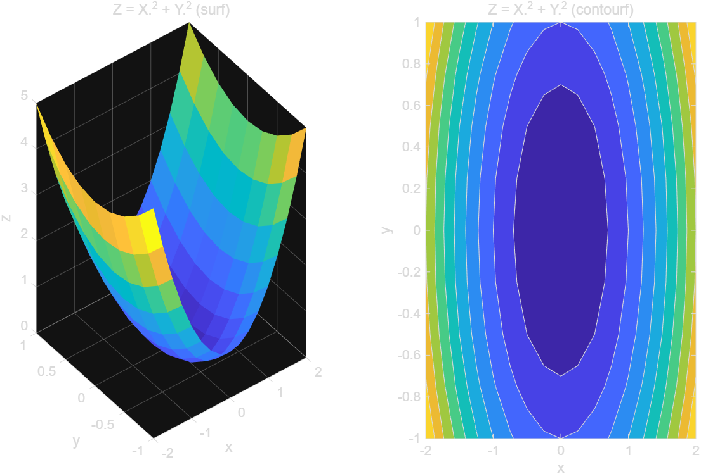

# 4.2 원소별 연산과 meshgrid

지금까지의 계산은 대부분 변수 하나만 다뤘다. 하지만 실제 공학 문제는 독립 변수가 두 개 이상인 경우가 많다. 이 절에서는 두 배열을 곱할 때 생기는 모호함(`*` vs `.*`)과, 크기가 다른 두 벡터로 계산할 때 쓰는 `meshgrid`를 다룬다.

## 4.2.1 스칼라 곱셈은 모호하지 않다

스칼라끼리의 곱셈, 그리고 스칼라와 배열의 곱셈은 헷갈릴 이유가 없다. 스칼라와 배열을 곱하면 배열의 모든 원소에 그 스칼라를 곱한다.

```matlab
k = 2;
v = [1 2 3];
k * v          % [2 4 6] - 모든 원소에 2를 곱함
```

## 4.2.2 배열과 배열의 곱셈: `*` vs `.*`

배열 두 개를 곱하는 것은 "어떻게 곱할 것인가?"라는 질문에 답이 두 가지라서 모호하다.

- **`*` (행렬곱)**: 선형대수의 행렬곱 규칙을 따른다. `(m×n) * (n×p)` 처럼 **앞 배열의 열 개수와 뒤 배열의 행 개수가 같아야** 계산할 수 있다.
- **`.*` (원소별 곱, element-wise)**: 같은 위치에 있는 원소끼리 곱한다. 이때는 두 배열의 **크기가 완전히 같아야** 한다 (또는 한쪽이 스칼라여야 한다).

```matlab
Arow = [1 2 3];                   % 1x3
Bcol = [4; 5; 6];                 % 3x1
matrixProduct = Arow * Bcol       % (1x3)*(3x1) -> 1x1 스칼라 (내적)

C = [1 2 3];
D = [10 20 30];
elementwise = C .* D              % [10 40 90] - 같은 자리 원소끼리 곱함
```

[전체 코드 보기](../../example/ch04/ex0402_star_vs_dotstar.m)

> ⚠️ **함정**: `*`와 `.*`를 헷갈리면 (1) 차원이 안 맞아 에러가 나거나, (2) 우연히 차원이 맞아버려서 **의도와 다른 결과가 조용히 계산**된다. 두 배열의 크기가 똑같을 때 원소별 곱을 하고 싶다면 반드시 `.*`를 써야 한다. (같은 이유로 나눗셈은 `/` vs `./`, 거듭제곱은 `^` vs `.^`도 구분해야 한다.)

행렬곱 `*`이 왜 차원 조건을 요구하는지도 기억해 두면 도움이 된다. `(m×n) * (n×p)`에서 결과의 각 원소는 앞 배열의 "행"과 뒤 배열의 "열"을 원소별로 곱한 뒤 다 더한 값(내적)이다. 그러려면 앞 배열의 행 길이(열 개수 `n`)와 뒤 배열의 열 길이(행 개수 `n`)가 같아야 짝을 지어 곱할 수 있다. 예를 들어 `(2×3) * (2×3)`처럼 안쪽 차원이 다르면(3 ≠ 2) `*`는 에러가 나지만, `.*`는 애초에 두 배열의 크기가 완전히 같을 때만 정의되므로 `(2×3) .* (2×3)`은 문제없이 계산된다.

### 원소별 연산자 모음

`.*` 외에도 나눗셈과 거듭제곱에 원소별 버전이 있다. 이들을 통틀어 **배열 연산자(array operator)**라 부르고, 점(`.`) 없는 `*`, `/`, `^`는 **행렬 연산자(matrix operator)**라 부른다.

| 행렬 연산자 | 배열(원소별) 연산자 | 의미 |
|---|---|---|
| `*` | `.*` | 곱셈 |
| `/` | `./` | 나눗셈 |
| `^` | `.^` | 거듭제곱 |

```matlab
a = [2 4 8];
b = [1 2 4];

a .* b     % [2 8 32]  - 원소별 곱
a ./ b     % [2 2 2]   - 원소별 나눗셈
a .^ 2     % [4 16 64] - 각 원소를 제곱 (스칼라 지수는 자동으로 모든 원소에 적용)
```

[전체 코드 보기](../../example/ch04/ex0402_array_operators.m)

## 4.2.3 meshgrid — 크기가 다른 두 벡터 다루기

두 독립 변수 `x`, `y`가 있는데 두 벡터의 크기(원소 개수)가 서로 다르면, 그냥 `.*`로 곱하거나 더할 수 없다. 이럴 때 `meshgrid`로 두 벡터를 **같은 크기의 2차원 격자**로 바꿔주면, 모든 `(x, y)` 조합에 대해 원소별 연산을 할 수 있다.

```matlab
x = -2:0.25:2;                 % 1x17
y = -1:0.25:1;                 % 1x9  (x와 크기가 다름)

[X, Y] = meshgrid(x, y);       % X, Y는 둘 다 9x17
Z = X.^2 + Y.^2;               % 이제 크기가 같으므로 원소별 연산 가능
```

`meshgrid(x, y)`는 `x`를 모든 행에 반복해서 채운 배열 `X`와, `y`를 모든 열에 반복해서 채운 배열 `Y`를 만든다. 그래서 `X(i,j)`와 `Y(i,j)`를 짝지으면 `x`, `y`의 모든 조합을 얻는다.

작은 예로 직접 확인해 보면 구조가 더 분명해진다.

```matlab
x = [1 2 3];      % 1x3
y = [10 20];       % 1x2

[X, Y] = meshgrid(x, y)
% X =
%      1     2     3
%      1     2     3
% Y =
%     10    10    10
%     20    20    20
```

[전체 코드 보기](../../example/ch04/ex0402_meshgrid_trace.m)

`X`, `Y`의 크기는 둘 다 `[length(y), length(x)]` = `2×3`이다. `X`는 `x`를 그대로 각 행에 반복하고, `Y`는 `y`의 각 값을 그 행 전체에 채운다. 그래서 `(X(2,1), Y(2,1)) = (1, 20)`처럼 짝을 지으면 `x`, `y`의 모든 조합 `(x_i, y_j)`를 빠짐없이 얻는다.

> **[보강]** 공학 문제가 아니어도 `meshgrid`는 유용하다. 예를 들어 품목별 단가와 구매 수량처럼 서로 길이가 다른 두 벡터가 있을 때, 모든 조합의 총액을 표로 만들 수 있다.

```matlab
unitPrice = [1000 1500 2000 2500];   % 1x4 - 품목별 단가
quantity  = [1 2 3];                  % 1x3 - 구매 수량

[Price, Qty] = meshgrid(unitPrice, quantity);  % Price, Qty 모두 3x4
totalCost = Price .* Qty                        % 모든 (단가, 수량) 조합의 총액
```

[전체 코드 보기](../../example/ch04/ex0402_meshgrid_table.m)

`meshgrid` 대신 이중 `for` 반복문으로 같은 결과를 만들 수도 있지만, 배열 전체를 한 번에 연산하는 방식(벡터화, vectorization)이 코드도 짧고 MATLAB에서 훨씬 빠르게 실행된다. `meshgrid`는 이런 벡터화 계산을 가능하게 해주는 도구다.

`meshgrid`로 만든 격자는 3차원 표면도나 등고선도를 그릴 때도 그대로 쓰인다. `tiledlayout`으로 두 그림을 나란히 그려서 비교해 보자.

```matlab
figure
tiledlayout(1, 2)

nexttile
surf(X, Y, Z, EdgeColor="none")
title("Z = X.^2 + Y.^2 (surf)")

nexttile
contourf(X, Y, Z)
title("Z = X.^2 + Y.^2 (contourf)")
```

[전체 코드 보기](../../example/ch04/ex0402_meshgrid.m)



> **[보강]** `EdgeColor="none"`처럼 `이름=값` 형태로 옵션을 쓰는 것이 R2026a의 최신 문법이다.<sup>*</sup>
>
> <sup>*</sup> 구문법: `surf(X, Y, Z, 'EdgeColor', 'none')`처럼 이름과 값을 따옴표 문자열과 쉼표로 나열한다.

## 연습문제

1. `A = [1 2; 3 4]`, `B = [1 2; 3 4]`일 때 `A*B`와 `A.*B`를 각각 계산하고, 두 결과가 다른 이유를 설명하시오.
2. `x = 1:3` (1x3), `y = 1:4` (1x4)일 때 `meshgrid`로 `X`, `Y`를 만들고 `Z = X + Y`를 계산하시오. `X`, `Y`, `Z`의 크기도 함께 구하시오.

해답은 [solutions.md](solutions.md)에 있다.
