# 5.1 2차원 그래프 (Two-Dimensional Plots)

## 왜 그래프인가

큰 표는 읽기 어렵다. 공학에서 그래프를 쓰는 이유는 세 가지다.

- 추세(trend)를 한눈에 본다.
- 최고점·최저점을 집어낸다.
- 측정 오류나 계산 오류로 보이는 점을 격리한다.

계산 결과가 기대한 모양인지 빠르게 확인하는 용도로도 쓴다.

2차원 x–y plot이 가장 흔하다. 순서쌍(ordered pair)들이 점을 만들고, MATLAB이 그 점들을 **직선으로 이어** 그린다. 곡선처럼 보이는 것은 점이 촘촘할 뿐이다. 관례상 **독립변수를 x축**, **종속변수를 y축**에 둔다.

## 5.1.1 기본 plotting

### plot

x 값 벡터와 y 값 벡터가 있으면 `plot(x, y)` 한 줄이면 된다.

실험 데이터를 예로 든다.

| Time (s) | Distance (ft) |
|---:|---:|
| 0 | 0 |
| 2 | 0.33 |
| 4 | 4.13 |
| 6 | 6.29 |
| 8 | 6.85 |
| 10 | 11.19 |
| 12 | 13.19 |
| 14 | 13.96 |
| 16 | 16.33 |
| 18 | 18.17 |

```matlab
x = 0:2:18;                                                  % Time, s
y = [0 0.33 4.13 6.29 6.85 11.19 13.19 13.96 16.33 18.17];   % Distance, ft

plot(x, y)
title("Laboratory Experiment 1")
xlabel("Time, sec")
ylabel("Distance, ft")
grid on
```

→ [`example/ch05/ex0501_plot.m`](../../example/ch05/ex0501_plot.m)

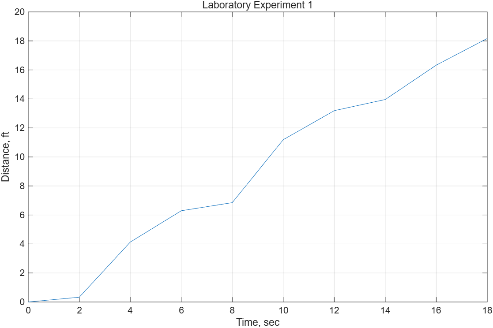

`plot`을 실행하면 **figure 창**이 MATLAB 데스크톱 위로 떠오른다. 다른 창처럼 데스크톱에 도킹(dock)할 수도 있고, 오른쪽 위 닫기 아이콘으로 지울 수도 있다. 창이 안 보이면 MATLAB 본 창 뒤에 숨은 것이다.

figure를 여러 개 열어 둔 채로 **도킹하면, 창이 한 자리에 겹쳐 쌓인다.** 나란히 놓이지 않고 탭처럼 포개지므로, 아래쪽 탭을 눌러 원하는 그림을 앞으로 꺼내야 한다. 여러 그림을 **한 화면에 동시에** 보고 싶다면 도킹이 아니라 [5.2 tiled chart layout](5.2-tiled-layout.md)을 쓴다.

#### 제목과 축 이름은 최소 요건

그래프에는 **최소한 제목과 축 이름**이 있어야 하고, 축 이름에는 **항상 단위**를 적는다. 시험에서 감점되는 가장 흔한 항목이다.

| 함수 | 하는 일 |
|---|---|
| `title(txt)` | 그래프 제목 |
| `xlabel(txt)` | x축 이름 |
| `ylabel(txt)` | y축 이름 |
| `grid on` | 격자선 켜기 (`grid off`로 끔, `grid`만 쓰면 토글) |
| `grid minor` | 보조 격자선까지 |

`doc grid`에 더 많은 옵션이 있다.

#### 작은따옴표 vs 큰따옴표

슬라이드가 한 페이지를 따로 쓸 만큼 강조하는 내용이다.

- `'Time, sec'` — **character array**(문자 배열). R2016b 이전에는 이것뿐이었다.
- `"Time, sec"` — **string**. R2016b부터 쓸 수 있다.

텍스트를 받는 MATLAB 함수는 대부분 둘 다 받는다. 하지만 문자 배열은 **글자 하나하나가 의미를 가질 때**(예: DNA 염기 서열)만 쓰는 것이 옳고, 한 덩어리로 의미를 갖는 글자 묶음은 string이어야 한다. **새로 쓰는 코드는 큰따옴표를 쓴다.**

이 노트는 전부 큰따옴표를 쓴다.

### area

`area`는 `plot`과 입력이 같지만 선 아래를 칠한다.

```matlab
area(x, y)
title("Laboratory Experiment 1 - area")
xlabel("Time, sec")
ylabel("Distance, ft")
grid minor
```

→ [`example/ch05/ex0501_area.m`](../../example/ch05/ex0501_area.m)

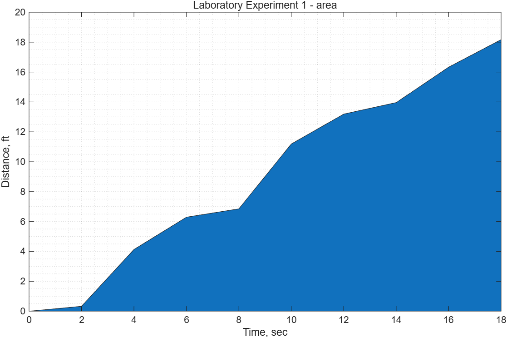

### figure 창 관리

스크립트에서 `plot`을 부르고 계산을 이어가다 다시 `plot`을 부르면, **먼저 그린 그래프가 덮어쓰인다**. MATLAB은 그래픽 창을 띄운 뒤 곧바로 다음 명령으로 넘어가기 때문이다.

`figure`로 창을 나눠 쓰면 피할 수 있다.

| 명령 | 하는 일 |
|---|---|
| `figure(2)` | "Figure 2" 창을 열고(있으면 활성화) 이후 plotting 대상으로 삼는다 |
| `figure` | 현재 창보다 1 큰 번호로 새 창을 연다 |
| `clf` | **활성 창만** 비운다. 창은 열린 채로 남는다 |
| `close all` | 열린 figure 창을 **전부** 닫는다 |

```matlab
figure(1)
plot(x, sin(x))

figure(2)                 % 여기서부터 plot 은 Figure 2 에 그려진다
plot(x, cos(x))

clf                       % 활성 창(Figure 2)만 비운다. Figure 1 은 그대로
close all                 % 전부 닫는다
```

→ [`example/ch05/ex0501_figure.m`](../../example/ch05/ex0501_figure.m)

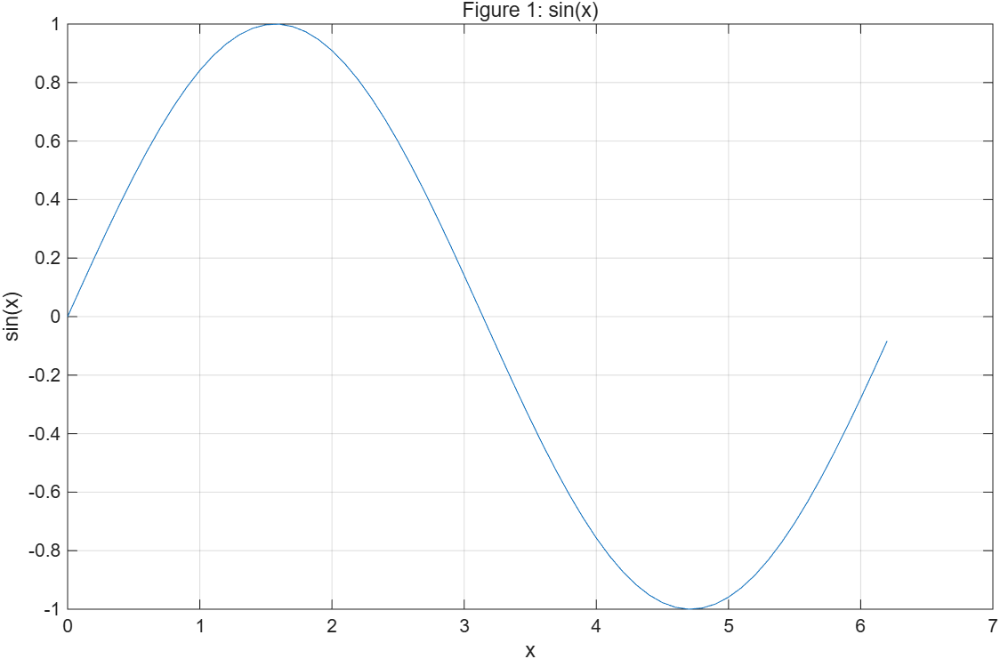
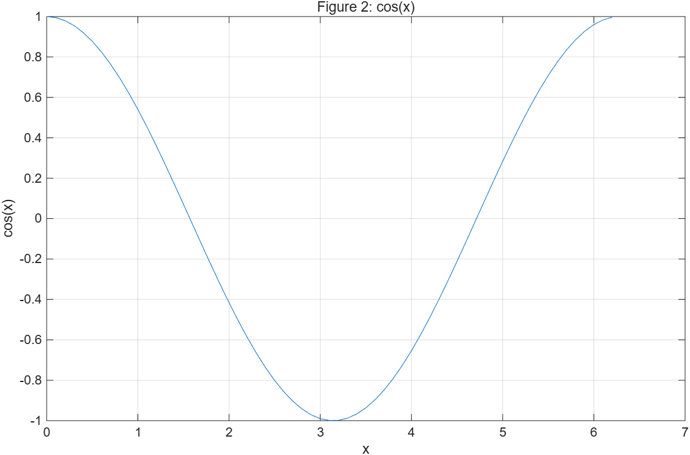

> **[보강]** live script(`.mlx`)에서는 `plot`을 실행할 때마다 새 그림이 만들어지므로 `figure` 명령이 필요 없다. 슬라이드도 이 점을 언급한다.

### hold on / hold off

같은 축에 선을 **겹쳐** 그리려면 `hold on`을 켠다.

```matlab
x  = 0:pi/100:2*pi;
y1 = cos(4*x);
y2 = sin(x);

plot(x, y1)
hold on
plot(x, y2)
hold off
legend("cos(4x)", "sin(x)")
```

→ [`example/ch05/ex0501_hold.m`](../../example/ch05/ex0501_hold.m)

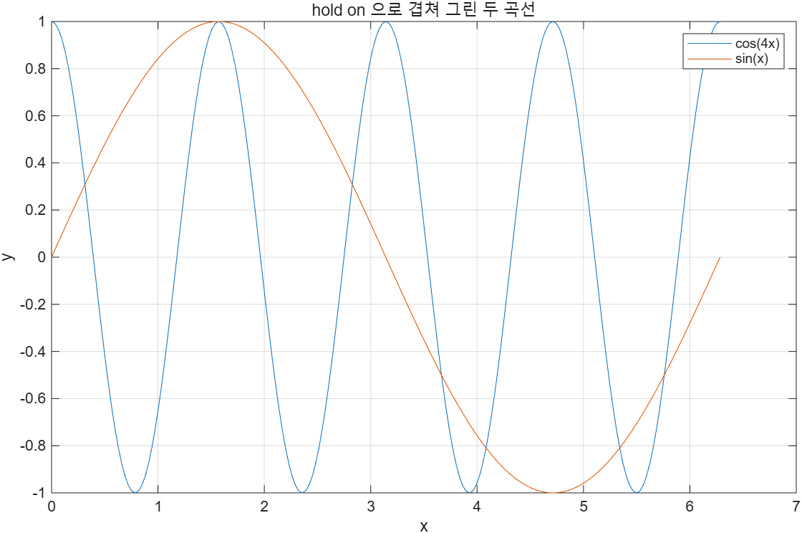

> ⚠️ **함정** — `hold on`을 켜고 `hold off`를 **안 끄면**, 이후 스크립트에서 그리는 모든 그래프가 이 축 위에 계속 쌓인다. 슬라이드가 "Don't Forget hold off!!"라고 따로 한 장을 쓴다. 짝을 맞춰라.

### 한 번의 plot으로 여러 선 그리기

`hold on` 말고 두 가지 방법이 더 있다.

**방법 1 — x, y 벡터를 번갈아 넘긴다.**

```matlab
plot(X1, Y1, X2, Y2)
% 예:
plot(x, y1, x, y2)
```

**방법 2 — y 값들을 2차원 배열로 묶는다.**

```matlab
Y = [y1; y2];      % 2 x 201
plot(x, Y)         % Y 의 각 행이 한 선이 된다
```

`x`가 1×201이고 `Y`가 2×201이므로, **`x`의 길이와 맞는 쪽(열, 201개)이 x 위치**가 되고 나머지 방향(행, 2개)이 선이 된다. 바로 다음 절에서 이 규칙이 왜 함정이 되는지 본다.

→ [`example/ch05/ex0501_multiline.m`](../../example/ch05/ex0501_multiline.m)

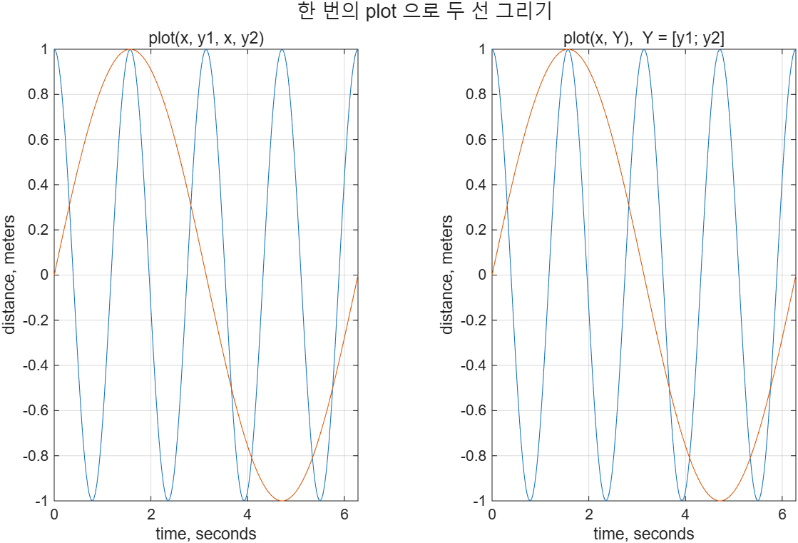

> ⚠️ **함정** — 새 `plot` 명령을 실행하면 **제목과 축 이름도 같이 지워진다**. 선만 바뀌는 게 아니다. 새로 그렸으면 `title`·`xlabel`·`ylabel`을 다시 불러야 한다.

### MATLAB은 column dominant

`plot`에 2차원 배열을 주면 MATLAB은 **열(column)마다 한 선**을 그린다. 이것이 초보자가 가장 크게 놀라는 지점이다.

```matlab
x = 0:pi/100:2*pi;
y1 = cos(x*4);
y2 = sin(x);
Y  = [y1; y2];      % 2 x 201
x1 = x;
x2 = 2*x;
X  = [x1; x2];      % 2 x 201

plot(X, Y)          % 열이 201개 -> 점 2개짜리 선이 201개!
plot(X', Y')        % 전치하면 201 x 2 -> 점 201개짜리 선 2개
```

→ [`example/ch05/ex0501_column.m`](../../example/ch05/ex0501_column.m)

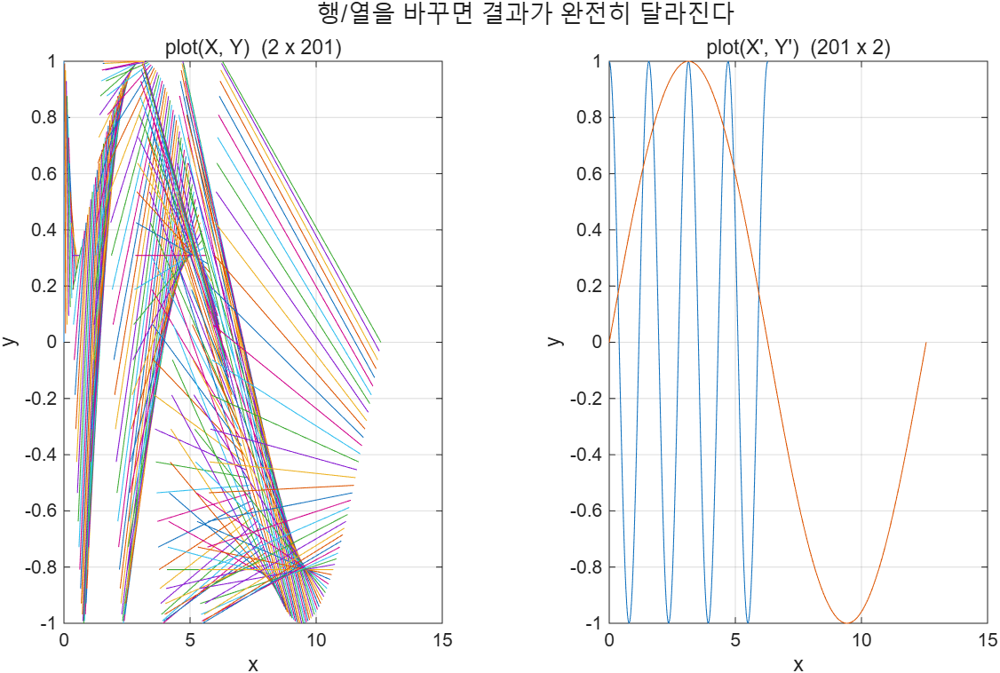

왼쪽이 기대를 배신한 결과다. `X`, `Y`가 2행 201열이므로 **열이 201개**, 즉 각각 점 2개(행 수)로 이루어진 선 201개가 그려진다. 전치 연산자 `'`로 행과 열을 뒤집으면 원하던 두 곡선이 나온다.

규칙을 한 줄로 정리하면 이렇다.

- `plot(x, Y)` — `x`가 **벡터**면, `Y`에서 `x`와 길이가 맞는 방향이 x 위치가 되고 나머지 방향이 선이 된다.
- `plot(X, Y)` — 둘 다 **같은 크기의 행렬**이면 판단할 근거가 없으므로 MATLAB은 무조건 **열 단위**로 짝지어 그린다.

즉 두 번째 경우에서 열이 곧 선이다. 곡선 하나를 한 열에 담아 두면 안전하다.

> ⚠️ **함정** — 여러 신호를 한 배열에 담을 때 `[y1; y2]`(행으로 쌓기)와 `[y1, y2]`(열로 붙이기) 중 어느 쪽인지, 그리고 x가 행 벡터인지 열 벡터인지를 늘 확인하라. `size(Y)`를 한 번 찍어 보는 습관이 안전하다.

### 입력이 하나뿐일 때

`plot(y)`처럼 벡터 하나만 주면 MATLAB은 **x 대신 인덱스 번호**를 쓴다.

```matlab
x  = 0:pi/100:2*pi;   % 201개
x1 = sin(x);
plot(x1)              % x축이 1..201 로 나온다
xlabel("Vector Index Number")
```

→ [`example/ch05/ex0501_singleinput.m`](../../example/ch05/ex0501_singleinput.m)

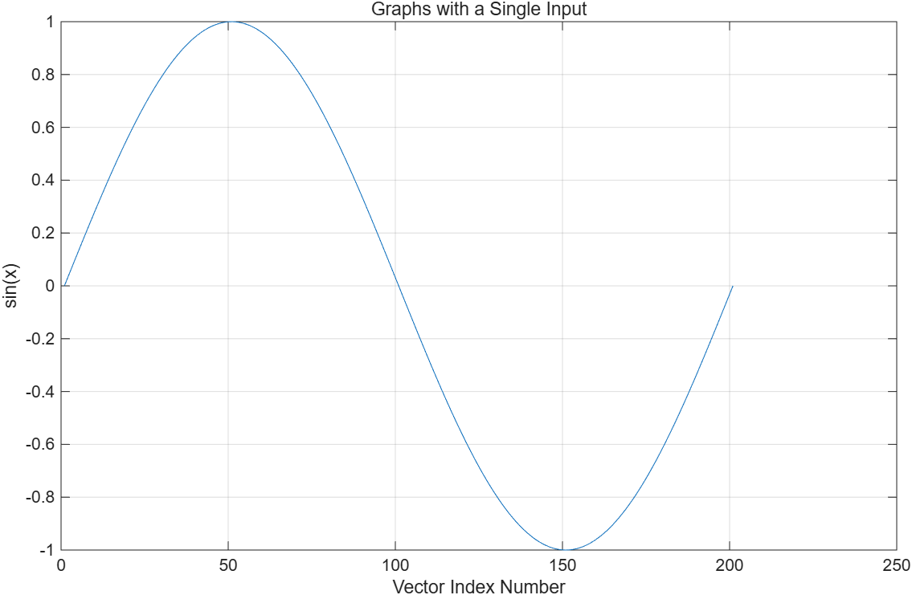

x축 눈금이 0부터 200 남짓까지 간다. `x` 값(0~2π)이 아니다.

---

### 연습문제

> **[보강]** 아래 연습문제와 그 해답은 슬라이드에 없다. 시험 대비용으로 새로 만들었다.

**5.1.1-1.** `t = 0:0.5:10` 초 동안 자유낙하한 거리 `d = 0.5*9.81*t.^2` (m)를 그려라. 제목, 축 이름(단위 포함), 격자를 모두 넣어라.

**5.1.1-2.** `x = 0:pi/50:4*pi`에 대해 `sin(x)`와 `sin(x)/2`를 한 축에 그려라. (a) `hold on`, (b) `plot(x,y1,x,y2)`, (c) 2차원 배열 — 세 방법 모두로 작성하고 결과가 같은지 확인하라.

**5.1.1-3.** `A = [1 2 3; 4 5 6]`를 `plot(A)`로 그리면 선이 몇 개 나오고 각 선은 점을 몇 개 갖는가? 실행하기 전에 예측하고, 그다음 확인하라.

해답: [`solutions.md`](solutions.md)

---

## 5.1.2 선, 색, 마커 스타일

선 모양·색·데이터점 마커는 직접 고를 수 있다. 지정하는 방법은 두 가지다.

1. **LineSpec 문자열** — `plot(x, y, ":ok")`처럼 x, y 뒤에 짧은 문자열 하나.
2. **속성 이름과 값** — `plot(x, y, LineWidth=2)`처럼 이름=값 쌍.

`help plot`이 쓸 수 있는 목록을 전부 보여 준다.

### LineSpec 문자열

문자열은 아래 세 열에서 **하나씩 골라 섞은** 것이다. 순서는 상관없다.

| 색 | | 마커 | | 선 |
|---|---|---|---|---|
| `b` | blue | `.` | point | `-` | solid |
| `g` | green | `o` | circle | `:` | dotted |
| `r` | red | `x` | x-mark | `-.` | dashdot |
| `c` | cyan | `+` | plus | `--` | dashed |
| `m` | magenta | `*` | star | (없음) | 선 없음 |
| `y` | yellow | `s` | square | | |
| `k` | **black** | `d` | diamond | | |
| `w` | white | `v` | triangle (down) | | |
| | | `^` | triangle (up) | | |
| | | `<` | triangle (left) | | |
| | | `>` | triangle (right) | | |
| | | `p` | pentagram | | |
| | | `h` | hexagram | | |

> ⚠️ **함정** — black은 `b`가 아니라 **`k`**다. `b`는 blue다. 시험에 잘 나온다.

예:

- `plot(X, Y, "c+:")` — cyan 점선 + 각 데이터점에 plus 마커
- `plot(X, Y, "bd")` — 선을 그리지 않고 파란 다이아몬드 마커만

선 문자를 빼면 **선이 사라지고 마커만** 남는다. 산점도를 만들 때 쓰는 요령이다.

#### 색 이름을 전부 적어도 된다

약어 대신 색 이름 전체를 써도 결과가 같다. 따옴표도 작은따옴표·큰따옴표 모두 받는다.

```matlab
x = 1:10;
y = [58.5 63.8 64.2 67.3 71.5 88.3 90.1 90.6 89.5 90.4];

plot(x, y, ":ok")
plot(x, y, ":oblack")    % 위와 같은 결과
```

→ [`example/ch05/ex0501_linespec.m`](../../example/ch05/ex0501_linespec.m)

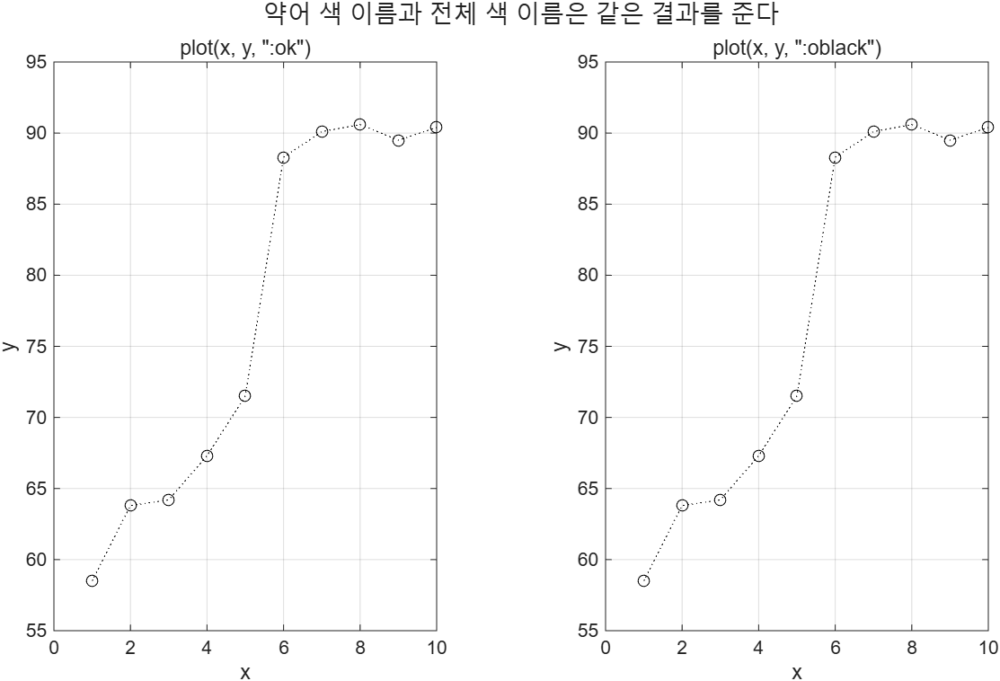

### 선마다 다른 스타일

여러 선을 한 `plot`에 넣을 때는 **각 (x, y) 쌍 뒤에** 문자열을 붙인다. 문자열을 빼면 그 선은 기본값을 쓴다.

```matlab
plot(x, y, ":ok", x, y*2, "--xr", x, y/2, "-b")
```

→ [`example/ch05/ex0501_multistyle.m`](../../example/ch05/ex0501_multistyle.m)

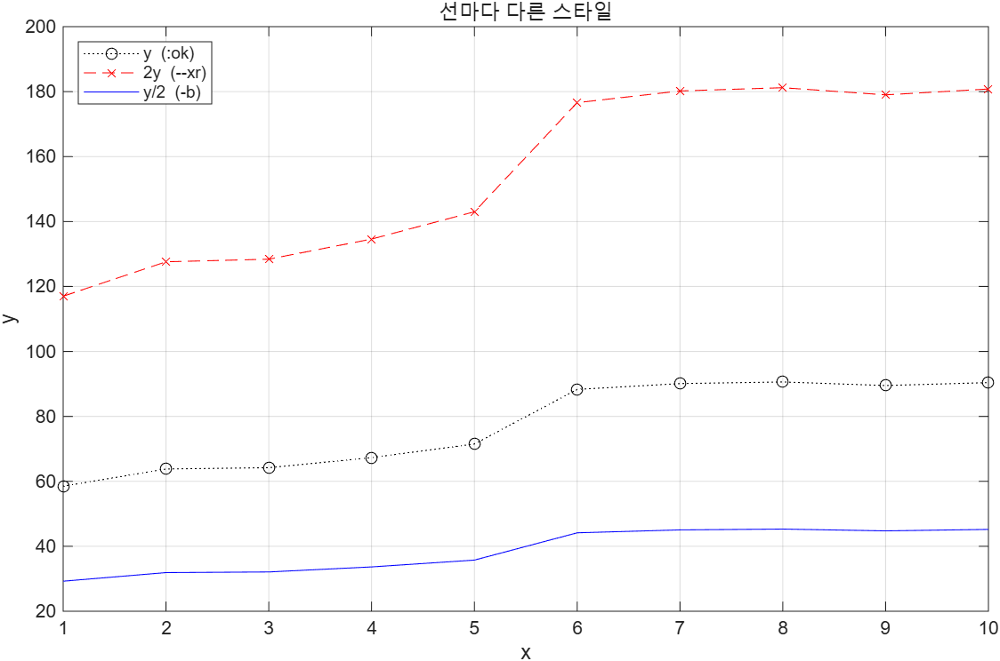

### 속성 이름과 값

LineSpec 문자열로는 **선 굵기나 마커 크기를 정할 수 없다**. 그런 것은 속성 이름을 적어야 한다.

R2021a부터 `Name=Value` 문법을 쓴다.

```matlab
plot(x, y, LineWidth=2, Marker="o", MarkerSize=10)
```

→ [`example/ch05/ex0501_namevalue.m`](../../example/ch05/ex0501_namevalue.m)

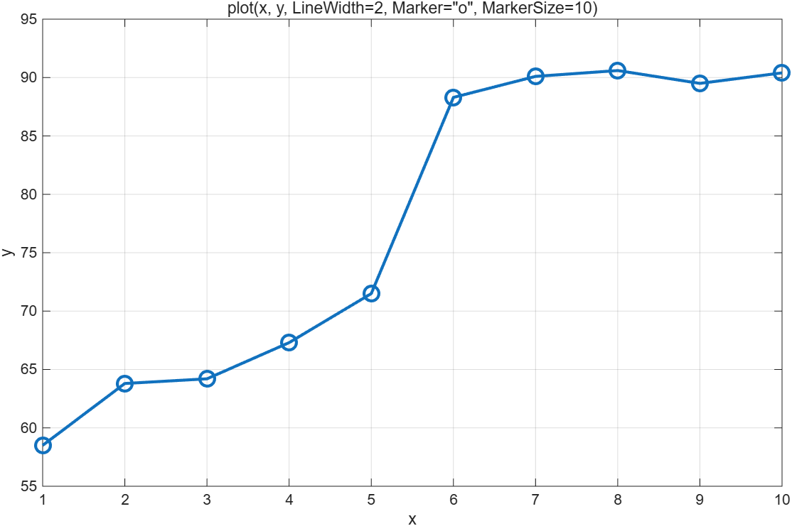

필요한 만큼 쌍을 계속 붙일 수 있다. 쓸 수 있는 속성 전체는 `doc Chart Line Properties`에 있다. 자주 쓰는 것들:

| 속성 | 값 예 | 뜻 |
|---|---|---|
| `LineWidth` | `2` | 선 굵기 (기본 0.5) |
| `LineStyle` | `"--"` | 선 종류 |
| `Color` | `"r"`, `[0 0.4 0.8]` | 선 색 (RGB 삼원소도 가능) |
| `Marker` | `"o"` | 마커 모양 |
| `MarkerSize` | `10` | 마커 크기 (기본 6) |
| `MarkerFaceColor` | `"y"` | 마커 내부 색 |
| `MarkerEdgeColor` | `"k"` | 마커 테두리 색 |

> **[보강]** R2021a 이전 구문법은 속성 이름을 따옴표로 감싼 쌍이다: `plot(x, y, "LineWidth", 2, "Marker", "o", "MarkerSize", 10)`. 결과는 같다. 옛 코드·옛 교재를 읽을 때 필요하다.

### 선마다 다른 속성을 주려면

`Name=Value`는 **그 `plot` 호출의 모든 선에 똑같이** 적용된다. 선마다 굵기를 다르게 하려면 `hold on`을 켜고 `plot`을 나눠 부른다.

```matlab
plot(x, y,   LineWidth=2, Marker="o", MarkerSize=10)
hold on
plot(x, y*2, LineWidth=1, Marker="h", MarkerSize=12)
plot(x, y/2, LineWidth=3, Marker="d", MarkerSize=8)
hold off
```

→ [`example/ch05/ex0501_holdstyle.m`](../../example/ch05/ex0501_holdstyle.m)

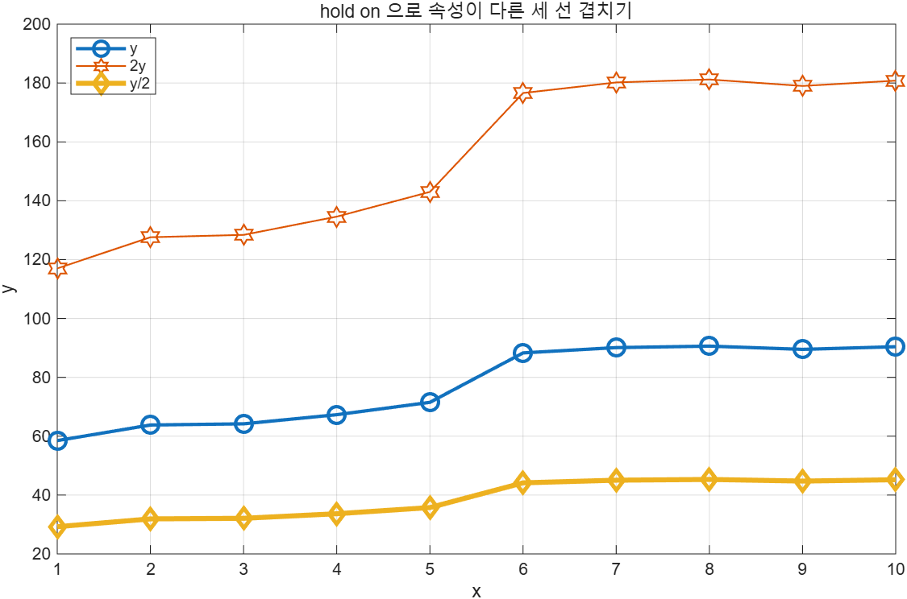

> ⚠️ **함정** — LineSpec 문자열과 `Name=Value`를 섞어 쓸 때 **문자열이 먼저**여야 한다. `Name=Value` 인수는 반드시 **맨 뒤**에 와야 한다.
>
> ```matlab
> plot(x, y, LineWidth=2, ":ok")   % 오류
> plot(x, y, ":ok", LineWidth=2)   % 올바름
> ```
>
> 앞쪽은 실행 오류가 아니라 **구문 오류(syntax error)** 다. 스크립트가 아예 실행되지 않고 이런 메시지가 뜬다.
>
> ```
> 오류: '=' 연산자는 사용할 수 없습니다. ...
> name=value 형식을 사용하여 이름-값 인수를 전달하려면
> 다른 모든 입력값 다음에 이 인수를 지정하십시오.
> ```

---

### 연습문제

> **[보강]** 아래 연습문제와 그 해답은 슬라이드에 없다. 시험 대비용으로 새로 만들었다.

**5.1.2-1.** `x = 0:0.1:2*pi`에 대해 `sin(x)`를 **빨간 파선 + 사각 마커**로, `cos(x)`를 **검은 점선 + 별 마커**로 한 축에 그려라. LineSpec 문자열만 써서 작성하라.

**5.1.2-2.** 위 문제의 두 선을 각각 `LineWidth` 3과 1로 다르게 만들어라. 왜 `plot` 한 번으로는 안 되는지 한 줄로 설명하라.

**5.1.2-3.** `plot(x, y, "b")`, `plot(x, y, "bo")`, `plot(x, y, "o")` 세 명령의 결과 차이를 예측하고 확인하라.

해답: [`solutions.md`](solutions.md)

---

## 5.1.3 축 크기 조절과 주석 달기

MATLAB은 x·y축 눈금을 알아서 잡는다. 하지만 두 그래프의 축을 맞추거나, 관심 구간만 확대하려면 직접 정해야 한다.

### axis

| 형태 | 하는 일 |
|---|---|
| `axis` | 입력 없이 쓰면 현재 눈금을 **동결**한다 (이후 데이터를 더해도 축이 안 변한다) |
| `axis([xmin xmax ymin ymax])` | 네 값을 담은 배열 하나로 범위를 지정한다 |

배열의 네 값은 순서대로 x축 최솟값, x축 최댓값, y축 최솟값, y축 최댓값이다.

```matlab
plot(x, y, ":ok", x, y*2, "--r", x, y/2, "-b")
axis([0 11 0 300])
```

→ [`example/ch05/ex0501_axis.m`](../../example/ch05/ex0501_axis.m)

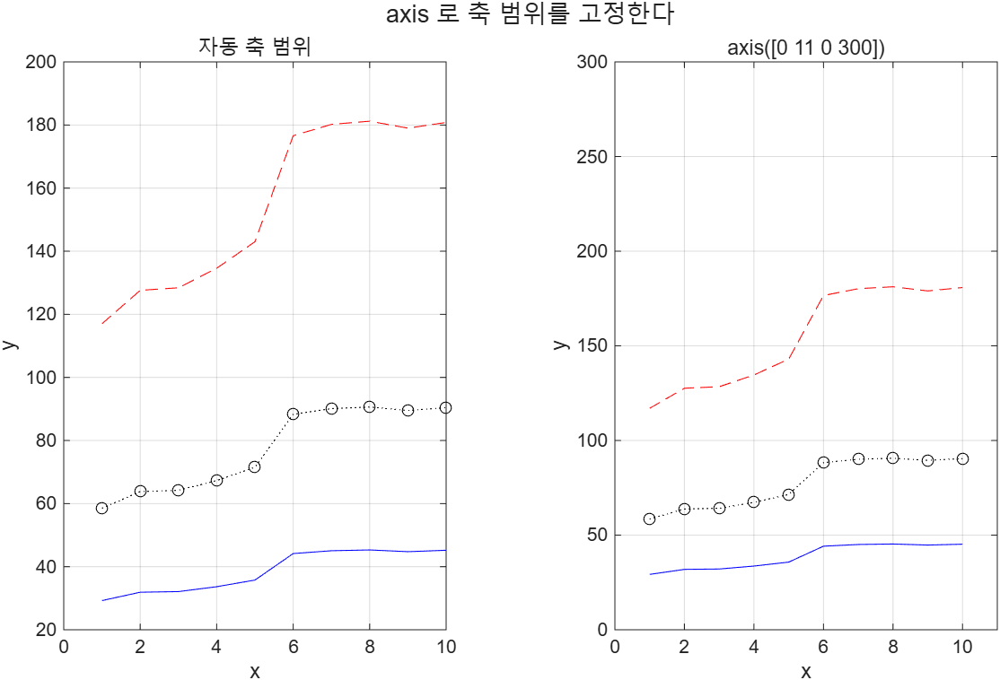

> **[보강]** 슬라이드 밖 옵션이지만 자주 쓴다.
> - `axis equal` — x축과 y축의 한 칸 길이를 같게 한다. 원을 원으로 그리려면 필수.
> - `axis square` — 그림 영역을 정사각형으로.
> - `axis tight` — 데이터에 딱 맞게 범위를 줄인다.
> - `xlim([0 11])`, `ylim([0 300])` — 한 축만 따로 지정.

> ⚠️ **함정** — `axis`의 입력은 **대괄호로 묶은 배열 하나**다. 대괄호를 빠뜨려 `axis(0, 11, 0, 300)`로 쓰면 더 나쁜 일이 벌어진다. **오류가 나지 않고, 아무 일도 일어나지 않는다.** R2026a에서 확인한 결과다.
>
> ```matlab
> plot(x, y)
> axis(0, 11, 0, 300)     % 오류 없음. 축 범위도 그대로
> axis([0 11 0 300])      % 이렇게 써야 적용된다
> ```
>
> 축이 안 바뀌는데 오류 메시지도 없다면 대괄호부터 확인하라.

### legend와 text

- `legend`는 선마다 이름을 붙여 범례를 만든다. 기본 위치는 오른쪽 위다.
- `text(x, y, txt)`는 그래프 안 임의의 위치에 글상자를 놓는다.

`text`의 좌표는 **축 값 기준**이다. 화면 비율(0~1)이 아니라 데이터 값이다.

```matlab
plot(x, y, ":ok", x, y*2, "--r", x, y/2, "-b")
legend("line 1", "line 2", "line 3", Location="northwest")
text(1, 100, "Label plots with the text command")
axis([0 11 0 300])
title("Example Graph for Chapter 5")
xlabel("My x-axis label")
ylabel("My y-axis label")
```

→ [`example/ch05/ex0501_legendtext.m`](../../example/ch05/ex0501_legendtext.m)

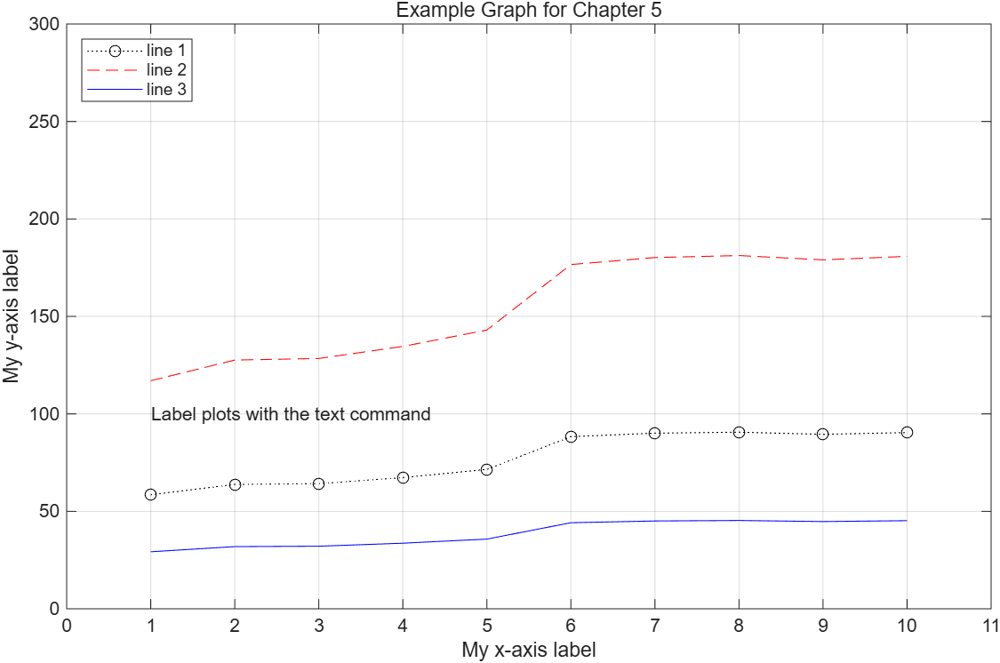

`Location`으로 범례 위치를 옮긴다: `"northwest"`, `"southeast"`, `"best"`, `"northoutside"` 등.

> ⚠️ **함정** — `legend`의 이름 순서는 **선이 그려진 순서**를 따른다. `hold on`으로 순서를 바꿔 그렸다면 범례 이름도 그 순서에 맞춰야 한다. 선 개수보다 이름을 적게 주면 남은 선은 범례에서 빠진다.

### TeX 문법

제목·축 이름·범례·`text` 문자열 안에서 TeX 명령을 쓸 수 있다.

| 쓰고 싶은 것 | 쓰는 법 | 결과 |
|---|---|---|
| 그리스 문자 | 이름 앞에 역슬래시 `\` | `\alpha \beta \gamma` → α β γ |
| 위 첨자 | 캐럿 `^` | `m/s^2` → m/s² |
| 아래 첨자 | 밑줄 `_` | `g_1` → g₁ |
| 두 글자 이상 묶기 | 중괄호 `{ }` | `A_{max}` → A_max 전체가 아래 첨자 |
| 화살표 | `\leftarrow`, `\rightarrow` | ← → |

```matlab
title("\alpha \beta \gamma")
ylabel("진폭 A_{max} [m/s^2]")
```

여러 줄 제목은 **문자열을 여러 행으로 쌓은 배열**로 넘긴다. 세미콜론으로 행을 나눈다.

```matlab
title(["첫 번째 줄"; "두 번째 줄"])
```

→ [`example/ch05/ex0501_tex.m`](../../example/ch05/ex0501_tex.m)

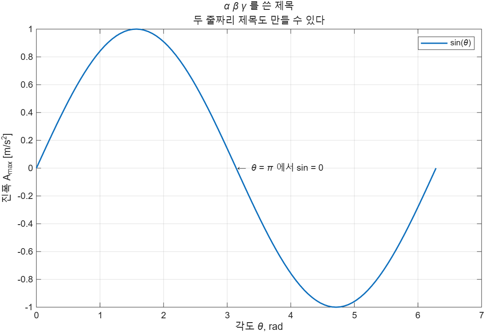

> ⚠️ **함정** — 중괄호를 빼면 **첫 글자 하나만** 첨자가 된다. `A_max`는 `A` 아래에 `m`만 붙고 `ax`는 그냥 따라 나온다. 반드시 `A_{max}`로 쓴다. 위 첨자 `^`도 같다.

> **[보강]** 글자 그대로 `_`나 `^`를 보이고 싶으면 앞에 역슬래시를 붙여 `\_`, `\^`로 쓰거나, 해당 객체의 `Interpreter` 속성을 `"none"`으로 바꾼다.

### Example 5.2 — 탄도 문제

중력가속도를 보통 g = 9.81 m/s²로 쓰지만 실제로는 상수가 아니다. 위치에 따라 9.8 ~ 9.9 m/s² 사이 값이 쓰인다. 이 차이가 결과를 얼마나 바꾸는가?

발사각 θ, 초기속도 v로 쏜 포탄의 사거리는

```
R = v² / g · sin(2θ)
```

```matlab
g1 = 9.8;                        % m/s^2
g2 = 9.9;                        % m/s^2
v  = 100;                        % m/s
theta = 0:0.05:pi/2;             % rad

R1 = v^2 ./ g1 .* sin(2*theta);  % m
R2 = v^2 ./ g2 .* sin(2*theta);  % m

plot(theta, R1, theta, R2)
title(["Cannon Range Sensitivity"; "To the Value of g"])
xlabel("Cannon Launch Angle, \theta")
ylabel("Range, meters")
legend("g_1 = 9.8 m/s^2", "g_2 = 9.9 m/s^2")
```

→ [`example/ch05/ex0501_ballistics.m`](../../example/ch05/ex0501_ballistics.m)

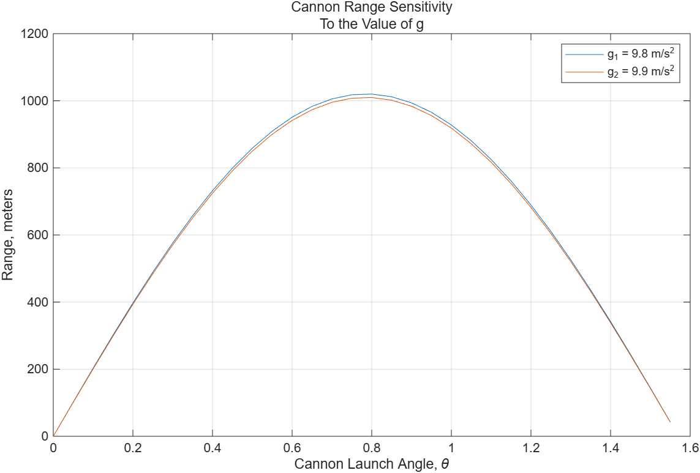

이 예제에서 눈여겨볼 것:

- x축 이름의 `\theta` → 그리스 문자 θ
- 범례의 `g_1`, `g_2` → 아래 첨자
- 범례의 `m/s^2` → 위 첨자
- 제목의 세미콜론 → 두 줄 제목

실행하면 최대 사거리 차이가 **10.30 m**로 나온다. 최대 사거리 약 1020 m에서 1% 남짓이다. g를 소수 둘째 자리까지 따지는 것이 의미 있는지 판단할 근거가 된다.

> ⚠️ **함정** — `v^2 ./ g1 .* sin(2*theta)`에서 `theta`가 벡터이므로 `./`와 `.*`를 써야 한다. `v^2 / g1 * sin(2*theta)`는 `g1`, `v`가 스칼라라 여기서는 우연히 같은 답이 나오지만, 분모가 벡터가 되는 순간 행렬 나눗셈으로 해석되어 엉뚱한 결과를 준다. 처음부터 원소별 연산자를 쓰는 습관을 들여라.

---

### 연습문제

> **[보강]** 아래 연습문제와 그 해답은 슬라이드에 없다. 시험 대비용으로 새로 만들었다.

**5.1.3-1.** `x = 0:0.1:10`에 대해 `y = exp(-0.3*x).*sin(3*x)`를 그리고, x축은 0~10, y축은 −1~1로 고정하라. 제목에 그리스 문자와 위 첨자를 하나씩 넣어라.

**5.1.3-2.** 위 탄도 예제를 v = 50, 100, 150 m/s 세 경우(g = 9.81 고정)로 바꿔 한 그래프에 그려라. 범례에 각 속도를 `v_1`, `v_2`, `v_3` 형태의 아래 첨자로 표시하고, 최대 사거리가 나오는 발사각을 `text`로 표시하라.

**5.1.3-3.** `title("A_max 와 A_{max}")`를 실행해 두 표기의 차이를 눈으로 확인하고, 왜 그런지 한 줄로 설명하라.

해답: [`solutions.md`](solutions.md)
