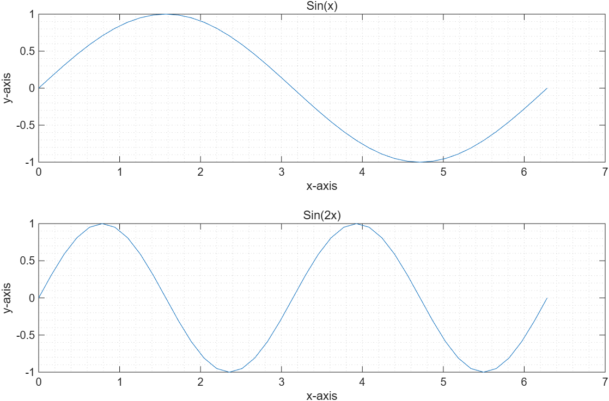
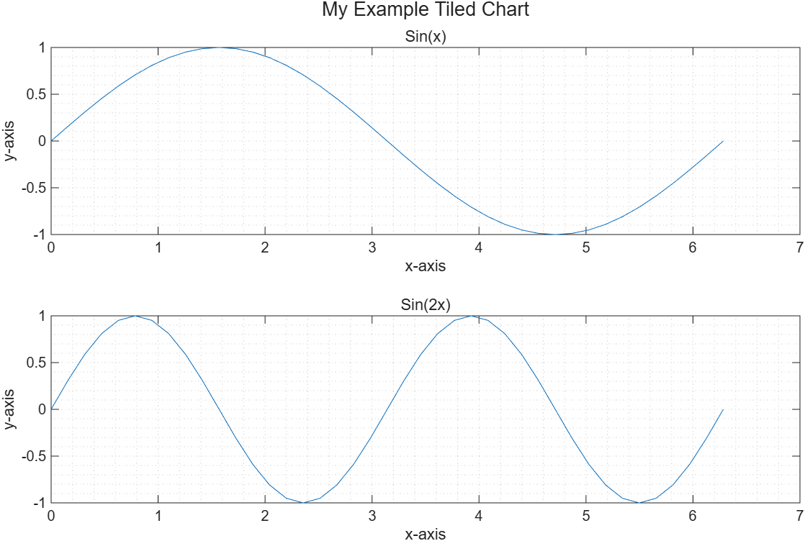
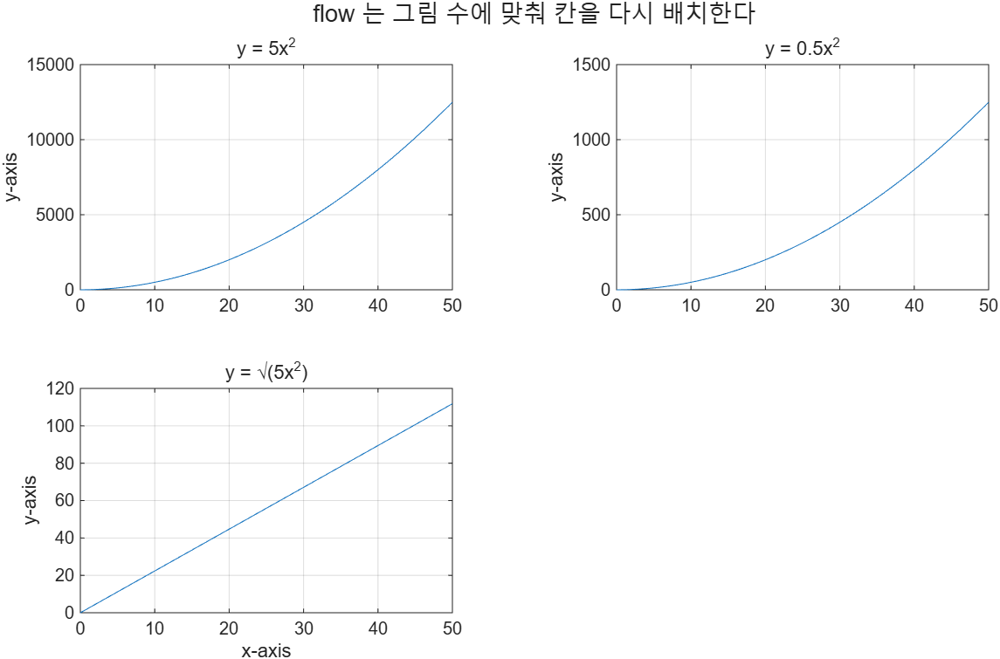
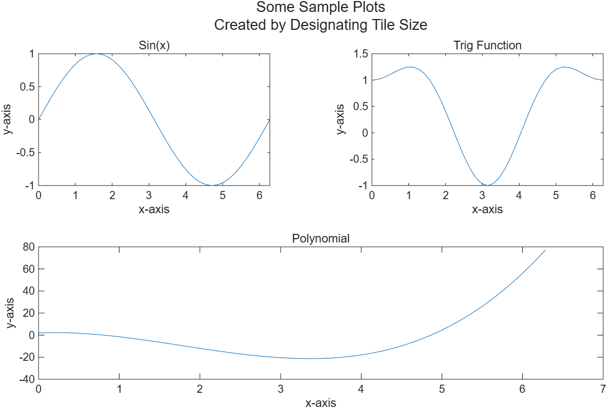

# 5.2 Subplots — Tiled Chart Layouts

한 figure 창을 격자로 쪼개 여러 그래프를 나란히 놓는다. `tiledlayout`과 `nexttile` 두 함수가 전부다.

> **[보강]** 예전 MATLAB은 `subplot(m, n, p)`을 썼다. 옛 코드에서 자주 보이지만, 새로 쓰는 코드는 `tiledlayout`을 쓴다. `tiledlayout`은 칸 사이 여백을 스스로 조절하고, 레이아웃 전체 제목을 달 수 있고, 칸을 합칠 수 있다.

## tiledlayout과 nexttile

- `tiledlayout(m, n)` — 창을 m행 n열 격자로 나눈다. 칸 하나를 **tile**이라 한다.
- `nexttile` — 다음 tile을 활성화한다. 이후 `plot`, `title` 등은 그 tile에 들어간다.

칸 번호는 **왼쪽에서 오른쪽, 위에서 아래** 순서다.

`nexttile`을 **입력 없이** 부르면 순서대로 채워지므로, 보통 번호를 적을 필요가 없다.

```matlab
x = 0:pi/20:2*pi;

tiledlayout(2, 1)

nexttile
plot(x, sin(x))
title("Sin(x)")
xlabel("x-axis"), ylabel("y-axis"), grid minor

nexttile
plot(x, sin(2*x))
title("Sin(2x)")
xlabel("x-axis"), ylabel("y-axis"), grid minor
```

→ [`example/ch05/ex0502_tiledlayout.m`](../../example/ch05/ex0502_tiledlayout.m)



> ⚠️ **함정** — `tiledlayout` 다음에 `nexttile`을 빼먹고 바로 `plot`을 부르면, MATLAB이 첫 tile을 알아서 만들긴 하지만 **두 번째 그래프가 첫 tile을 덮어쓴다**. 그래프마다 `nexttile`을 한 번씩 부른다.

## 레이아웃 전체 제목

각 tile의 `title`은 그 칸에만 붙는다. 창 전체에 제목을 달려면 `tiledlayout`이 돌려주는 **TiledChartLayout 객체**를 변수에 받아 `title(t, ...)`로 넘긴다.

```matlab
t = tiledlayout(2, 1);        % 세미콜론으로 출력을 막는다
...
title(t, "My Example Tiled Chart")
```

객체를 출력하면 속성 목록이 길게 쏟아지므로, 코딩 스타일상 **세미콜론으로 억제**하는 것이 좋다.

→ [`example/ch05/ex0502_title.m`](../../example/ch05/ex0502_title.m)



레이아웃 제목도 여러 줄이 된다.

```matlab
m = ["A Polynomial Plotted"; "Using Multiple Graphing Strategies"];
title(t, m)
```

> **[보강]** 같은 객체로 `xlabel(t, "...")`, `ylabel(t, "...")`를 쓰면 레이아웃 전체에 공통 축 이름을 붙일 수 있다.

## flow — 칸 수를 모를 때

그래프를 몇 개 그릴지 미리 모른다면 행·열 대신 `"flow"`를 넣는다.

```matlab
tiledlayout("flow")
```

- 첫 그래프는 tile 하나짜리 창에 그려진다.
- 그래프가 늘어날 때마다 창이 **다시 흘러(reflow)** 필요한 만큼 칸이 생긴다.
- 각 tile이 대략 **4:3 비율**이 되도록 격자를 만든다.

```matlab
x = 0:0.5:50;
y = 5*x.^2;

t = tiledlayout("flow");

nexttile, plot(x, y),       title("y = 5x^2"),   ylabel("y-axis"), grid on
nexttile, plot(x, y/10),    title("y = 0.5x^2"), ylabel("y-axis"), grid on
nexttile, plot(x, sqrt(y)), title("y = \surd(5x^2)"), xlabel("x-axis"), ylabel("y-axis"), grid on
```

→ [`example/ch05/ex0502_flow.m`](../../example/ch05/ex0502_flow.m)



## 칸 합치기 (span)

모든 그래프가 같은 크기일 필요는 없다. `nexttile`에 두 개의 입력을 준다.

```matlab
nexttile(시작_칸_번호, [행수, 열수])
```

- 첫 번째 입력 — 합칠 영역의 **왼쪽 위 칸 번호**
- 두 번째 입력 — 차지할 **[행 수, 열 수]** 배열

합칠 영역을 포함하는 격자를 먼저 `tiledlayout`으로 만들어 두어야 한다.

```matlab
tile_name = tiledlayout(2, 2);

nexttile                      % 1번 칸
plot(x, sin(x))
title("Sin(x)"), xlabel("x-axis"), ylabel("y-axis")

nexttile                      % 2번 칸
plot(x, sin(x).^2 + cos(x))
title("Trig Function"), xlabel("x-axis"), ylabel("y-axis")

nexttile(3, [1, 2])           % 3번 칸부터 1행 2열 -> 아래 줄 전체
plot(x, 2 + 3*x - 8*x.^2 + 1.5*x.^3)
title("Polynomial"), xlabel("x-axis"), ylabel("y-axis")

title(tile_name, ["Some Sample Plots"; "Created by Designating Tile Size"])
```

→ [`example/ch05/ex0502_span.m`](../../example/ch05/ex0502_span.m)



2×2 격자의 아래 줄 두 칸(3번, 4번)이 하나로 합쳐졌다.

> ⚠️ **함정** — `nexttile(3, [1, 2])`의 `3`은 **칸 번호**, `[1, 2]`는 **크기**다. 둘을 헷갈려 `nexttile([1,2], 3)`으로 쓰면 오류다. 그리고 합칠 영역이 격자를 벗어나면(예: 2×2에서 `nexttile(4, [1,2])`) 오류가 난다.

> **[보강]** 슬라이드가 조언하듯, tile 합치기는 복잡한 배치에 들어가기 전에 **단순한 예제로 먼저 연습**하는 편이 좋다. `doc tiledlayout`에 `TileSpacing`, `Padding` 등 여백 조절 속성이 더 있다.

---

## 연습문제

> **[보강]** 아래 연습문제와 그 해답은 슬라이드에 없다. 시험 대비용으로 새로 만들었다.

**5.2-1.** `x = 0:0.1:2*pi`에 대해 `sin(x)`, `cos(x)`, `tan(x)`, `sin(x).*cos(x)` 네 그래프를 2×2 격자에 그려라. 각 tile에 제목과 축 이름을 넣고, 레이아웃 전체 제목을 붙여라. (`tan`은 `ylim`으로 범위를 제한하라.)

**5.2-2.** 위 문제를 `tiledlayout("flow")`로 다시 작성하라. 그래프를 셋만 그렸을 때와 넷을 그렸을 때 배치가 어떻게 달라지는가?

**5.2-3.** 3×3 격자를 만들어, 위쪽 두 줄 전체(1번 칸부터 2행 3열)를 차지하는 큰 그래프 하나와 아래 줄에 작은 그래프 세 개를 배치하라.

해답: [`solutions.md`](solutions.md)
