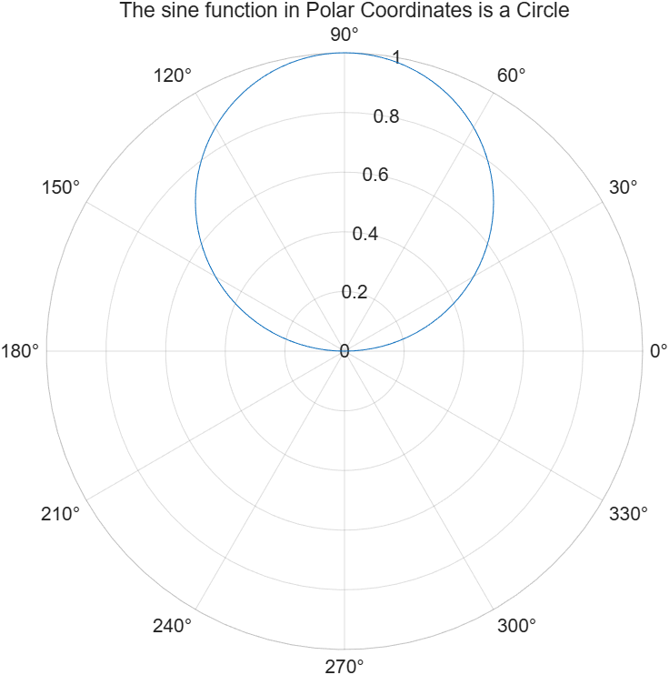
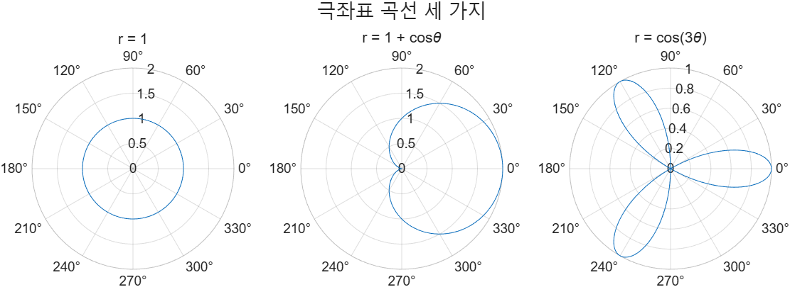

# 5.3.1 극좌표 그래프 (Polar Plots)

## 5.3 다른 종류의 2차원 그래프

단순한 x–y plot이 공학에서 가장 흔하지만, 상황에 따라 더 적절한 표현 방법이 있다. 공학자가 자주 쓰는 2차원 그래프는 다음과 같다.

- **Polar Plots** — 극좌표 (5.3.1)
- **Logarithmic Plots** — 로그 눈금 (5.3.2)
- Bar Graphs — 막대그래프
- Pie Charts — 원그래프
- Histograms — 히스토그램
- Graphs with Two y-Axes — y축이 둘인 그래프
- Function Plots — 함수 그래프

이 문서는 앞의 둘을 다룬다. 나머지는 Chapter 05_2 쪽 문서에 있다.

## polarplot

극좌표로 그리려면 `polarplot`을 쓴다.

```matlab
polarplot(theta, r)
```

- `theta` — 각도. **항상 라디안**이다.
- `r` — 원점에서의 거리(반지름).

```matlab
theta  = 0:pi/100:pi;
radius = sin(theta);

polarplot(theta, radius)
title("The sine function in Polar Coordinates is a Circle")
```

→ [`example/ch05/ex0503_polarplot.m`](../../example/ch05/ex0503_polarplot.m)



`r = sin(θ)`는 극좌표에서 **원**이 된다. θ를 0부터 π까지만 돌려도 원이 한 바퀴 완성된다. θ가 π를 넘으면 `sin(θ)`가 음수가 되어 같은 원을 한 번 더 덧그린다.

> ⚠️ **함정** — `theta`에 **도(degree)를 넣으면 안 된다**. `polarplot(0:360, r)`은 라디안 360까지를 도는, 즉 약 57바퀴를 도는 그래프가 된다. 도 단위 데이터라면 `deg2rad`로 바꾸거나 `theta*pi/180`을 쓴다.

> **[보강]** 옛 MATLAB은 `polarplot` 대신 `polar`를 썼다. 슬라이드도 이를 언급한다. `polar`는 현재 비권장(deprecated)이다.

> **[보강]** R2022a 이전에는 `polarplot` 축에 **도 기호(°)가 기본으로 표시되지 않았다**. R2026a에서는 각도 눈금에 ° 기호가 붙는다. MATLAB은 6개월마다 갱신되므로, 교재·튜토리얼과 실제 화면이 사소하게 다를 수 있다는 점을 슬라이드가 짚어 준다. `doc polarplot`으로 현재 버전의 동작을 확인하라.

## 자주 나오는 극좌표 곡선

> **[보강]** 이 절은 슬라이드에 없다. 시험에서 "이 식은 어떤 모양인가"를 묻기 좋아 덧붙인다.

| 식 | 이름 | 모양 |
|---|---|---|
| `r = 1` | 원 | 원점 중심 반지름 1 |
| `r = sin(theta)` | 원 | 중심이 원점에서 벗어난 원 |
| `r = 1 + cos(theta)` | 카디오이드(cardioid) | 심장 모양 |
| `r = cos(3*theta)` | 장미(rose) | 잎 3장 |
| `r = theta` | 아르키메데스 나선 | 감기는 나선 |

`cos(n*theta)`는 n이 **홀수면 잎이 n장**, **짝수면 2n장**이다.

```matlab
theta = 0:pi/200:2*pi;

t = tiledlayout(1, 3);
nexttile, polarplot(theta, ones(size(theta))), title("r = 1")
nexttile, polarplot(theta, 1 + cos(theta)),    title("r = 1 + cos\theta")
nexttile, polarplot(theta, cos(3*theta)),      title("r = cos(3\theta)")
title(t, "극좌표 곡선 세 가지")
```

→ [`example/ch05/ex0503_polarshapes.m`](../../example/ch05/ex0503_polarshapes.m)



`r = 1`을 `ones(size(theta))`로 풀어 쓴 이유는 의도를 분명히 하기 위해서다. R2026a에서는 `polarplot(theta, 1)`처럼 스칼라를 줘도 MATLAB이 알아서 길이를 맞춰 준다(scalar expansion). 다만 `r`이 벡터인데 `theta`와 **길이가 다르면** 오류다.

> ⚠️ **함정** — 극좌표 그래프에는 `xlabel`, `ylabel`, `axis([...])`가 통하지 않는다. x축·y축이 없기 때문이다. 대신 `rlim([0 2])`로 반지름 범위를, `thetalim([0 180])`으로 각도 범위를 정한다.

---

## 연습문제

**5.3.1-1.** `r = 1 + 2*cos(theta)`를 θ = 0 ~ 2π에서 그려라 (limaçon). 안쪽 고리가 왜 생기는지, `r`이 음수가 되는 구간을 근거로 설명하라.

**5.3.1-2.** `r = cos(2*theta)`와 `r = cos(5*theta)`를 1×2 tiled layout에 나란히 그리고, 잎의 개수를 세어 위 표의 규칙(홀수 n → n장, 짝수 n → 2n장)이 맞는지 확인하라.

해답: [`solutions.md`](solutions.md)
