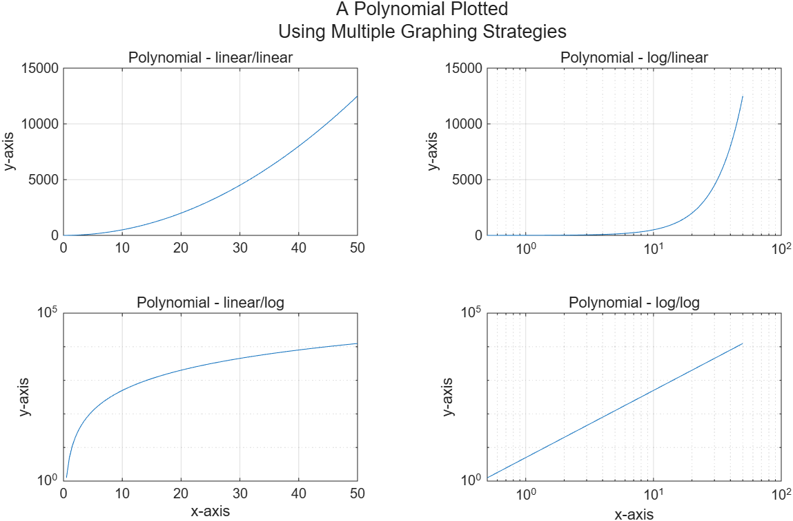
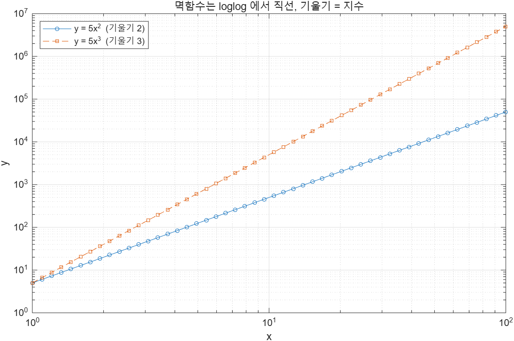

# 5.3.2 로그 그래프 (Logarithmic Plots)

지금까지 그린 그래프는 x축과 y축이 **일정한 간격**으로 나뉘어 있었다. 이런 그래프를 선형(linear) 또는 직교(rectangular) 그래프라 한다.

가끔은 한쪽 또는 양쪽 축에 **로그 눈금**을 쓰는 편이 낫다. 밑이 10인 로그 눈금은

- 변수가 **여러 자릿수(orders of magnitude)에 걸쳐** 변할 때, 작은 값을 뭉개지 않고 넓은 범위를 한 그림에 담을 수 있고,
- **지수적으로 변하는 데이터**를 표현하는 데 유리하다.

## 네 가지 함수

| 함수 | x축 | y축 |
|---|---|---|
| `plot` | 선형 | 선형 |
| `semilogx` | **로그** | 선형 |
| `semilogy` | 선형 | **로그** |
| `loglog` | **로그** | **로그** |

입력 형식은 `plot`과 완전히 같다. LineSpec 문자열도, `Name=Value` 속성도 그대로 쓸 수 있다.

## 같은 데이터를 네 가지 축으로

슬라이드는 `tiledlayout("flow")`를 함께 보여 주는 예제를 쓴다. 그래프를 하나씩 추가할 때마다 창이 1칸 → 2칸 → 3칸 → 4칸으로 다시 흐른다.

```matlab
x = 0:0.5:50;
y = 5*x.^2;

t = tiledlayout("flow");

nexttile
plot(x, y)
title("Polynomial - linear/linear")
ylabel("y-axis"), grid

nexttile
semilogx(x, y)                   % x 축만 로그
title("Polynomial - log/linear")
ylabel("y-axis"), grid

nexttile
semilogy(x, y)                   % y 축만 로그
title("Polynomial - linear/log")
xlabel("x-axis"), ylabel("y-axis"), grid

nexttile
loglog(x, y)                     % 두 축 모두 로그
title("Polynomial - log/log")
xlabel("x-axis"), ylabel("y-axis"), grid

m = ["A Polynomial Plotted"; "Using Multiple Graphing Strategies"];
title(t, m)
```

→ [`example/ch05/ex0503_semilog.m`](../../example/ch05/ex0503_semilog.m)



### 스타일에 대한 한마디

슬라이드가 짚는 부분이다. 위 그림에서 **아래 두 칸에만 x축 이름이 붙어 있다.** 위아래 칸의 x축이 같은 뜻이라면, 맨 아래 줄에만 이름을 달아 그림을 덜 복잡하게 만드는 것이 관례다.

## 왜 log/log에서 직선이 되는가

슬라이드의 마지막 질문이다. 네 번째 그래프의 선이 직선인 이유를 설명하라.

멱함수(power function)를 생각해 보자.

```
y = a·xⁿ
```

양변에 상용로그를 취하면

```
log₁₀(y) = log₁₀(a) + n·log₁₀(x)
```

`log₁₀(x)`를 가로축, `log₁₀(y)`를 세로축으로 놓으면 **기울기가 n, y절편이 log₁₀(a)인 직선**이다. loglog 그래프는 정확히 이 축을 쓰므로, 멱함수는 항상 직선으로 나온다.

**데이터 분석에 쓸 수 있다.** 측정 데이터를 loglog로 그렸을 때 직선이면 그 데이터는 멱함수 관계이고, **직선의 기울기가 곧 지수 n**이다. 관계식을 추측하는 데 바로 쓰인다.

같은 논리로 `semilogy`에서 직선이면 `y = a·10^(bx)` 꼴의 **지수함수**다.

```matlab
x  = logspace(0, 2, 50);         % 1 부터 100 까지 로그 간격 50점
y1 = 5*x.^2;                     % n = 2
y2 = 5*x.^3;                     % n = 3

loglog(x, y1, "-o", x, y2, "--s", MarkerSize=4)
legend("y = 5x^2  (기울기 2)", "y = 5x^3  (기울기 3)", Location="northwest")
grid on

n2 = (log10(y1(end)) - log10(y1(1))) / (log10(x(end)) - log10(x(1)));
n3 = (log10(y2(end)) - log10(y2(1))) / (log10(x(end)) - log10(x(1)));
fprintf("측정한 기울기: %.4f, %.4f\n", n2, n3);
```

→ [`example/ch05/ex0503_loglog_slope.m`](../../example/ch05/ex0503_loglog_slope.m)



실행하면 `측정한 기울기: 2.0000, 3.0000`이 찍힌다. 지수와 정확히 일치한다.

> **[보강]** 위 예제는 슬라이드에 없다. 슬라이드 마지막 장의 질문("왜 직선인가, 데이터 분석에 쓸모가 있는가")에 답하려고 덧붙였다. 로그 간격 점을 만드는 `logspace(a, b, n)`은 10^a 부터 10^b 까지 n개를 로그 간격으로 준다. 선형 간격인 `linspace`와 짝을 이룬다.

## 함정

> ⚠️ **함정** — 로그 눈금에 **0이나 음수는 올릴 수 없다.** `log(0)`은 −∞다. `x = 0:0.5:50`의 첫 원소가 0이므로 `semilogx(x, y)`와 `loglog(x, y)`에서 **그 점은 그냥 빠진다.** 오류도 경고도 안 뜨므로, 그래프가 시작점부터 안 그려지면 이것부터 의심하라. 위 예제에서 `logspace(0, 2, 50)`으로 1부터 시작한 이유도 같다.

> ⚠️ **함정** — `semilogx`와 `semilogy`를 헷갈리기 쉽다. **이름에 붙은 축이 로그**다. `semilogx` → x축이 로그.

> ⚠️ **함정** — `plot`으로 이미 그린 뒤 `semilogy`를 부르면 새 그래프로 덮어쓰인다. 기존 축의 눈금만 바꾸고 싶다면 `set(gca, "YScale", "log")`를 쓴다.

---

## 연습문제

**5.3.2-1.** `x = logspace(-1, 3, 100)`에 대해 `y = 3*x.^1.5`를 `plot`과 `loglog`로 1×2 tiled layout에 그려라. 어느 쪽이 데이터를 읽기 쉬운지 한 줄로 쓰라.

**5.3.2-2.** `x = 0:0.5:10`, `y = 2*exp(0.8*x)`를 `plot`, `semilogy`로 각각 그려라. `semilogy` 쪽이 직선이 되는 이유를 로그를 취한 식으로 설명하라.

해답: [`solutions.md`](solutions.md)
