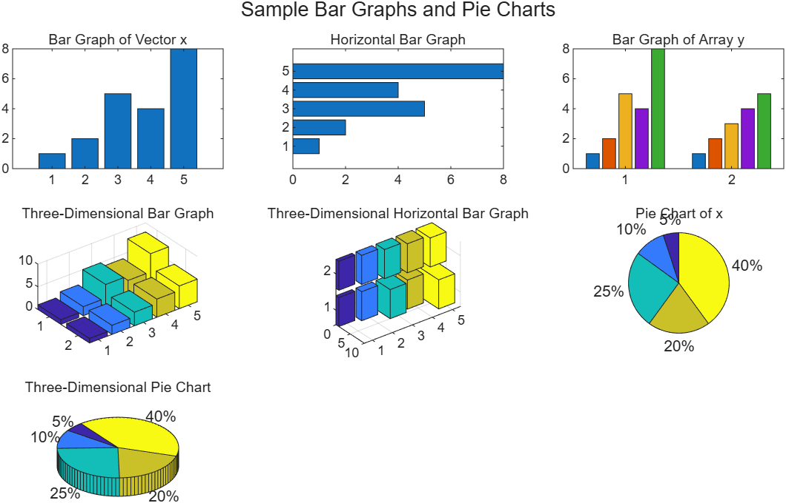

# 5.3.3 막대 그래프와 파이 차트 (Bar Graphs and Pie Charts)

[← 목차](README.md) · [다음: 5.3.4 히스토그램](5.3.4-histogram.md)

데이터를 "값의 변화"가 아니라 "항목별 크기"로 보여 줄 때는 x–y plot보다 막대 그래프나
파이 차트가 낫다. MATLAB은 2차원·3차원 두 가지 버전을 모두 제공한다.

| 함수 | 결과 |
|---|---|
| `bar(x)` | 세로 막대 |
| `barh(x)` | 가로 막대 |
| `bar3(x)` | 3차원 세로 막대 |
| `bar3h(x)` | 3차원 가로 막대 |
| `pie(x)` | 파이 차트 |
| `pie3(x)` | 3차원 파이 차트 |

## 벡터를 주면 값 하나가 막대 하나

```matlab
x = [1, 2, 5, 4, 8];
bar(x)
title("A Bar Graph of Vector x")
```

x축은 값의 **인덱스**(1~5)이고 막대 높이가 값이다. 항목 이름을 붙이려면 `xticklabels`를 쓴다.

## 배열을 주면 열마다 막대가 묶인다

```matlab
y = [x; 1:5];   % 2x5 배열
bar(y)          % 열 5개 각각에 막대 2개(행 2개)가 묶여 나온다
```

`bar`는 **행을 계열(series), 열을 그룹**으로 읽는다. 데이터가 반대로 들어가 있으면 `bar(y')`처럼
전치해서 넘긴다.

## 파이 차트

```matlab
pie(x)                              % 각 조각 = 값 / 전체합
pie(x, ["A" "B" "C" "D" "E"])       % 조각 레이블
```

파이 차트는 값을 **비율로 자동 변환**한다. 합이 1보다 작은 벡터를 주면 그때는 비율이 아니라
값 그대로 해석해 원의 일부만 채운다(예: `pie([0.2 0.3])`는 반원만 그린다).

## 전체 예제

```matlab
x = [1, 2, 5, 4, 8];    % 1x5 벡터
y = [x; 1:5];           % 2x5 배열 (행이 두 개의 데이터 계열)

t = tiledlayout("flow");
title(t, "Sample Bar Graphs and Pie Charts")

nexttile
bar(x)
title("Bar Graph of Vector x")

nexttile
barh(x)
title("Horizontal Bar Graph")

nexttile
bar(y)                  % 행렬을 주면 열마다 그룹이 생긴다
title("Bar Graph of Array y")

nexttile
bar3(y)
title("Three-Dimensional Bar Graph")

nexttile
bar3h(y)
title("Three-Dimensional Horizontal Bar Graph")

nexttile
pie(x)
title("Pie Chart of x")

nexttile
pie3(x)
title("Three-Dimensional Pie Chart")
```

실행 코드: [`example/ch05/ex0533_bar_pie.m`](../../example/ch05/ex0533_bar_pie.m)



> **[보강]** 슬라이드는 `tiledlayout("flow")` + `nexttile`을 쓴다. 타일 개수를 미리 정하지 않고
> `nexttile`을 부를 때마다 배치가 자동으로 늘어나는 모드다. 개수를 알고 있으면
> `tiledlayout(2,3)`처럼 못 박는 편이 배치가 안정적이다.

> **[보강]** `title(t, "...")`처럼 첫 인자로 layout 객체를 넘기면 **전체 제목**이 되고,
> 그냥 `title("...")`이면 **현재 타일**의 제목이 된다. 시험에서 자주 헷갈리는 지점이다.

⚠️ **함정**
- `bar(x)`의 x축 눈금은 데이터 값이 아니라 인덱스다. 연도·월 같은 실제 x값을 쓰려면
  `bar(years, values)`처럼 x를 **첫 인자로** 넘겨야 한다.
- `pie`는 음수나 `NaN`을 받으면 오류가 난다. 막대 그래프는 음수를 그릴 수 있다.
- 2차원 `bar(y)`에서 계열과 그룹을 반대로 넣으면 그림이 완전히 달라진다. `size(y)`를 먼저 확인할 것.

## 도움말 읽기

`doc bar`, `doc pie`를 열면 각 함수의 변형(`bar(...,"stacked")`, 조각 떼어내기 `pie(x, explode)` 등)과
예제가 모두 나와 있다. 시험 범위 밖의 옵션이 필요할 때 검색하는 습관을 들여 두면 좋다.

## 연습문제

> **[보강]** 아래 문제와 해답은 슬라이드에 없는 추가 문제다.

1. 학점 A~E를 받은 학생 수가 각각 `[4 7 9 3 1]`이다. 왼쪽에는 막대 그래프(축 눈금에 학점 표시),
   오른쪽에는 파이 차트(조각마다 학점 레이블)를 `tiledlayout(1,2)`로 나란히 그려라.
2. 1~6월 강수량 `[32 45 61 88 120 210]`(mm)을 **가로** 막대로 그리고, y축 눈금에 월 이름을
   표시하고 축 라벨과 제목, 격자를 넣어라.

해답: [solutions.md](solutions.md#533-막대-그래프와-파이-차트)
