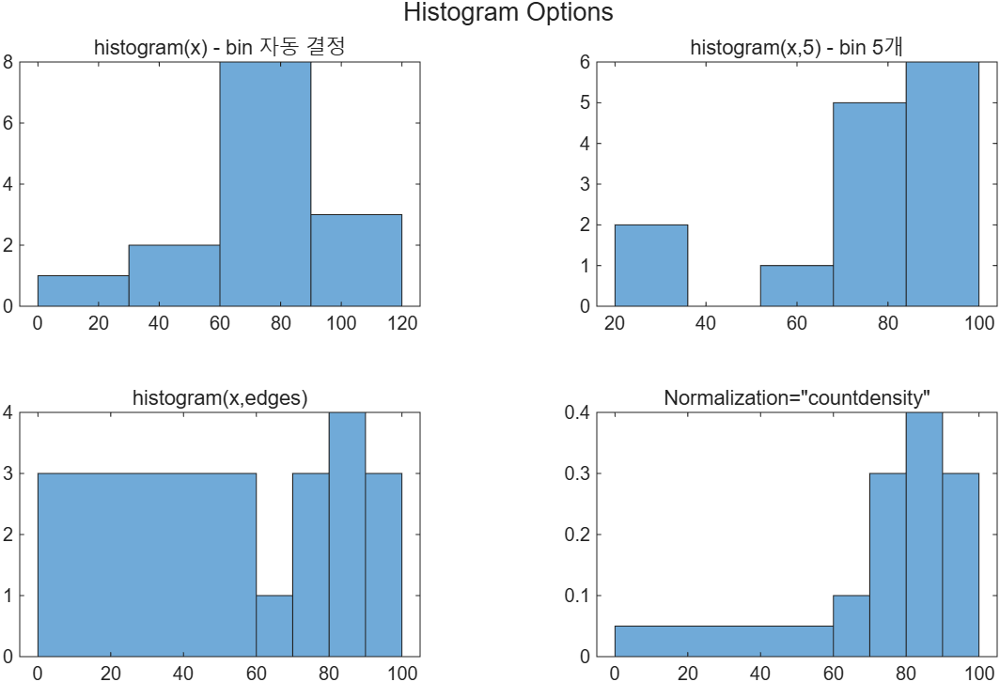
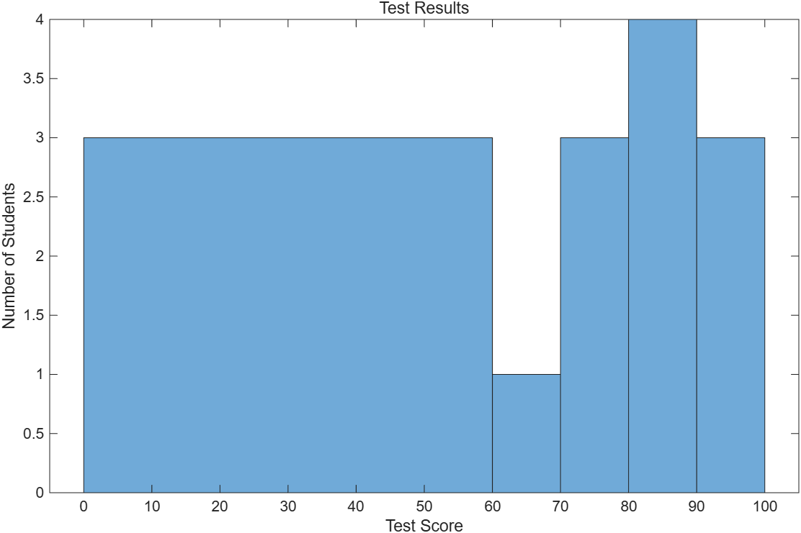

# 5.3.4 히스토그램 (Histograms)

[← 목차](README.md) · [이전: 5.3.3 막대/파이](5.3.3-bar-pie.md) · [다음: 5.3.5 두 개의 y축](5.3.5-yyaxis.md)

히스토그램은 값이 **어느 구간에 몇 개씩 모여 있는지**를 보여 주는 그림이다. 통계 분석의 출발점이고,
막대 그래프와 생김새는 비슷하지만 의미가 다르다. 막대 그래프는 "항목별 값"이고,
히스토그램은 "구간별 개수(도수)"다.

다음 시험 점수 14개를 계속 예제로 쓴다.

```matlab
x = [100,95,74,87,22,78,34,82,93,88,86,69,55,72];
```

## 1) bin을 MATLAB에 맡기기

```matlab
histogram(x)
```

`histogram`은 최솟값과 최댓값 사이를 **같은 폭**으로 나눈 bin을 알아서 정한다.
위 데이터에서는 폭 20짜리 bin(0–20, 20–40, …)이 선택된다.

## 2) bin 개수 지정

```matlab
histogram(x, 5)     % 두 번째 입력이 스칼라 -> bin 개수
```

최솟값~최댓값을 5등분한다. bin 개수를 바꾸면 같은 데이터가 전혀 다른 분포처럼 보인다.

## 3) bin 경계(edge) 직접 지정

```matlab
edges = [0, 60, 70, 80, 90, 100];   % E D C B A
histogram(x, edges)                 % 두 번째 입력이 벡터 -> bin 경계
```

점수처럼 **의미 있는 경계**가 따로 있는 데이터는 폭이 같을 필요가 없다.
경계가 n개면 bin은 n-1개다. 각 bin은 `[edges(k), edges(k+1))`(왼쪽 닫힘, 오른쪽 열림)이고,
마지막 bin만 양쪽을 다 포함한다. 그래서 100점도 마지막 bin에 들어간다.

## 4) 정규화 — 폭이 다른 bin의 함정

앞의 그림에서 0–60 bin에는 3명뿐인데도 폭이 60이라 막대가 유난히 커 보인다.
막대의 **면적**이 도수에 비례하도록 바꾸면 눈속임이 사라진다.

```matlab
histogram(x, edges, Normalization="countdensity")   % 높이 = 도수 / bin 폭
```

| `Normalization` 값 | 막대 높이의 의미 |
|---|---|
| `"count"` (기본) | 그 bin에 든 개수 |
| `"countdensity"` | 개수 / bin 폭 → **면적**이 개수 |
| `"probability"` | 개수 / 전체 개수 (합 = 1) |
| `"pdf"` | 확률밀도 → 전체 면적 = 1 |
| `"cdf"` | 누적 분포 |

> **[보강]** 슬라이드는 `"countdensity"` 하나만 다룬다. 나머지 네 가지는 도움말(`doc histogram`)에서
> 가져와 표로 정리한 것이다.

```matlab
x = [100,95,74,87,22,78,34,82,93,88,86,69,55,72];   % 14명의 시험 점수

t = tiledlayout(2,2);
title(t, "Histogram Options")

nexttile
histogram(x)
title("histogram(x) - bin 자동 결정")

nexttile
histogram(x, 5)
title("histogram(x,5) - bin 5개")

edges = [0, 60, 70, 80, 90, 100];   % E D C B A 학점 경계
nexttile
histogram(x, edges)
title("histogram(x,edges)")

nexttile
histogram(x, edges, Normalization="countdensity")
title("Normalization=""countdensity""")
```

실행 코드: [`example/ch05/ex0534_histogram.m`](../../example/ch05/ex0534_histogram.m)



## 5) 제목과 축 라벨

히스토그램도 다른 플롯과 똑같이 주석을 단다.

```matlab
histogram(x, edges)
xlabel("Test Score")
ylabel("Number of Students")
title("Test Results")
```

## 6) `histcounts` — 그림 없이 숫자만

`histogram`이 내부에서 세는 값을 그대로 돌려주는 함수다. 계산에 다시 쓰려면 이쪽을 쓴다.

```matlab
x = [100,95,74,87,22,78,34,82,93,88,86,69,55,72];
edges = [0, 60, 70, 80, 90, 100];

n = histcounts(x, edges);           % edge 기준 도수
fprintf("edges 기준 도수: %s\n", mat2str(n));

[nAuto, edgesAuto] = histcounts(x); % bin 경계까지 함께 받기
fprintf("자동 bin 도수 : %s\n", mat2str(nAuto));
fprintf("자동 bin 경계 : %s\n", mat2str(edgesAuto));

fprintf("총 인원(합계) : %d\n", sum(n));

histogram(x, edges)
xlabel("Test Score")
ylabel("Number of Students")
title("Test Results")
```

실행 코드: [`example/ch05/ex0534_histcounts.m`](../../example/ch05/ex0534_histcounts.m)



> **[보강]** `histcounts(x, edges)`의 출력 길이는 항상 `numel(edges) - 1`이다.
> 학점 레이블 배열(`["E" "D" "C" "B" "A"]`)과 길이를 맞출 때 이 규칙을 기억하면 인덱스 오류가 없다.

> **[보강]** R2026a에서는 옵션을 `Normalization="countdensity"`처럼 `Name=Value`로 쓴다.
> 구문법 `histogram(x, edges, "Normalization", "countdensity")`도 여전히 동작한다.

⚠️ **함정**
- `histogram(x, 5)`와 `histogram(x, [5])`는 **다르다**. 스칼라는 bin 개수, 벡터는 bin 경계다.
  경계를 하나만 주는 벡터는 오류가 된다.
- `hist`(옛 함수)와 `histogram`은 다른 함수다. `hist`는 권장되지 않으며 정규화 옵션이 없다.
- bin 개수를 바꿔 가며 "보기 좋은" 그림을 고르는 것은 데이터 왜곡이 되기 쉽다.
  경계를 지정했으면 왜 그 경계인지 설명할 수 있어야 한다.
- 폭이 다른 bin을 `"count"`로 그리면 넓은 bin이 과장되어 보인다. 이때는 `"countdensity"`.

## 연습문제

> **[보강]** 아래 문제와 해답은 슬라이드에 없는 추가 문제다.

1. `rng(0)`으로 씨앗을 고정한 뒤 `randn(1,1000)`으로 난수를 만들고, bin 20개짜리 히스토그램을
   `Normalization="probability"`로 그려라. 모든 bin 확률의 합이 1인지 확인하는 줄도 넣어라.
2. 위 시험 점수와 `edges = [0 60 70 80 90 100]`을 써서 `histcounts`로 학점별 인원을 구하고,
   `A (90 ~ 100) : 3명` 형태로 한 줄씩 출력한 뒤 합계도 찍어라.

해답: [solutions.md](solutions.md#534-히스토그램)
