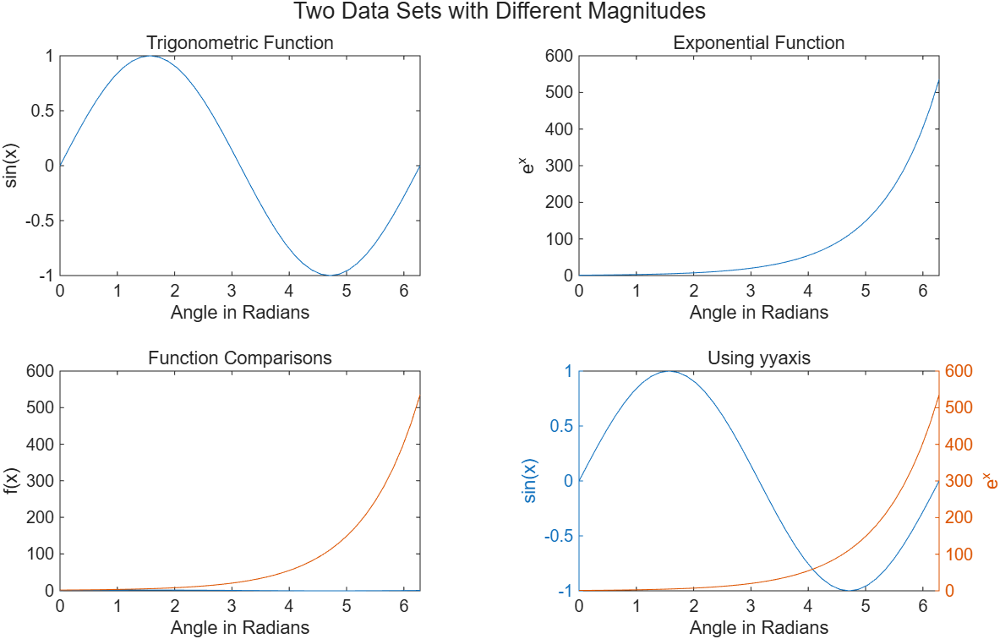
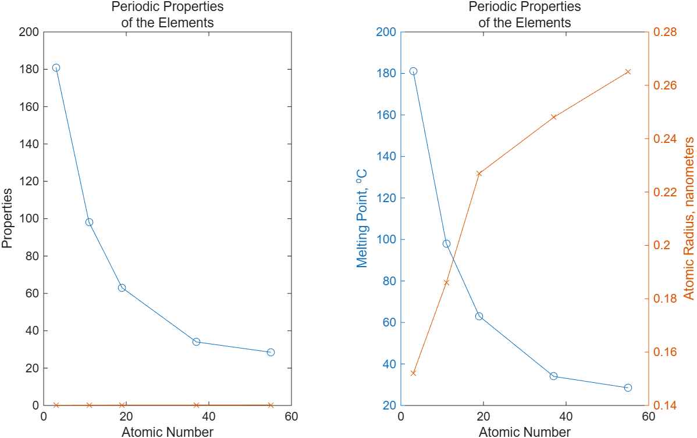

# 5.3.5 y축이 두 개인 그래프 (Graphs with Two y-Axes)

[← 목차](README.md) · [이전: 5.3.4 히스토그램](5.3.4-histogram.md) · [다음: 5.3.6 함수 플롯](5.3.6-fplot.md)

x는 같은데 y의 **크기 차수(order of magnitude)가 크게 다른** 두 데이터를 겹쳐 그리면,
작은 쪽이 바닥에 붙어 정보가 사라진다. 이때 `yyaxis`로 왼쪽/오른쪽 y축을 따로 둔다.

예제 데이터:

```matlab
x  = linspace(0, 2*pi, 41);
y1 = sin(x);    % -1 ~ 1
y2 = exp(x);    % 1 ~ 535
```

`plot(x, y1, x, y2)`로 한 축에 그리면 y축 범위가 0~535로 잡히고 `sin(x)`는 직선처럼 눌린다.

## `yyaxis` 사용법

```matlab
yyaxis left         % 이후의 plot은 왼쪽 축에 그린다 (기본값)
plot(x, y1)
ylabel("sin(x)")

yyaxis right        % 이후의 plot은 오른쪽 축에 그린다
plot(x, y2)
ylabel("e^x")

xlabel("Angle in Radians")
title("Using yyaxis")
```

- `yyaxis left` / `yyaxis right`는 **그 다음에 오는 그리기 명령이 어느 축을 쓸지**를 정하는 스위치다.
- 축 색이 자동으로 선 색과 맞춰진다(왼쪽 파랑, 오른쪽 주황). 그래서 어느 라벨이 어느 곡선인지 알 수 있다.
- `ylabel`, `ylim`, `yticks`도 현재 선택된 쪽에만 적용된다.

실행 코드: [`example/ch05/ex0535_yyaxis.m`](../../example/ch05/ex0535_yyaxis.m)

```matlab
x  = linspace(0, 2*pi, 41);
y1 = sin(x);        % -1 ~ 1
y2 = exp(x);        % 1 ~ 500 이상

t = tiledlayout(2,2);
title(t, "Two Data Sets with Different Magnitudes")

nexttile
plot(x, y1)
title("Trigonometric Function")
xlabel("Angle in Radians"); ylabel("sin(x)")

nexttile
plot(x, y2)
title("Exponential Function")
xlabel("Angle in Radians"); ylabel("e^x")

nexttile
plot(x, y1, x, y2)      % 같은 축 - y1의 정보가 사라진다
title("Function Comparisons")
xlabel("Angle in Radians"); ylabel("f(x)")

nexttile
yyaxis left             % 기본값이므로 생략해도 된다
plot(x, y1)
xlabel("Angle in Radians"); ylabel("sin(x)")
yyaxis right
plot(x, y2)
ylabel("e^x")
title("Using yyaxis")
```



네 타일은 각각 (1) `sin(x)`만, (2) `exp(x)`만, (3) 한 축에 둘 다, (4) `yyaxis`로 나눈 경우다.
(3)에서 사라졌던 `sin(x)`가 (4)에서 되살아나는 것이 이 절의 요점이다.

## Example 5.5 — 원소의 주기적 성질

알칼리 금속(Li, Na, K, Rb, Cs)의 녹는점(°C, 수십~수백)과 원자 반지름(nm, 0.1~0.3)은
차수가 1000배 넘게 차이 난다.

```matlab
atomicNumber = [3, 11, 19, 37, 55];                     % Li Na K Rb Cs
meltingPoint = [181, 98, 63, 34, 28.5];                 % degrees C
atomicRadius = [0.152, 0.186, 0.227, 0.248, 0.265];     % nanometers

t = tiledlayout(1,2);

nexttile
plot(atomicNumber, meltingPoint, "-o", atomicNumber, atomicRadius, "-x")
title(["Periodic Properties"; "of the Elements"])
xlabel("Atomic Number"); ylabel("Properties")

nexttile
yyaxis left
plot(atomicNumber, meltingPoint, "-o")
ylabel("Melting Point, ^oC")
yyaxis right
plot(atomicNumber, atomicRadius, "-x")
ylabel("Atomic Radius, nanometers")
title(["Periodic Properties"; "of the Elements"])
xlabel("Atomic Number")
```

실행 코드: [`example/ch05/ex0535_periodic.m`](../../example/ch05/ex0535_periodic.m)



왼쪽 그림(한 축)에서는 원자 반지름이 완전히 0처럼 깔려 보이지만, 오른쪽 그림에서는
"원자 번호가 커지면 녹는점은 내려가고 반지름은 커진다"는 경향이 한눈에 보인다.

> **[보강]** `title(["줄1"; "줄2"])`처럼 문자열 배열을 주면 제목이 두 줄이 된다.
> 세로로 쌓으려면 각 줄의 길이가 같아야 하는 `char` 배열과 달리, `string` 배열은 길이가 달라도 된다.

> **[보강]** `yyaxis` 이전 버전 코드에서는 `plotyy(x,y1,x,y2)`를 썼다. `plotyy`는 더 이상 권장되지
> 않으니 시험에서는 `yyaxis`로 답하면 된다.

⚠️ **함정**
- `yyaxis right` 상태에서 `hold on` 없이 `plot`을 부르면 **그쪽 축의 기존 곡선만** 지워진다.
  반대쪽 축의 곡선은 남는다.
- 두 축에 legend를 달면 순서가 왼쪽 계열 → 오른쪽 계열이다. 라벨 순서를 확인할 것.
- `yyaxis`를 쓴 axes에서 `ylim`을 조정할 때는 먼저 `yyaxis left`/`right`로 대상을 고른 뒤에 해야 한다.
- 축이 두 개라고 해서 두 곡선의 "교차점"에 물리적 의미가 있는 것은 아니다. 눈금이 서로 다르기 때문이다.

## 연습문제

> **[보강]** 아래 문제와 해답은 슬라이드에 없는 추가 문제다.

1. `x = linspace(0,10,100)`에 대해 `y1 = sin(x)`와 `y2 = x.^3`을 `yyaxis`로 한 그림에 그리고,
   양쪽 y축에 각각 라벨을 달아라.
2. 반응기 데이터 `time = 0:2:20`(분), `temperature = 20 + 3*time`(°C),
   `pressure = 101 + 0.8*time.^2`(kPa)를 두 y축으로 그려라. 마커를 서로 다르게 하고 legend를 붙여라.

해답: [solutions.md](solutions.md#535-y축이-두-개인-그래프)
