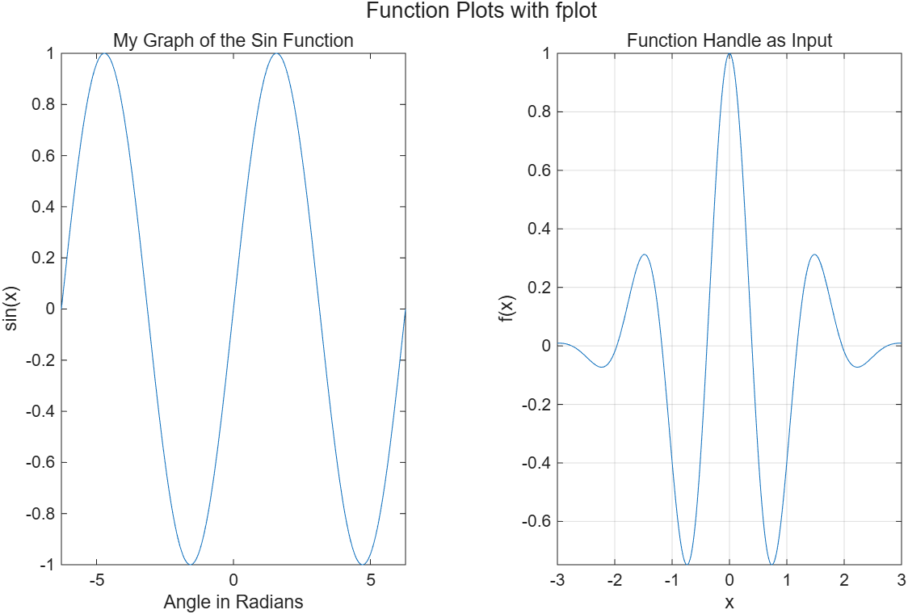

# 5.3.6 함수 플롯 (Function Plots)

[← 목차](README.md) · [이전: 5.3.5 두 개의 y축](5.3.5-yyaxis.md) · [다음: 5.4.1 3차원 선 그래프](5.4.1-plot3.md)

지금까지는 x 배열을 만들고 y를 계산한 뒤 `plot(x,y)`를 불렀다. `fplot`은 그 과정을 생략한다.
**함수 자체**와 **x 범위**만 주면 MATLAB이 곡선이 매끄러워지도록 점 간격을 알아서 조절한다.

```matlab
fplot(@(x) sin(x), [-2*pi, 2*pi])
```

인자는 두 덩어리다.

1. `@(x) sin(x)` — `@` 뒤 괄호에 **독립변수 이름**, 그 뒤에 **식**. 이것을 익명 함수(anonymous function)라 한다.
2. `[-2*pi, 2*pi]` — 그릴 **범위**를 담은 2원소 배열.

제목·라벨·격자는 다른 플롯과 똑같이 붙인다.

```matlab
fplot(@(x) sin(x), [-2*pi, 2*pi])
title("My Graph of the Sin Function")
xlabel("Angle in Radians")
ylabel("sin(x)")
```

## 함수 핸들을 변수에 담기

식이 길면 미리 변수에 저장해 두고 이름만 넘긴다. 이 변수가 **함수 핸들(function handle)**이다.

```matlab
fun = @(x) exp(-x.^2/2) .* cos(4*x);
fplot(fun, [-3, 3])
```

`fun`을 workspace에서 보면 값이 `@(x)exp(-x.^2/2).*cos(4*x)`로 표시되고 클래스는 `function_handle`이다.
함수 핸들과 익명 함수는 함수(function)를 다루는 뒤 장에서 자세히 배운다.

실행 코드: [`example/ch05/ex0536_fplot.m`](../../example/ch05/ex0536_fplot.m)

```matlab
t = tiledlayout(1,2);
title(t, "Function Plots with fplot")

nexttile
fplot(@(x) sin(x), [-2*pi, 2*pi])       % @(독립변수) 함수, [범위]
title("My Graph of the Sin Function")
xlabel("Angle in Radians"); ylabel("sin(x)")

fun = @(x) exp(-x.^2/2) .* cos(4*x);    % 함수 핸들을 변수에 저장
nexttile
fplot(fun, [-3, 3])
title("Function Handle as Input")
xlabel("x"); ylabel("f(x)")
grid on
```



## `plot`과 비교

> **[보강]** 아래 비교표는 슬라이드에 없다. 두 함수를 언제 골라 쓸지 정리한 것이다.

| | `plot(x,y)` | `fplot(f, [a b])` |
|---|---|---|
| 입력 | 계산해 둔 배열 두 개 | 함수 + 범위 |
| 점 간격 | 내가 정한 그대로 | 곡선이 급한 곳은 촘촘하게 자동 조절 |
| 데이터 그리기 | 가능 | 불가능(식이 있어야 한다) |
| 급변 구간 | 점이 성기면 각져 보임 | 자동으로 보완 |

> **[보강]** 범위를 생략하면 `fplot(fun)`은 기본값 `[-5, 5]`를 쓴다. 슬라이드는 "입력 3개"라고
> 설명하지만(변수, 식, 범위), 문법상으로는 인자가 2개다: 함수 핸들 하나와 범위 배열 하나.

> **[보강]** 여러 곡선을 겹치려면 `hold on` 뒤에 `fplot`을 다시 부르거나,
> `fplot(@(x) sin(x), [-pi pi]); hold on; fplot(@(x) cos(x), [-pi pi]); hold off`처럼 쓴다.
> 3차원 곡선용 `fplot3`, 음함수용 `fimplicit`, 곡면용 `fsurf`도 같은 사용법이다.

⚠️ **함정**
- 익명 함수 안에서는 배열 연산자를 써야 한다. `@(x) x^2`은 `x`가 배열일 때 행렬 거듭제곱이 되어
  오류가 난다. `@(x) x.^2`처럼 **점 연산자**를 쓸 것.
- 범위는 `[a, b]` **배열**이다. `fplot(@(x) sin(x), -2*pi, 2*pi)`처럼 따로 주면 오류다.
- `fplot(sin(x), [-pi pi])`처럼 `@`를 빼면 "x가 없다"는 오류가 난다. `@(x)`가 있어야 함수다.
- 함수 핸들 변수 이름을 `sin`, `plot` 같은 내장 함수 이름으로 두면 그 함수를 가려 버린다.

## 연습문제

> **[보강]** 아래 문제와 해답은 슬라이드에 없는 추가 문제다.

1. `fplot`으로 감쇠 진동 `f(x) = exp(-x/3) * sin(3x)`를 `[0, 10]` 구간에 그리고 제목, 축 라벨,
   격자를 넣어라.
2. `g = @(x) x.^2 - 3*x + 2`를 함수 핸들 변수로 만들고 `[-1, 4]`에서 `fplot`으로 그려라.
   `yline(0,"--")`로 기준선을 긋고, `g(1)`과 `g(2)` 값을 출력해 근을 확인하라.

해답: [solutions.md](solutions.md#536-함수-플롯)
