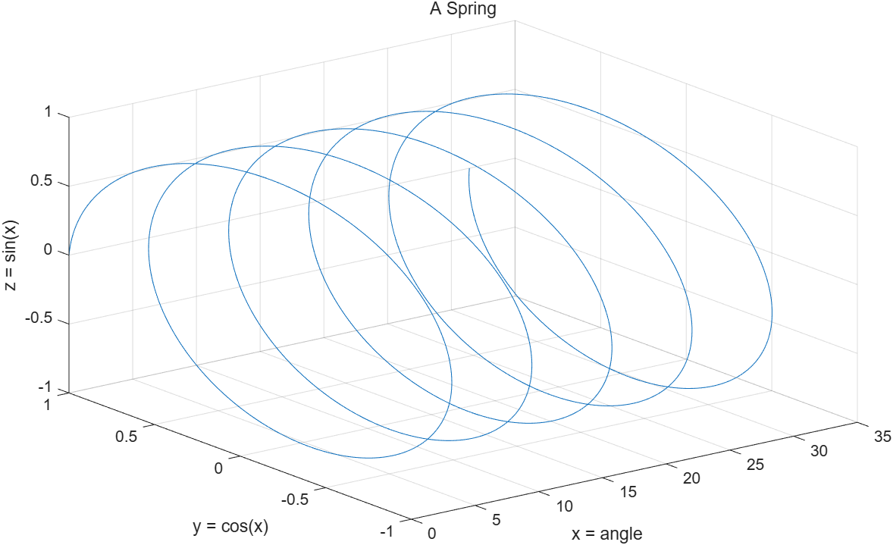
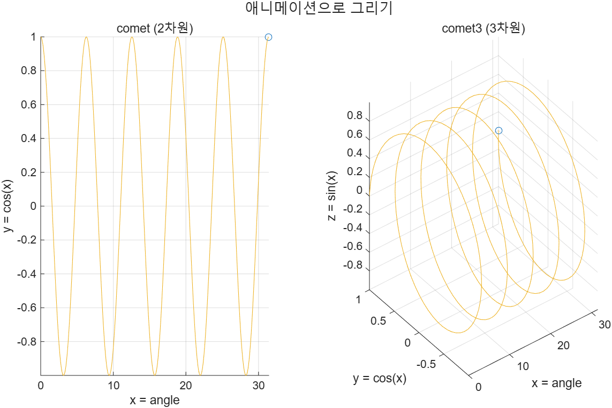

# 5.4.1 3차원 선 그래프 (Three-Dimensional Line Plots)

[← 목차](README.md) · [이전: 5.3.6 함수 플롯](5.3.6-fplot.md) · [다음: 5.4.2 mesh와 surf](5.4.2-mesh-surf.md)

`plot`이 (x, y) 쌍을 이었다면 `plot3`은 (x, y, z) **순서쌍 세 개**를 3차원 공간에 찍고 직선으로 잇는다.
세 벡터의 길이는 모두 같아야 한다.

```matlab
x = linspace(0, 10*pi, 1000);
y = cos(x);
z = sin(x);

plot3(x, y, z)
grid on
xlabel("x = angle")
ylabel("y = cos(x)")
zlabel("z = sin(x)")
title("A Spring")
```

제목·라벨·격자는 2차원과 똑같고, z축 라벨만 `zlabel`로 추가된다.
좌표계는 공학에서 쓰는 **오른손 법칙** 방향이다(x→y로 감을 때 엄지가 z).

실행 코드: [`example/ch05/ex0541_plot3.m`](../../example/ch05/ex0541_plot3.m)

```matlab
x = linspace(0, 10*pi, 1000);
y = cos(x);
z = sin(x);

plot3(x, y, z)
grid on
xlabel("x = angle")
ylabel("y = cos(x)")
zlabel("z = sin(x)")
title("A Spring")
```



## `comet3` — 그려지는 과정을 애니메이션으로

```matlab
comet3(x, y, z)
```

결과 그림은 `plot3`과 같지만 선이 시간에 따라 "그려지는" 모습을 보여 준다.
점이 적으면 순식간에 끝나므로 데이터 점을 늘려야 볼만하다. 2차원 선 그래프용은 `comet`이며,
아래 예제는 둘을 나란히 실행한다.

실행 코드: [`example/ch05/ex0541_comet3.m`](../../example/ch05/ex0541_comet3.m)

```matlab
x = linspace(0, 10*pi, 300);    % 점이 적으면 애니메이션이 너무 빨리 끝난다
y = cos(x);
z = sin(x);

t = tiledlayout(1,2);
title(t, "애니메이션으로 그리기")

nexttile
comet(x, y)                     % 2차원용
grid on
xlabel("x = angle"); ylabel("y = cos(x)")
title("comet (2차원)")

nexttile
comet3(x, y, z)                 % 3차원용
grid on
xlabel("x = angle"); ylabel("y = cos(x)"); zlabel("z = sin(x)")
title("comet3 (3차원)")
```



슬라이드는 Live Script(라이브 스크립트)에서 실행해 애니메이션을 재생하고 MP4로 저장하는 방법을
소개한다. 일반 스크립트에서는 애니메이션이 끝난 마지막 장면만 남는다.

> **[보강]** 시점을 바꾸려면 `view(az, el)`를 쓴다. `view(2)`는 위에서 내려다본 2차원 시점,
> `view(3)`은 기본 3차원 시점이다. 코드로 시점을 고정해 두면 다시 실행해도 같은 그림이 나온다.

⚠️ **함정**
- `plot3(x, y, z)`의 세 입력 길이가 하나라도 다르면 오류다. `length(x)`를 먼저 확인할 것.
- `zlabel`은 `plot`(2차원)에서는 의미가 없다. 3차원 축에만 쓴다.
- `comet3`는 애니메이션이므로 실행 시간이 데이터 점 수에 비례한다. 점을 수만 개로 잡으면 한참 걸린다.
- `grid on`을 빼면 3차원 그림은 깊이감이 사라져 해석하기 어렵다. 3차원 플롯에서는 거의 필수다.

## 연습문제

> **[보강]** 아래 문제와 해답은 슬라이드에 없는 추가 문제다.

1. 반지름 1인 나선(helix) `x = cos(t)`, `y = sin(t)`, `z = t`를 `t = 0 ~ 6π`에서 `plot3`로 그려라.
   격자와 세 축 라벨, 제목을 넣어라.
2. 3차원 리사주 곡선 `x = sin(3t)`, `y = sin(4t)`, `z = sin(5t)` (`t = 0 ~ 2π`)를 두 타일에 그리되,
   오른쪽 타일은 `view(0, 90)`으로 위에서 내려다본 모습으로 만들어라.

해답: [solutions.md](solutions.md#541-3차원-선-그래프)
