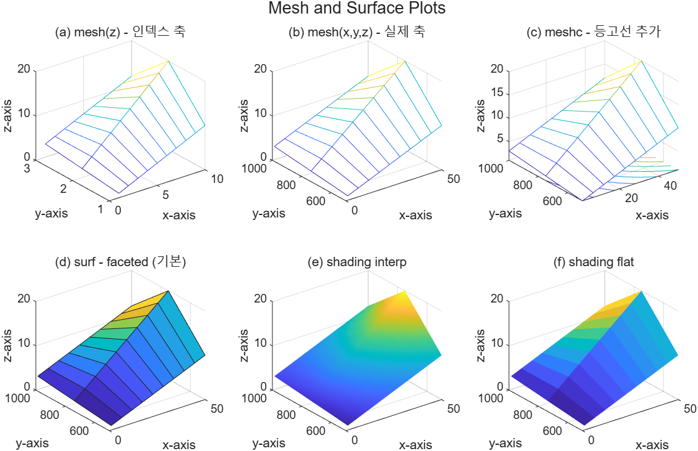
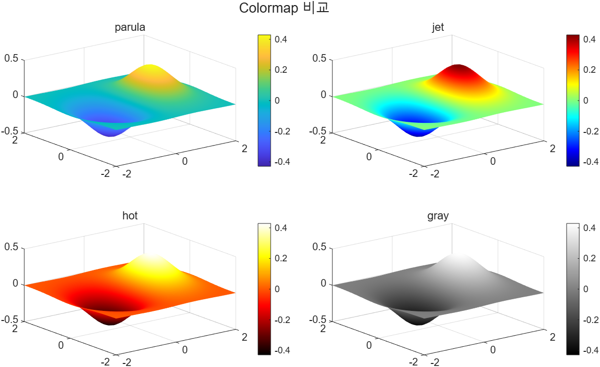
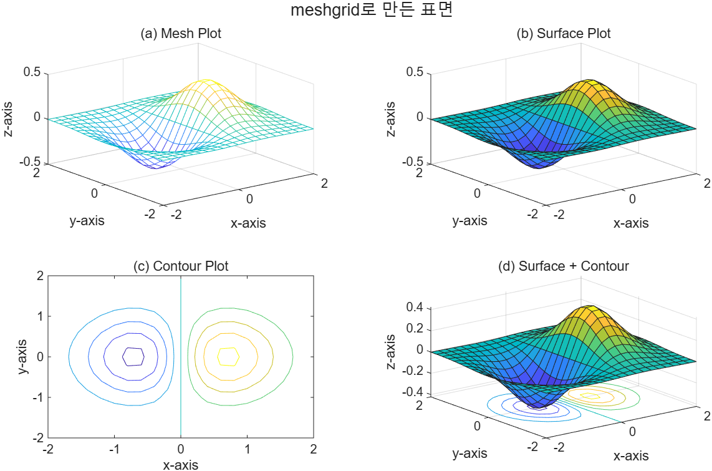

# 5.4.2 곡면 그래프 — mesh와 surf (Surface Plots)

[← 목차](README.md) · [이전: 5.4.1 3차원 선 그래프](5.4.1-plot3.md) · [다음: 5.4.3 등고선과 pcolor](5.4.3-contour-pcolor.md)

곡면 그래프는 **독립변수가 두 개**인 함수를 그린다. 수학 표기로는

```
z = f(x, y)        또는        y = f(x1, x2)
```

둘은 같은 뜻이다(어느 변수를 종속변수로 부르느냐의 차이). 결과는 2차원 배열 `z` 하나이며,
`mesh`는 이를 격자선(wireframe)으로, `surf`는 색이 칠해진 면으로 보여 준다.

## 입력이 1개일 때 — 축은 인덱스 번호

이미 계산된 2차원 배열이 있으면 그대로 넘긴다.

```matlab
z = [ 1, 2, 3, 4,  5,  6,  7,  8,  9, 10;
      2, 4, 6, 8, 10, 12, 14, 16, 18, 20;
      3, 4, 5, 6,  7,  8,  9, 10, 11, 12];   % 3x10
mesh(z)
```

이때 x축은 **열 번호 1~10**, y축은 **행 번호 1~3**이다. 즉 `z(2,5) = 10`은
"x = 5, y = 2에서 높이 10"으로 그려진다. 행이 y, 열이 x라는 순서를 놓치면 그림을 잘못 읽는다.

## 입력이 3개일 때 — 실제 x, y 값

측정 조건이 인덱스가 아니라 실제 값이라면 `x`, `y` 벡터를 함께 준다.

```matlab
x = linspace(1, 50, 10);      % 길이 = z의 열 개수(10)
y = linspace(500, 1000, 3);   % 길이 = z의 행 개수(3)
mesh(x, y, z)
```

**크기 규칙**(시험 단골):

```
numel(x) == size(z, 2)   % x는 열 개수와 같아야 한다
numel(y) == size(z, 1)   % y는 행 개수와 같아야 한다
```

그림 모양은 거의 같고 **축 눈금만** 바뀐다.

## `surf`와 shading

`surf`는 `mesh`와 입력 규칙이 같고, 면을 z 값에 따른 색으로 칠한다. 면의 음영 방식은 `shading`으로 정한다.

| 명령 | 결과 |
|---|---|
| `shading faceted` | 기본값. 면마다 단색 + 검은 격자선 |
| `shading interp` | 꼭짓점 색을 보간해 부드럽게. 격자선 없음 |
| `shading flat` | 면마다 단색, 격자선 없음 |

아래 예제는 같은 데이터를 `mesh`(입력 1개/3개), `meshc`, 그리고 `surf`의 음영 세 가지로 그린다.

실행 코드: [`example/ch05/ex0542_mesh_surf.m`](../../example/ch05/ex0542_mesh_surf.m)

```matlab
z = [ 1, 2, 3, 4,  5,  6,  7,  8,  9, 10;
      2, 4, 6, 8, 10, 12, 14, 16, 18, 20;
      3, 4, 5, 6,  7,  8,  9, 10, 11, 12];   % 3x10 배열

x = linspace(1, 50, 10);      % 열 개수(10)와 같아야 한다
y = linspace(500, 1000, 3);   % 행 개수(3)와 같아야 한다

t = tiledlayout(2,3);
title(t, "Mesh and Surface Plots")

nexttile
mesh(z)                        % 입력 1개 - 축은 인덱스 번호
title("(a) mesh(z) - 인덱스 축")
xlabel("x-axis"); ylabel("y-axis"); zlabel("z-axis")

nexttile
mesh(x, y, z)                  % 입력 3개 - 실제 x, y 값
title("(b) mesh(x,y,z) - 실제 축")
xlabel("x-axis"); ylabel("y-axis"); zlabel("z-axis")

nexttile
meshc(x, y, z)                 % 격자선 곡면 + 아래쪽 등고선
title("(c) meshc - 등고선 추가")
xlabel("x-axis"); ylabel("y-axis"); zlabel("z-axis")

nexttile
surf(x, y, z)                  % 색이 칠해진 면
title("(d) surf - faceted (기본)")
xlabel("x-axis"); ylabel("y-axis"); zlabel("z-axis")

nexttile
surf(x, y, z)
shading interp                 % 면 사이를 보간하고 격자선을 없앤다
title("(e) shading interp")
xlabel("x-axis"); ylabel("y-axis"); zlabel("z-axis")

nexttile
surf(x, y, z)
shading flat                   % 면마다 단색, 격자선만 제거
title("(f) shading flat")
xlabel("x-axis"); ylabel("y-axis"); zlabel("z-axis")
```



## colormap — 색 배합 바꾸기

색이 z 값을 나타내므로 배합을 바꾸면 인상이 달라진다. 기본값은 `parula`다.

```matlab
[X, Y] = meshgrid(-2:0.1:2);        % 벡터 하나만 주면 meshgrid(x,x)와 같다
Z = X .* exp(-X.^2 - Y.^2);

maps = ["parula", "jet", "hot", "gray"];

t = tiledlayout(2,2);
title(t, "Colormap 비교")

for k = 1 : numel(maps)
    ax = nexttile;
    surf(ax, X, Y, Z)
    shading interp
    colormap(ax, maps(k))           % axes 단위로 colormap을 지정할 수 있다
    colorbar(ax)
    title(ax, maps(k))
end
```

실행 코드: [`example/ch05/ex0542_colormap.m`](../../example/ch05/ex0542_colormap.m)



## `meshgrid` — 두 독립변수를 격자로 펼치기

다음 함수를 그린다고 하자.

```
z(x, y) = x * exp(-x^2 - y^2)
```

MATLAB 식으로는 `Z = X.*exp(-X.^2 - Y.^2);`인데, 이 줄은 `X`와 `Y`의 **크기가 같을 때만** 계산된다.
1×21 벡터 두 개로는 안 되고, 두 변수의 모든 조합을 담은 21×21 배열 두 개가 필요하다.
그 변환이 `meshgrid`다.

```matlab
x = -2 : 0.2 : 2;       % 1x21
y = -2 : 0.2 : 2;       % 1x21
[X, Y] = meshgrid(x, y);% 각각 21x21
Z = X .* exp(-X.^2 - Y.^2);
```

`X`는 x값이 행마다 반복된 배열, `Y`는 y값이 열마다 반복된 배열이다. 둘을 겹치면
격자의 모든 교점 좌표가 된다.

**HINT (슬라이드)**
- 벡터를 하나만 주면 `meshgrid(x)`는 `meshgrid(x, x)`와 같다.
- 정의를 그대로 넣어도 된다: `[X, Y] = meshgrid(-2:0.2:2)`.

```matlab
x = -2 : 0.2 : 2;
y = -2 : 0.2 : 2;
[X, Y] = meshgrid(x, y);        % 1x21 벡터 두 개 -> 21x21 배열 두 개
Z = X .* exp(-X.^2 - Y.^2);     % 배열 크기가 맞아야 계산된다

fprintf("x: %s, X: %s, Z: %s\n", mat2str(size(x)), mat2str(size(X)), mat2str(size(Z)));

t = tiledlayout(2,2);
title(t, "meshgrid로 만든 표면")

nexttile
mesh(X, Y, Z)
title("(a) Mesh Plot"); xlabel("x-axis"); ylabel("y-axis"); zlabel("z-axis")

nexttile
surf(X, Y, Z)
title("(b) Surface Plot"); xlabel("x-axis"); ylabel("y-axis"); zlabel("z-axis")

nexttile
contour(X, Y, Z)
title("(c) Contour Plot"); xlabel("x-axis"); ylabel("y-axis")

nexttile
surfc(X, Y, Z)
title("(d) Surface + Contour"); xlabel("x-axis"); ylabel("y-axis"); zlabel("z-axis")
```

실행 코드: [`example/ch05/ex0542_meshgrid.m`](../../example/ch05/ex0542_meshgrid.m)



> **[보강]** `surfc`는 곡면(`surf`) 아래에 등고선(`contour`)을 함께 그린다. `meshc`도 같은 방식이다.
> 등고선만 따로 보는 방법은 다음 절에서 다룬다.

> **[보강]** `colormap(gca, "jet")`처럼 첫 인자로 axes를 주면 그 축에만 적용된다.
> `colormap("jet")`만 쓰면 현재 figure 전체에 적용되어 tiledlayout의 모든 타일이 함께 바뀐다.

⚠️ **함정**
- `X.*exp(...)`의 점 연산자를 빼면(`X*exp(...)`) 행렬 곱이 되어 크기가 안 맞거나 엉뚱한 값이 나온다.
- `meshgrid(x, y)`의 결과 크기는 `numel(y) × numel(x)`다. **행이 y, 열이 x**로 뒤집혀 들어간다.
- `mesh(x, y, z)`에서 x와 y를 바꿔 넣으면 "크기가 맞지 않는다"는 오류가 나거나, 크기가 우연히 같으면
  **오류 없이 잘못된 그림**이 나온다. 후자가 더 위험하다.
- `shading interp` 뒤에는 격자선이 사라지므로 격자가 필요하면 `surf` 대신 `mesh`를 쓰거나
  `shading faceted`로 되돌린다.

## 연습문제

> **[보강]** 아래 문제와 해답은 슬라이드에 없는 추가 문제다.

1. `[X, Y] = meshgrid(-8:0.5:8)`로 격자를 만들고 `R = sqrt(X.^2 + Y.^2) + eps`,
   `Z = sin(R)./R`인 멕시코 모자 곡면을 `surf`로 그려라. `shading interp`와 `colorbar`를 적용하라.
   (`eps`를 더하는 이유를 한 줄로 설명하라.)
2. `z = magic(6)`을 `mesh(z)`와 `mesh(x, y, z)`(`x = linspace(0,100,6)`, `y = linspace(10,60,6)`)로
   나란히 그려 축 눈금이 어떻게 달라지는지 보여라.

해답: [solutions.md](solutions.md#542-곡면-그래프)
