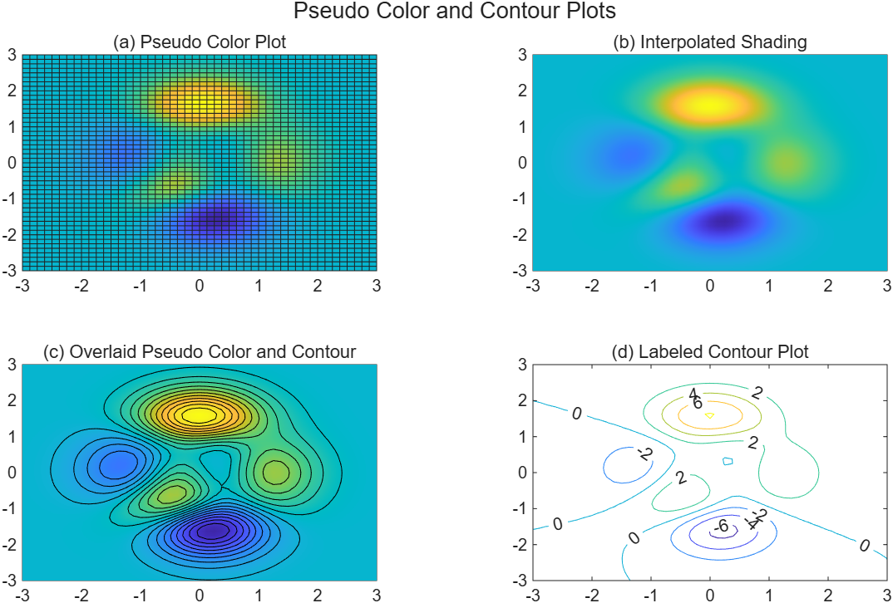
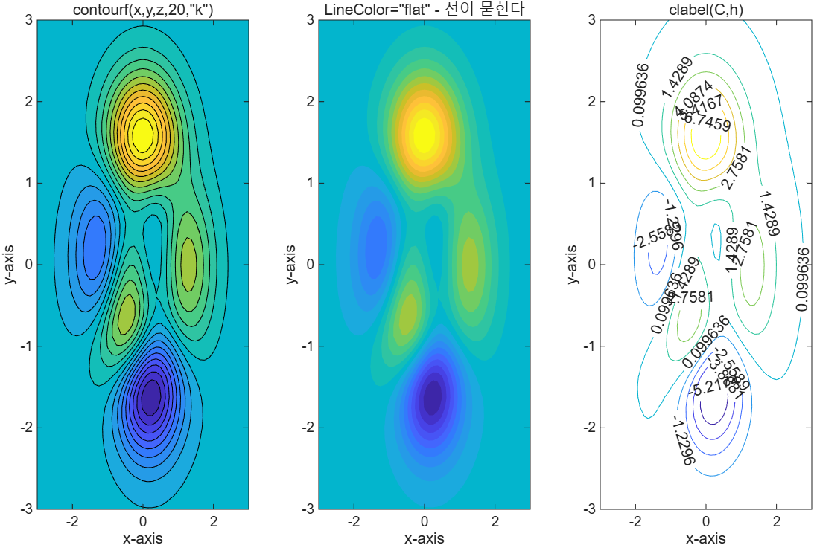

# 5.4.3 등고선과 의사 색상 그래프 (Contour and Pseudo Color Plots)

[← 목차](README.md) · [이전: 5.4.2 mesh와 surf](5.4.2-mesh-surf.md) · [다음: 5.5 플롯 편집](5.5-editing-plots.md)

> **[보강]** 교재는 등고선·pcolor를 5.4.2의 뒷부분에서 함께 다루지만, 분량이 많아 이 노트에서는
> 5.4.3으로 따로 떼어 정리한다. 시험 범위는 같다.

3차원 곡면을 **2차원 평면에 눌러** 표현하는 두 가지 방법이다.
등산 지도의 등고선을 떠올리면 된다.

| 함수 | 하는 일 |
|---|---|
| `contour(x,y,z)` | 같은 높이를 잇는 등고선만 그린다 |
| `contourf(x,y,z)` | 등고선 사이를 색으로 채운다 |
| `surfc(x,y,z)` | 곡면 + 그 아래 등고선 |
| `pcolor(x,y,z)` | 격자 칸을 z 값에 따라 칠한다 (의사 색상) |
| `clabel` | 등고선에 값 표시 |

## 예제 함수 `peaks`

MATLAB은 실습용 곡면 `peaks`를 내장하고 있다. 산맥처럼 봉우리와 골이 섞인 49×49 데이터다.

```matlab
[x, y, z] = peaks;      % x, y, z 모두 49x49 배열
```

## `pcolor` — 격자를 색으로 칠하기

```matlab
pcolor(x, y, z)         % 기본: 칸마다 단색 + 검은 격자선
shading interp          % 색을 보간해 부드럽게, 격자선 제거
```

`pcolor`는 위에서 내려다본 `surf`라고 생각하면 된다(높이 대신 색만 남긴 것).

## 등고선 겹치기

의사 색상 위에 등고선을 얹으면 "색 + 높이 값"을 같이 읽을 수 있다.

```matlab
pcolor(x, y, z)
shading interp
hold on
contour(x, y, z, 20, "k")   % 등고선 20개, 검은색
hold off
```

세 번째 인자 `20`은 **등고선 개수**, `"k"`는 선 색이다.

> **[보강]** 슬라이드는 "선 색을 지정하지 않으면 등고선이 pcolor 색에 묻힌다"고 설명하지만,
> R2026a의 `contourf`는 기본적으로 어두운 선을 그리므로 지정하지 않아도 선이 보인다.
> 선이 면 색에 묻히는 상황은 `LineColor="flat"`으로 명시했을 때다. 아래 예제의 가운데 타일이 그 경우다.

같은 결과를 한 줄로 얻는 방법도 있다.

```matlab
contourf(x, y, z, 20, "k")
```

실행 코드: [`example/ch05/ex0543_pcolor_contour.m`](../../example/ch05/ex0543_pcolor_contour.m)

```matlab
[x, y, z] = peaks;      % MATLAB이 제공하는 49x49 예제 표면

t = tiledlayout(2,2);
title(t, "Pseudo Color and Contour Plots")

nexttile
pcolor(x, y, z)
title("(a) Pseudo Color Plot")

nexttile
pcolor(x, y, z)
shading interp          % 격자선이 사라지고 색이 부드럽게 이어진다
title("(b) Interpolated Shading")

nexttile
pcolor(x, y, z)
shading interp
hold on
contour(x, y, z, 20, "k")   % 등고선 20개를 검은색으로 겹쳐 그린다
hold off
title("(c) Overlaid Pseudo Color and Contour")

nexttile
contour(x, y, z, ShowText=true)
title("(d) Labeled Contour Plot")
```



실행 코드: [`example/ch05/ex0543_contourf.m`](../../example/ch05/ex0543_contourf.m)

```matlab
[x, y, z] = peaks;

t = tiledlayout(1,3);

nexttile
contourf(x, y, z, 20, "k")      % 등고선 20개, 선 색은 검정
title("contourf(x,y,z,20,""k"")")
xlabel("x-axis"); ylabel("y-axis")

nexttile
contourf(x, y, z, 20, LineColor="flat")   % 선 색을 면 색에 맞추면 등고선이 묻힌다
title("LineColor=""flat"" - 선이 묻힌다")
xlabel("x-axis"); ylabel("y-axis")

nexttile
[C, h] = contour(x, y, z, 10);  % 등고선 행렬 C와 객체 h를 함께 받는다
clabel(C, h)                    % 슬라이드의 clabel 방식
title("clabel(C,h)")
xlabel("x-axis"); ylabel("y-axis")
```



## 등고선에 값 표시하기

교재 슬라이드는 다음과 같이 쓴다.

```matlab
h = contour(x, y, z);
clabel(h)
```

> **[보강]** R2026a에서 `contour`의 출력 하나짜리 호출은 **Contour 객체**를 돌려주므로
> `clabel(h)` 형태는 더 이상 맞지 않는다. 다음 두 가지 중 하나를 쓴다.
>
> ```matlab
> contour(x, y, z, ShowText=true)      % 권장: 옵션 한 개로 끝
> [C, h] = contour(x, y, z); clabel(C, h)   % 등고선 행렬 C와 객체 h를 모두 받는 방식
> ```
>
> 본문 예제는 `ShowText=true`를 쓰고,
> `ex0543_contourf.m`의 세 번째 타일에서 `[C,h] = contour(...); clabel(C,h)` 형태도 함께 실행해 둔다.
> 옛 코드에서 `clabel(h)`를 보면 "출력이 하나였던 시절의 문법"이라고 이해하면 된다.

## 무엇을 언제 쓰나

> **[보강]** 이 정리는 슬라이드에 없다. 네 함수의 쓰임새를 한눈에 비교하려고 덧붙였다.

- 값의 **크기 분포**만 빠르게 보고 싶다 → `pcolor` + `shading interp`
- 특정 높이의 **경계선**이 중요하다(등압선, 등온선) → `contour`
- 지도처럼 **채워진 층**으로 보고 싶다 → `contourf`
- 3차원 형태와 등고선을 함께 → `surfc`

⚠️ **함정**
- `pcolor`는 **마지막 행과 열을 그리지 않는다**(칸의 네 꼭짓점이 필요하기 때문).
  49×49 데이터면 48×48 칸이 그려진다. 경계 데이터가 중요한 경우 주의.
- `contour(x,y,z,20)`의 `20`은 등고선 "개수"지만, `contour(x,y,z,[0 2 4])`처럼 **벡터**를 주면
  그 높이에만 등고선을 그린다. 스칼라와 벡터의 의미가 다르다.
- 등고선 색을 지정하지 않고 색이 칠해진 배경 위에 겹치면 선이 보이지 않는다.
- `hold on` 뒤 `hold off`를 잊으면 다음 플롯이 같은 축에 겹쳐 그려진다.

## 연습문제

> **[보강]** 아래 문제와 해답은 슬라이드에 없는 추가 문제다.

1. `peaks` 데이터를 등고선 20개로 그리고 각 등고선에 값이 표시되도록 하라(`ShowText=true`).
   `colorbar`도 붙여라.
2. 같은 데이터를 왼쪽에는 `pcolor` + `shading interp`, 오른쪽에는 `contourf(...,20,"k")`로
   나란히 그려 두 표현을 비교하라.

해답: [solutions.md](solutions.md#543-등고선과-의사-색상-그래프)
