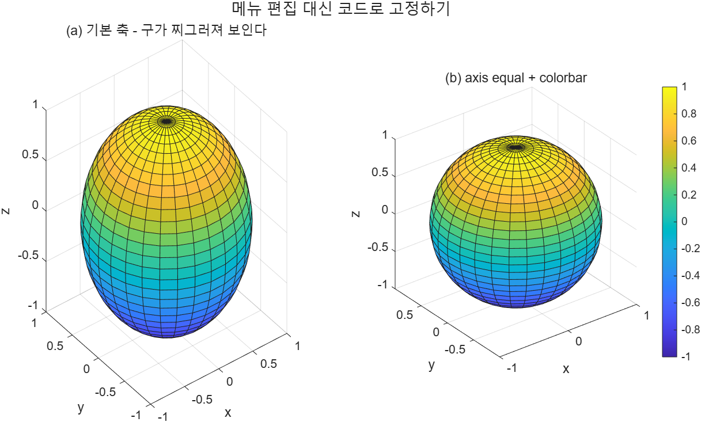

# 5.5 창에서 플롯 편집하기 (Editing Plots from the Menu Bar)

[← 목차](README.md) · [이전: 5.4.3 등고선](5.4.3-contour-pcolor.md) · [다음: 5.6 Workspace에서 플롯 만들기](5.6-workspace-plots.md)

MATLAB은 명령으로 그림을 꾸미는 방법 외에, **다 그려진 figure를 마우스로 고치는** 방법도 제공한다.
슬라이드는 `sphere` 함수로 만든 구를 예로 든다(`peaks`처럼 실습용 예제 함수다).

## figure 창의 메뉴

| 메뉴 | 할 수 있는 일 |
|---|---|
| **Insert** | 축 라벨, 제목, legend, 텍스트 상자, 화살표 삽입 |
| **Tools** | 확대/축소, 데이터 커서, 종횡비(aspect ratio) 조절, 회전 |
| **Edit → Axes Properties** | Property Inspector를 열어 축 속성을 직접 수정 |
| **File → Save As** | 그림 저장 (5.7절) |

메뉴 아래 **Figure Toolbar**의 아이콘으로도 같은 일을 할 수 있다.

슬라이드의 편집 순서(구를 제대로 보이게 만들기):

1. `Edit → Axes Properties` 선택
2. Property Inspector에서 `Position → Data Aspect Ratio Mode`를 찾는다
3. 모드를 `manual`로 바꾼다 → 세 축의 눈금 간격이 같아져 구가 구처럼 보인다
4. 이어서 라벨, 제목, colorbar를 Property Editor나 Insert 메뉴로 추가한다

## 대화식 편집의 치명적 단점

이렇게 고친 내용은 **figure에만** 남는다. 스크립트를 다시 실행하면 새 figure가 그려지고
편집 결과는 사라진다. 그래서 교재는 같은 일을 **코드로** 해 두라고 권한다.

**HINT (슬라이드)** — `axis equal`을 쓰면 모든 축의 데이터 간격이 같아진다.
이 방법은 M-file에 넣어 둘 수 있어 다시 실행해도 결과가 유지된다.

```matlab
[X, Y, Z] = sphere(30);     % 30x30 면으로 나눈 단위 구

t = tiledlayout(1,2);
title(t, "메뉴 편집 대신 코드로 고정하기")

nexttile
surf(X, Y, Z)
title("(a) 기본 축 - 구가 찌그러져 보인다")
xlabel("x"); ylabel("y"); zlabel("z")

ax = nexttile;
surf(X, Y, Z)
axis equal                  % 세 축의 눈금 간격을 같게 -> 진짜 구 모양
colorbar(ax)                % 색이 무엇을 뜻하는지 표시
title("(b) axis equal + colorbar")
xlabel("x"); ylabel("y"); zlabel("z")
```

실행 코드: [`example/ch05/ex0550_sphere.m`](../../example/ch05/ex0550_sphere.m)



왼쪽은 기본 축(구가 눌려 보인다), 오른쪽은 `axis equal`을 적용한 결과다.

> **[보강]** `axis` 명령의 다른 형태도 함께 외워 두면 좋다.
> `axis square`(축 상자를 정사각형으로), `axis tight`(데이터에 딱 맞게), `axis off`(축 감추기),
> `axis([xmin xmax ymin ymax])`(범위 직접 지정).

> **[보강]** 대화식으로 편집한 뒤 `File → Generate Code`를 고르면 그 그림을 다시 만드는
> 스크립트를 MATLAB이 써 준다. 마우스로 찾은 설정을 코드로 옮길 때 편하다.

⚠️ **함정**
- 대화식 편집 결과는 스크립트를 재실행하면 사라진다. 시험 답안이나 보고서용 그림은 코드로 남길 것.
- `axis equal`은 **데이터 간격**을 같게 만드는 것이지 축 상자를 정사각형으로 만드는 것이 아니다.
  후자는 `axis square`다.
- `sphere`를 출력 없이 `sphere(30)`으로만 부르면 곧바로 그림이 그려진다.
  `[X,Y,Z] = sphere(30)`처럼 출력을 받으면 좌표만 계산되고 그림은 그려지지 않는다.

## 연습문제

> **[보강]** 아래 문제와 해답은 슬라이드에 없는 추가 문제다.

1. `sphere(40)`으로 좌표를 받아 `surf`로 그리고, `shading interp` · `axis equal` · `colorbar` ·
   세 축 라벨 · 제목을 모두 **코드로** 넣어라.
2. `cylinder(1, 40)`으로 원기둥 좌표를 받아 `axis equal`을 적용한 경우와 하지 않은 경우를
   `tiledlayout(1,2)`로 나란히 그려 비교하라.

해답: [solutions.md](solutions.md#55-플롯-편집)
