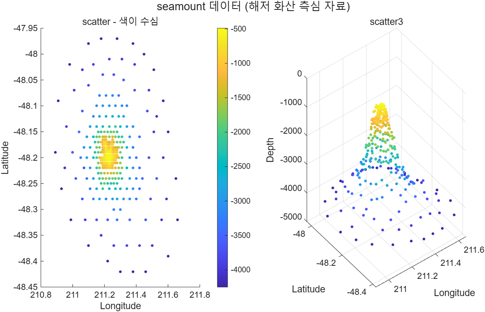

# 5.6 Workspace 창에서 플롯 만들기 (Creating Plots from the Workspace Window)

[← 목차](README.md) · [이전: 5.5 플롯 편집](5.5-editing-plots.md) · [다음: 5.7 플롯 저장](5.7-saving-plots.md)

코드를 한 줄도 쓰지 않고, workspace에 들어 있는 변수를 골라 바로 그림을 그릴 수 있다.

## 순서

1. Workspace 창에서 그릴 변수를 클릭한다.
2. 변수를 여러 개 쓰려면 `Ctrl`을 누른 채 추가로 클릭한다 (예: `x` → `y` → `z`).
3. 데스크톱 위쪽의 **PLOTS 탭**을 선택한다.
4. MATLAB이 그 데이터에 "어울린다고 판단한" 플롯 종류를 아이콘으로 나열한다.
5. 원하는 아이콘을 클릭하면 현재 figure에 그림이 그려지고,
   **그 그림을 만드는 코드가 Command Window에 찍힌다.**
6. 목록에 원하는 것이 없으면 드롭다운을 열어 전체 목록에서 고른다.

6번이 이 기능의 진짜 쓸모다. 생각해 보지 못한 플롯 종류를 제안받을 수 있다.
그리고 5번 덕분에 **마우스로 고른 결과를 코드로 되돌릴 수 있다**.

## 슬라이드 예제 — `seamount`

`seamount`는 MATLAB에 포함된 실측 데이터로, 해저 화산 주변의 경도·위도·수심이 들어 있다.

```matlab
load seamount     % x, y, z (각각 294x1) 이 workspace에 들어온다
whos x y z
```

이 상태에서 `x`를 클릭하고 `Ctrl`을 누른 채 `y`, `z`를 고른 뒤 PLOTS 탭을 열면
`plot`, `scatter`, `scatter3`, `stem3` 등이 제안된다.

같은 그림을 코드로 쓰면 이렇다.

```matlab
load seamount           % x, y, z 벡터가 workspace에 들어온다
whos x y z

t = tiledlayout(1,2);
title(t, "seamount 데이터 (해저 화산 측심 자료)")

nexttile
scatter(x, y, 10, z, "filled")      % PLOTS 탭의 scatter에 해당
colorbar
title("scatter - 색이 수심")
xlabel("Longitude"); ylabel("Latitude")

nexttile
scatter3(x, y, z, 10, z, "filled")  % PLOTS 탭의 scatter3에 해당
title("scatter3")
xlabel("Longitude"); ylabel("Latitude"); zlabel("Depth")
```

실행 코드: [`example/ch05/ex0560_seamount.m`](../../example/ch05/ex0560_seamount.m)



> **[보강]** 변수를 고르는 **순서**가 곧 인자 순서다. `y`를 먼저, `x`를 나중에 고르면
> 축이 뒤바뀐 그림이 나온다. 제안 목록의 아이콘 위에 마우스를 올리면 어떤 함수인지 이름이 뜬다.

> **[보강]** 변수 하나만 고르면 x축은 인덱스가 된다. 두 개를 고르면 앞이 x, 뒤가 y다.

⚠️ **함정**
- PLOTS 탭으로 만든 그림도 **스크립트에는 남지 않는다**. Command Window에 찍힌 코드를 복사해
  스크립트에 붙여 넣어야 다시 만들 수 있다.
- 제안 목록은 변수의 크기·형태에 따라 달라진다. 크기가 다른 두 변수를 고르면 목록이 비거나
  엉뚱한 것만 나온다.
- 이 기능은 데스크톱(GUI)에서만 쓸 수 있다. `-batch`로 실행하는 스크립트에는 해당 사항이 없다.

## 연습문제

> **[보강]** 아래 문제와 해답은 슬라이드에 없는 추가 문제다.

1. `load seamount` 후, PLOTS 탭이 제안할 법한 세 가지(`plot`, `scatter`, `stem3`)를
   `tiledlayout(1,3)`으로 한 figure에 코드로 그려라.
2. 같은 데이터를 `scatter3`로 그리되, 왼쪽은 기본 시점, 오른쪽은 `view(2)`(위에서 본 시점)로
   두고 색 막대를 붙여 비교하라.

해답: [solutions.md](solutions.md#56-workspace-창에서-플롯-만들기)
