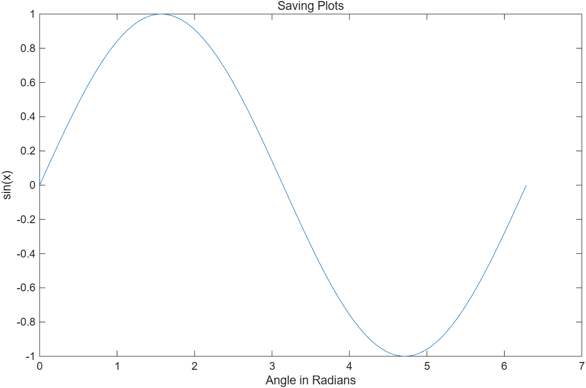

# 5.7 플롯 저장하기 (Saving Your Plots)

[← 목차](README.md) · [이전: 5.6 Workspace에서 플롯 만들기](5.6-workspace-plots.md) · [다음: 5.8 그 밖의 플롯](5.8-other-plots.md)

그림을 남기는 방법은 네 가지다.

| 방법 | 설명 | 다시 편집 |
|---|---|---|
| **코드 다시 실행** | 스크립트에 그리는 코드가 있으면 언제든 재생산 가능 | ○ |
| **`.fig`로 저장** | MATLAB 전용 형식. 파일을 더블클릭하면 그대로 열린다 | ○ |
| **그림 파일로 저장** | `.png`, `.jpg`, `.gif` 등. 워드·한글 문서에 삽입 | × |
| **Edit → Copy Figure** | 클립보드로 복사해 다른 문서에 붙여넣기 | × |

`File → Save As`를 고르면 위 형식들을 선택할 수 있고, `File → Generate Code`를 고르면
그 그림을 다시 만드는 스크립트를 얻는다.

## 코드로 저장하기

> **[보강]** 슬라이드는 File 메뉴로 저장하는 방법만 설명한다. 같은 일을 코드로 하는 방법을 덧붙인다.

```matlab
plot(x, sin(x))
title("Saving Plots")

savefig("myplot.fig")                 % MATLAB 전용 형식
exportgraphics(gcf, "myplot.png")     % 문서에 넣을 그림 파일
openfig("myplot.fig");                % 저장한 그림 다시 열기
```

- `savefig` / `openfig` — 축, 라벨, 데이터까지 그대로 보존한다. 나중에 다시 편집할 수 있다.
- `exportgraphics` — 화면에 보이는 그대로를 그림 파일로 내보낸다. 여백이 거의 없어 문서 삽입에 좋다.
- `gcf`는 "get current figure", `gca`는 "get current axes"다.

실행 코드: [`example/ch05/ex0570_saving.m`](../../example/ch05/ex0570_saving.m)

```matlab
x = linspace(0, 2*pi, 100);
plot(x, sin(x))
title("Saving Plots")
xlabel("Angle in Radians"); ylabel("sin(x)")

outDir = tempname;          % 예제이므로 임시 폴더에 저장한다
mkdir(outDir);

figFile = fullfile(outDir, "myplot.fig");
pngFile = fullfile(outDir, "myplot.png");

savefig(figFile)            % MATLAB 전용 형식 - 나중에 다시 편집 가능
exportgraphics(gcf, pngFile)% 문서에 넣을 그림 파일

close all
f  = openfig(figFile);      % .fig를 다시 열면 축, 라벨이 그대로 살아난다
ax = findobj(f, "Type", "axes");                % 축을 이름으로 찾는다
fprintf("다시 연 figure의 제목: %s\n", ax.Title.String);

dir(outDir)


close(f)
rmdir(outDir, "s");         % 예제 뒤처리
```



> **[보강]** 이 노트의 모든 플롯 이미지는
> `exportgraphics(gcf, "../../textbook/ch05/img/exXXYY_keyword.png")`로 만들었다.
> 해상도를 올리려면 `exportgraphics(gcf, "out.png", Resolution=300)`을 쓴다.

> **[보강]** R2026a의 기본 figure 테마는 **dark**라서 그대로 내보내면 배경이 검은 그림이 된다.
> 문서에 넣을 때는 저장 직전에 `theme(gcf, "light")`로 밝은 테마를 지정한다.
> 이 노트의 예제 코드는 모두 이 한 줄을 넣어 두었다.
> 현재 테마는 `gcf().Theme.BaseColorStyle`로 확인할 수 있다.

> **[보강]** 옛 코드에서는 `saveas(gcf, "myplot.png")`나 `print -dpng myplot.png`를 썼다.
> 둘 다 여전히 동작하지만, 문서용 그림에는 여백을 잘라 주는 `exportgraphics`가 권장된다.
> 벡터 형식이 필요하면 `exportgraphics(gcf, "out.pdf", ContentType="vector")`.

⚠️ **함정**
- `.fig`는 MATLAB에서만 열린다. 보고서에 붙이려면 반드시 `.png`/`.jpg` 등으로도 내보내야 한다.
- 파일 이름에 확장자를 빼먹으면 `savefig`는 `.fig`를 붙이지만 `exportgraphics`는 오류를 낸다.
- `exportgraphics`의 첫 인자는 figure(`gcf`)나 axes(`gca`)다. axes를 주면 그 축만 잘라 저장된다.
- 대화식으로 편집한 그림을 저장하지 않고 스크립트를 다시 돌리면 편집 결과는 사라진다.

## 연습문제

> **[보강]** 아래 문제와 해답은 슬라이드에 없는 추가 문제다.

1. 감쇠 사인 곡선을 그려 `.fig`로 저장하고, 모든 창을 닫은 뒤 `openfig`로 다시 열어 제목을
   `"Edited After Reopening"`으로 바꾸고 `.png`로 내보내라. (임시 폴더 `tempname`를 쓸 것)
2. 같은 그림을 기본 해상도와 `Resolution=300`으로 각각 저장하고 두 파일의 크기를 KB 단위로 출력해
   비교하라.

해답: [solutions.md](solutions.md#57-플롯-저장하기)
