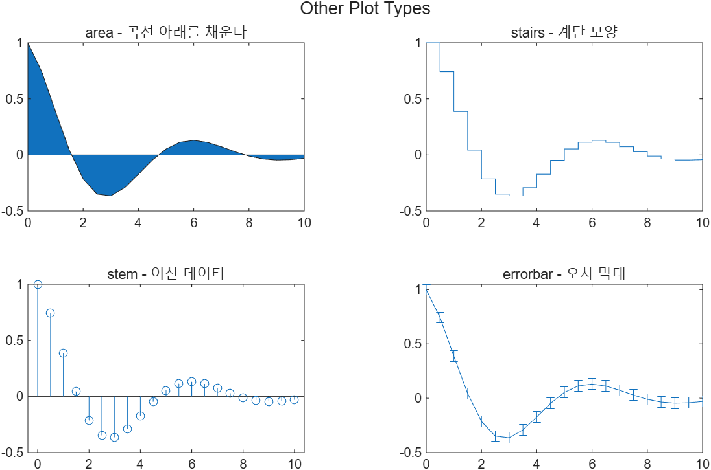

# 5.8 그 밖의 플롯들 (Other Plotting Options)

[← 목차](README.md) · [이전: 5.7 플롯 저장](5.7-saving-plots.md)

MATLAB의 플롯 종류는 계속 늘어난다. 최신 목록은 도움말에서
**"types of MATLAB plots"**를 검색하면 표로 볼 수 있다. 표의 각 항목은 사용법 문서로,
그리고 다른 사용자들이 올린 예제 갤러리로 연결된다.

슬라이드의 표는 이런 갈래로 나뉜다.

| 갈래 | 대표 함수 |
|---|---|
| Line Plots | `plot`, `plot3`, `stairs`, `errorbar`, `area`, `loglog`, `semilogx`, `semilogy`, `fplot`, `fplot3`, `fimplicit` |
| Scatter and Bubble Charts | `scatter`, `scatter3`, `bubblechart`, `swarmchart`, `spy` |
| Data Distribution Plots | `histogram`, `histogram2`, `pie`, `pie3`, `scatterhistogram`, `wordcloud`, `heatmap`, `parallelplot` |
| Discrete Data Plots | `bar`, `barh`, `bar3`, `pareto`, `stem`, `stem3`, `stairs` |
| Geographic Plots | `geoplot`, `geoscatter`, `geobubble` |
| Polar Plots | `polarplot`, `polarhistogram`, `polarscatter`, `compass`, `ezpolar` |
| Contour Plots | `contour`, `contourf`, `contour3`, `contourslice`, `fcontour` |
| Vector Fields | `quiver`, `quiver3`, `feather` |
| Surface and Mesh Plots | `surf`, `surfc`, `surfl`, `ribbon`, `pcolor`, `fsurf`, `mesh`, `meshc`, `meshz`, `waterfall`, `fmesh` |
| Volume Visualization | `streamline`, `streamslice`, `streamtube`, `coneplot`, `slice` |
| Animation | `animatedline`, `comet`, `comet3` |
| Images | `image`, `imagesc` |

## 몇 가지 맛보기

```matlab
x = 0 : 0.5 : 10;
y = exp(-x/3) .* cos(x);

t = tiledlayout(2,2);
title(t, "Other Plot Types")

nexttile
area(x, y)
title("area - 곡선 아래를 채운다")

nexttile
stairs(x, y)
title("stairs - 계단 모양")

nexttile
stem(x, y)
title("stem - 이산 데이터")

nexttile
errorbar(x, y, 0.05*ones(size(x)))
title("errorbar - 오차 막대")
```

실행 코드: [`example/ch05/ex0580_other_plots.m`](../../example/ch05/ex0580_other_plots.m)



> **[보강]** 모르는 플롯이 필요할 때의 순서: ① 도움말에서 "types of MATLAB plots" 표를 훑는다
> → ② 후보 함수를 `doc 함수이름`으로 연다 → ③ 문서 맨 위의 예제를 그대로 실행해 본다.
> 시험에서는 함수 이름을 다 외우기보다 **어느 갈래에 무엇이 있는지**를 기억하는 편이 낫다.

⚠️ **함정**
- `heatmap`, `wordcloud` 같은 일부 차트는 `tiledlayout`의 타일 안에 넣을 수 없다
  (자체 레이아웃을 쓰는 차트라서 `nexttile` 뒤에 부르면 오류가 난다). 필요하면 `figure`를 따로 만든다.
- 표에 있는 함수 중에는 추가 툴박스가 필요한 것도 있다. `which -all 함수이름`으로 설치 여부를 확인한다.
- `image`와 `imagesc`는 다르다. `imagesc`는 데이터 범위를 colormap 전체로 늘려서(scale) 보여 준다.

## 챕터 요약 (슬라이드 Summary 1~5)

- 공학에서 가장 흔한 그래프는 x–y plot이다. 어떤 그래프든 **제목과 축 라벨**은 항상 있어야 하고,
  축 라벨에는 `ft/s`, `kJ/kg` 같은 **단위**를 적는다.
- 선 색(color), 선 종류(line style), 마커(marker)를 지정할 수 있고, 격자(`grid`)와 축 범위(`axis`),
  텍스트 상자와 legend로 그래프를 설명한다.
- `tiledlayout`은 창을 m × n 타일로 나눈다. 각 타일에는 어떤 종류의 플롯이든 넣을 수 있다.
- x–y plot 외에 polar plot, pie chart, bar graph, histogram, y축이 둘인 그래프가 있다.
  축 눈금을 로그로 바꾸면(`loglog`, `semilogx`, `semilogy`) 공학 데이터가 직선으로 펴진다.
- 대화식 도구로 그림을 고칠 수 있고, Workspace 창에서 바로 그림을 만들 수도 있다.
  저장은 MATLAB 전용 `.fig`와 표준 그림 형식 모두 가능하다.
- `fplot`은 x, y 배열 없이 함수를 직접 그린다. 점 개수와 간격은 MATLAB이 정한다.
- 3차원 플롯에는 선 그래프(`plot3`), 곡면 그래프(`mesh`, `surf`), 등고선(`contour`)이 있다.
  2차원에서 쓰던 옵션 대부분이 3차원에도 그대로 적용된다.
- `meshgrid`는 독립변수가 두 개인 계산을 가능하게 해 주며, 곡면 그래프의 출발점이다.

## 연습문제

> **[보강]** 아래 문제와 해답은 슬라이드에 없는 추가 문제다.

1. `n = 0:15`, `y = 0.8.^n`을 `stem`과 `stairs`로 나란히 그려 두 표현의 차이를 보여라.
2. 표에는 다뤘지만 본문에서 쓰지 않은 `bubblechart`와 `imagesc`를 각각 써서 그림을 하나씩 만들어라.
   (`bubblechart(x, y, sz)`, `imagesc(magic(8))` + `colorbar`)

해답: [solutions.md](solutions.md#58-그-밖의-플롯들)
