# Chapter 5 연습문제 해답 (5.1 ~ 5.3.2)

> **[보강]** 이 문서 전체가 슬라이드 밖 내용이다. 문제와 해답 모두 시험 대비용으로 새로 만들었으므로, 원본 슬라이드와 대조할 때는 이 파일을 제외하면 된다.

각 해답 코드는 `example/ch05/solXXYY_N.m`에 있다. 번호 규칙은 `sol` + 장(05) + 절 + `_` + 문제 번호다.

| 문제 | 해답 코드 |
|---|---|
| 5.1.1-1 | [`sol0501_1.m`](../../example/ch05/sol0501_1.m) |
| 5.1.1-2 | [`sol0501_2.m`](../../example/ch05/sol0501_2.m) |
| 5.1.1-3 | [`sol0501_3.m`](../../example/ch05/sol0501_3.m) |
| 5.1.2-1 | [`sol0501_4.m`](../../example/ch05/sol0501_4.m) |
| 5.1.2-2 | [`sol0501_5.m`](../../example/ch05/sol0501_5.m) |
| 5.1.2-3 | [`sol0501_6.m`](../../example/ch05/sol0501_6.m) |
| 5.1.3-1 | [`sol0501_7.m`](../../example/ch05/sol0501_7.m) |
| 5.1.3-2 | [`sol0501_8.m`](../../example/ch05/sol0501_8.m) |
| 5.1.3-3 | [`sol0501_9.m`](../../example/ch05/sol0501_9.m) |
| 5.2-1 | [`sol0502_1.m`](../../example/ch05/sol0502_1.m) |
| 5.2-2 | [`sol0502_2.m`](../../example/ch05/sol0502_2.m) |
| 5.2-3 | [`sol0502_3.m`](../../example/ch05/sol0502_3.m) |
| 5.3.1-1 | [`sol0503_1.m`](../../example/ch05/sol0503_1.m) |
| 5.3.1-2 | [`sol0503_2.m`](../../example/ch05/sol0503_2.m) |
| 5.3.2-1 | [`sol0503_3.m`](../../example/ch05/sol0503_3.m) |
| 5.3.2-2 | [`sol0503_4.m`](../../example/ch05/sol0503_4.m) |

---

## 5.1.1 기본 plotting

### 5.1.1-1 자유낙하 거리

```matlab
t = 0:0.5:10;                    % s
d = 0.5*9.81*t.^2;               % m

plot(t, d)
title("자유낙하 거리")
xlabel("시간 t, s")
ylabel("낙하 거리 d, m")
grid on
```

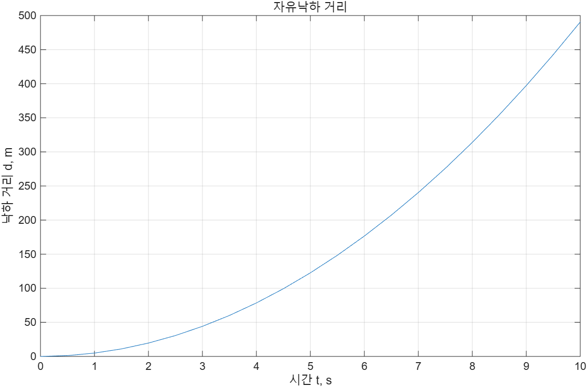

핵심은 `t.^2`다. `t`가 벡터이므로 `t^2`(행렬 거듭제곱)는 오류가 난다.

### 5.1.1-2 두 선을 그리는 세 가지 방법

```matlab
x  = 0:pi/50:4*pi;
y1 = sin(x);
y2 = sin(x)/2;

% (a) hold on
plot(x, y1), hold on, plot(x, y2), hold off

% (b) x, y 쌍을 번갈아
plot(x, y1, x, y2)

% (c) 2차원 배열
Y = [y1; y2];
plot(x, Y)
```

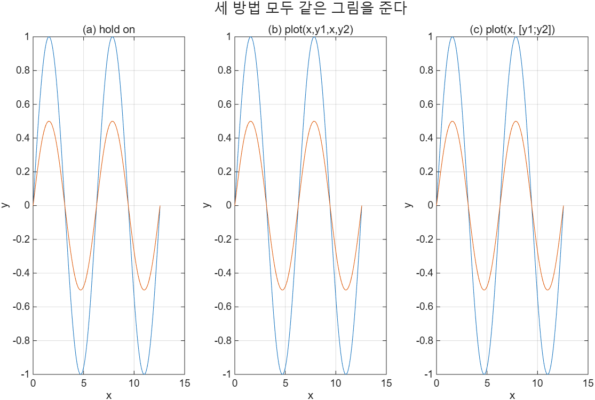

세 그림이 동일하다. (c)에서 `[y1; y2]`는 2×201이고 `x`는 1×201이다. 이때 MATLAB은 `Y`의 각 **행**을 한 선으로 그린다 — `x`의 길이(201)와 맞는 쪽이 열이기 때문이다.

### 5.1.1-3 `plot(A)`의 선 개수

`A = [1 2 3; 4 5 6]`은 2행 3열이다.

- MATLAB은 **열마다 한 선**을 그린다 → **선 3개**
- 각 선은 행 수만큼 점을 갖는다 → **점 2개씩**
- `x`를 주지 않았으므로 x축은 행 인덱스 1, 2

```matlab
A = [1 2 3; 4 5 6];              % 2 x 3
plot(A, "-o")
legend("1열: [1;4]", "2열: [2;5]", "3열: [3;6]", Location="northwest")

fprintf("선 %d개, 각 선의 점 %d개\n", size(A, 2), size(A, 1));
% 선 3개, 각 선의 점 2개
```

→ [`sol0501_3.m`](../../example/ch05/sol0501_3.m)

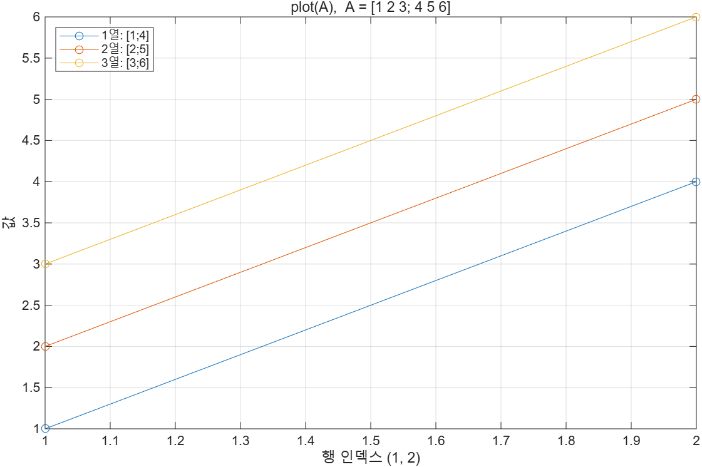

---

## 5.1.2 선, 색, 마커 스타일

### 5.1.2-1 LineSpec 문자열만으로

```matlab
plot(x, sin(x), "--rs", x, cos(x), ":k*")
```

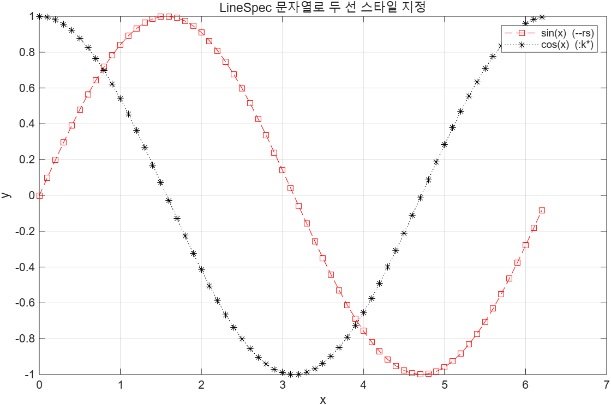

`--rs` = 파선(`--`) + 빨강(`r`) + 사각 마커(`s`). `:k*` = 점선(`:`) + 검정(`k`) + 별 마커(`*`). 세 문자의 **순서는 상관없다**. black이 `k`인 점에 주의.

### 5.1.2-2 선마다 다른 굵기

```matlab
plot(x, sin(x), "--rs", LineWidth=3)
hold on
plot(x, cos(x), ":k*",  LineWidth=1)
hold off
```

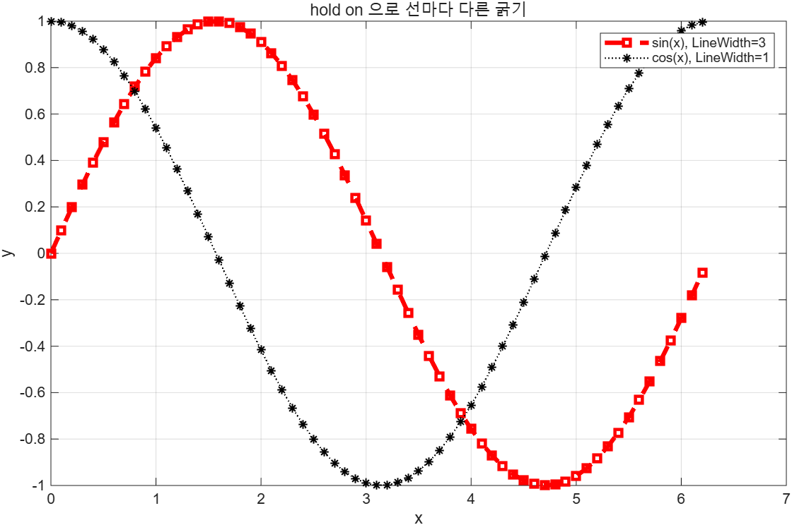

`plot` 한 번으로는 안 된다. `Name=Value` 속성은 **그 호출로 그려지는 모든 선에 똑같이** 적용되기 때문이다. 선마다 다르게 하려면 `plot`을 나눠 부르고 `hold on`으로 겹쳐야 한다.

### 5.1.2-3 `"b"` / `"bo"` / `"o"`

| 문자열 | 결과 |
|---|---|
| `"b"` | 파란 **실선**, 마커 없음 (선 문자를 안 썼으므로 기본 실선) |
| `"bo"` | 파란 **원 마커만**, 선 없음 |
| `"o"` | 기본색 **원 마커만**, 선 없음 |

```matlab
plot(x, y, "b")      % 파란 실선
plot(x, y, "bo")     % 파란 원 마커만
plot(x, y, "o")      % 기본색 원 마커만
```

→ [`sol0501_6.m`](../../example/ch05/sol0501_6.m)

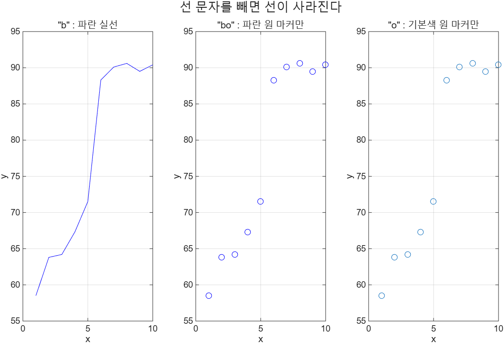

규칙: 마커 문자를 쓰고 선 문자를 **안 쓰면 선이 사라진다**. 산점도를 만드는 요령이다.

---

## 5.1.3 축 크기 조절과 주석 달기

### 5.1.3-1 감쇠 진동

```matlab
x = 0:0.1:10;
y = exp(-0.3*x).*sin(3*x);

plot(x, y, LineWidth=1.5)
axis([0 10 -1 1])
title("감쇠 진동  y = e^{-0.3x} sin(3\omega x)")
xlabel("x"), ylabel("진폭 y"), grid on
```

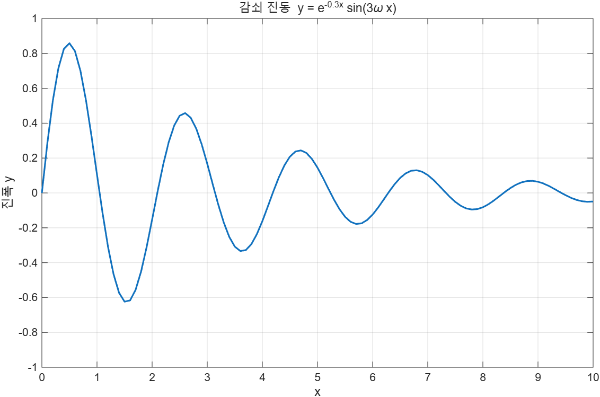

`exp(-0.3*x).*sin(3*x)`의 `.*`가 핵심이다. 두 벡터의 원소별 곱이다. 제목의 `e^{-0.3x}`는 중괄호로 지수 전체를 묶었고, `\omega`는 그리스 문자 ω다.

### 5.1.3-2 초기속도에 따른 사거리

```matlab
g = 9.81;
v = [50 100 150];
theta = 0:0.01:pi/2;

R1 = v(1)^2 / g * sin(2*theta);
R2 = v(2)^2 / g * sin(2*theta);
R3 = v(3)^2 / g * sin(2*theta);

plot(theta, R1, theta, R2, theta, R3, LineWidth=1.2)
legend("v_1 = 50 m/s", "v_2 = 100 m/s", "v_3 = 150 m/s", Location="south")

[Rmax, idx] = max(R3);
text(theta(idx), Rmax, sprintf("  \\leftarrow 최대 %.0f m at \\theta = %.3f rad", Rmax, theta(idx)))
```

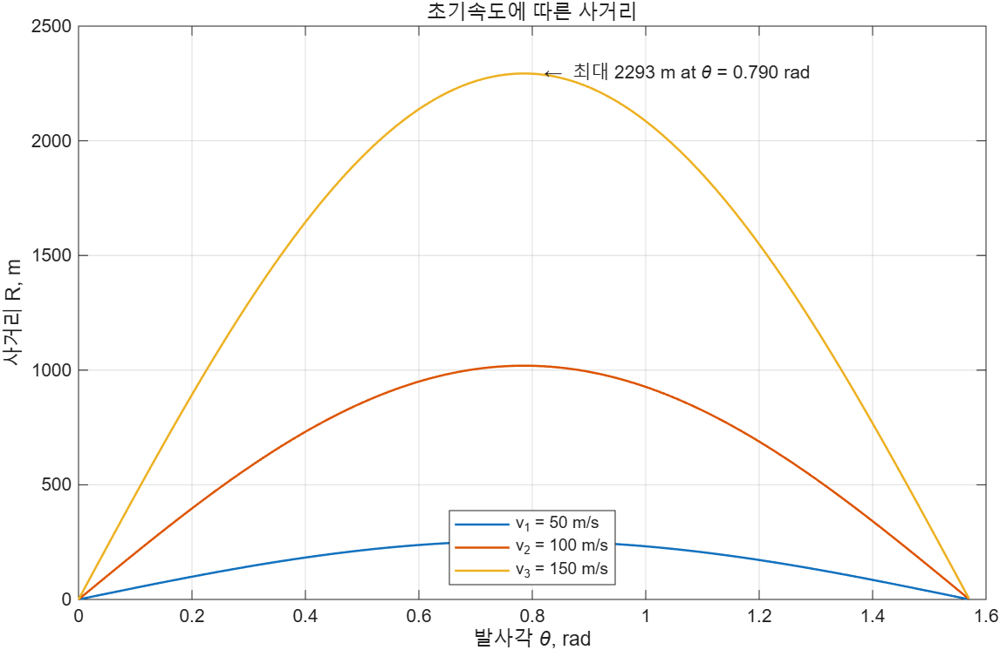

최대 사거리는 `sin(2θ) = 1`, 즉 **θ = π/4 ≈ 0.7854 rad (45°)**에서 나온다. `theta`가 0.01 간격의 이산 표본이므로 `max`가 실제로 돌려주는 값은 **0.7900 rad**이다. 이론값과 정확히 같지 않은 것이 정상이다 — `max`는 **표본점 중에서** 가장 큰 것을 고를 뿐이고, π/4는 표본점에 들어 있지 않다.

사거리는 v²에 비례하므로 속도를 3배로 올리면 사거리는 9배가 된다.

`sprintf` 안에서 TeX 명령을 쓸 때는 역슬래시를 **두 번**(`\\theta`) 적어야 한다. `sprintf`가 `\t`를 탭 문자로 해석하기 때문이다.

### 5.1.3-3 `A_max` vs `A_{max}`

```matlab
plot(x, sin(x))
title("A_max 와 A_{max}")
```

→ [`sol0501_9.m`](../../example/ch05/sol0501_9.m)

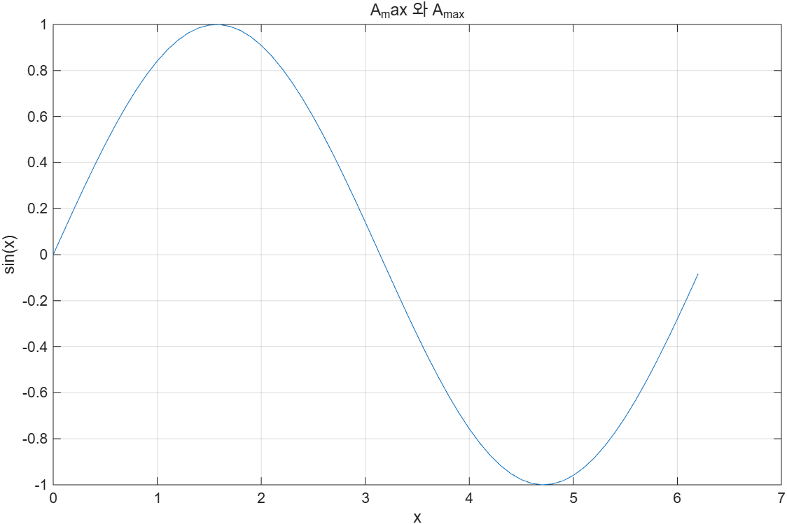

TeX에서 `_`는 **바로 다음 글자 하나**만 아래 첨자로 만든다.

- `A_max` → `A` 아래에 `m`만 붙고, `ax`는 본문 크기로 따라 나온다.
- `A_{max}` → 중괄호가 `max`를 한 덩어리로 묶어 전체가 아래 첨자가 된다.

위 첨자 `^`도 규칙이 같다. `x^10`은 10이 아니라 1만 위 첨자가 되므로 `x^{10}`으로 써야 한다.

---

## 5.2 Tiled Chart Layouts

### 5.2-1 2×2 격자

```matlab
t = tiledlayout(2, 2);

nexttile, plot(x, sin(x)), title("sin(x)"), xlabel("x, rad"), ylabel("y"), grid on
nexttile, plot(x, cos(x)), title("cos(x)"), xlabel("x, rad"), ylabel("y"), grid on
nexttile, plot(x, tan(x)), ylim([-5 5]), title("tan(x)"), xlabel("x, rad"), ylabel("y"), grid on
nexttile, plot(x, sin(x).*cos(x)), title("sin(x)cos(x)"), xlabel("x, rad"), ylabel("y"), grid on

title(t, "삼각함수 네 가지")
```

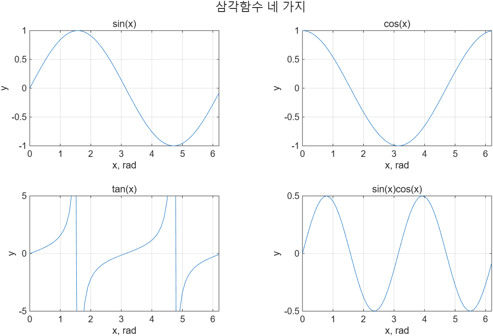

`tan(x)`는 x = π/2, 3π/2에서 발산한다. `ylim([-5 5])`로 자르지 않으면 y축이 ±10¹⁵까지 늘어나 나머지가 전부 평평한 선으로 보인다.

### 5.2-2 flow의 재배치

```matlab
% 그림 3개
t3 = tiledlayout("flow");
nexttile, plot(x, sin(x)), title("sin(x)"), grid on
nexttile, plot(x, cos(x)), title("cos(x)"), grid on
nexttile, plot(x, tan(x)), ylim([-5 5]), title("tan(x)"), grid on
title(t3, "flow, 그림 3개")

% 그림 4개 — 위에 한 줄만 더 붙인다
figure
t4 = tiledlayout("flow");
nexttile, plot(x, sin(x)), title("sin(x)"), grid on
nexttile, plot(x, cos(x)), title("cos(x)"), grid on
nexttile, plot(x, tan(x)), ylim([-5 5]), title("tan(x)"), grid on
nexttile, plot(x, sin(x).*cos(x)), title("sin(x)cos(x)"), grid on
title(t4, "flow, 그림 4개")
```

→ [`sol0502_2.m`](../../example/ch05/sol0502_2.m)

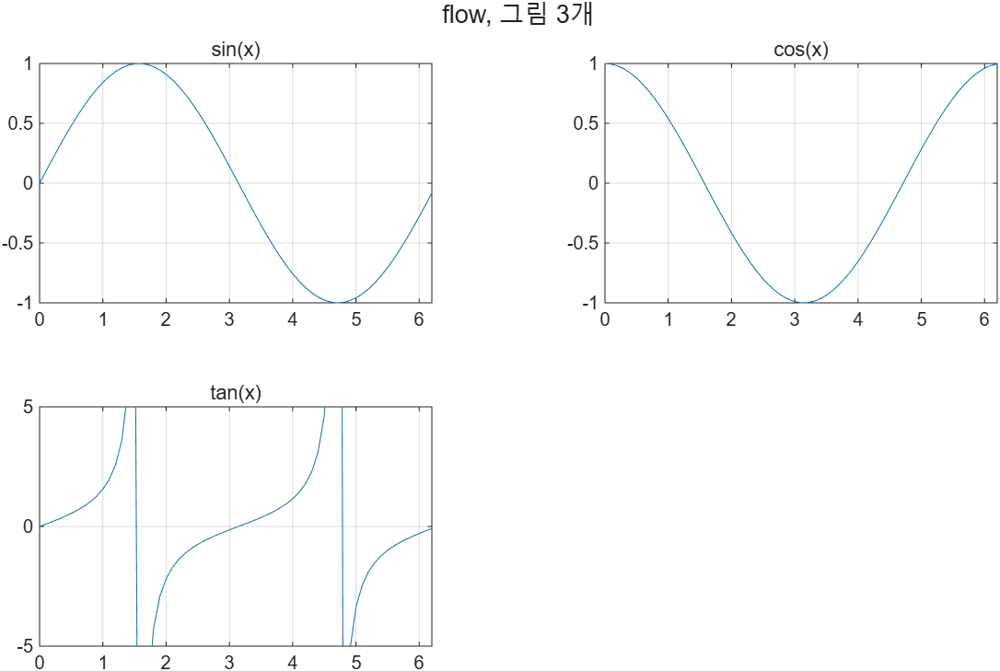
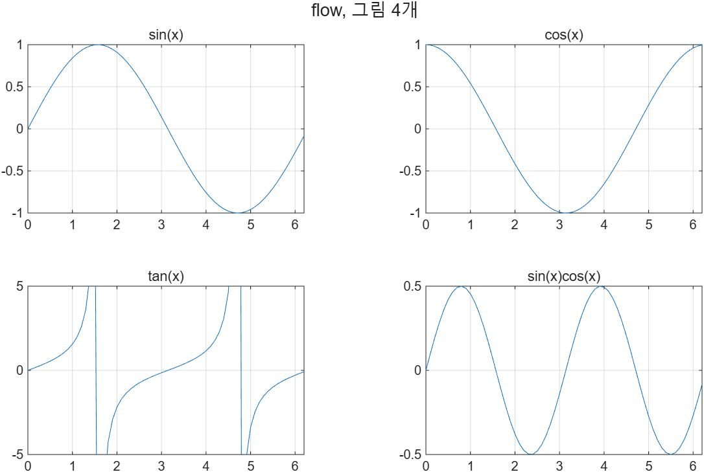

`flow`는 각 tile이 대략 4:3 비율이 되도록 격자 크기를 고른다. 그림이 3개면 **2×2 격자를 만들고 네 번째 칸을 빈 채로 둔다** — 남은 칸에 폭을 나눠 주지는 않는다. 그림이 4개가 되면 그 빈 칸이 채워져 2×2가 꽉 찬다.

즉 `flow`가 해 주는 일은 "**칸 수를 미리 정하지 않아도 되게** 하는 것"이지, 빈 자리를 예쁘게 메워 주는 것이 아니다. 배치를 정확히 통제하고 싶으면 `tiledlayout(m, n)`으로 직접 지정하거나 칸 합치기를 쓴다.

### 5.2-3 3×3에서 위 두 줄 합치기

```matlab
t = tiledlayout(3, 3);

nexttile(1, [2, 3])              % 1번 칸부터 2행 3열
plot(x, sin(x), x, cos(x), LineWidth=1.2)

nexttile, plot(x, sin(2*x)), title("sin(2x)"), grid on
nexttile, plot(x, sin(3*x)), title("sin(3x)"), grid on
nexttile, plot(x, sin(4*x)), title("sin(4x)"), grid on
```

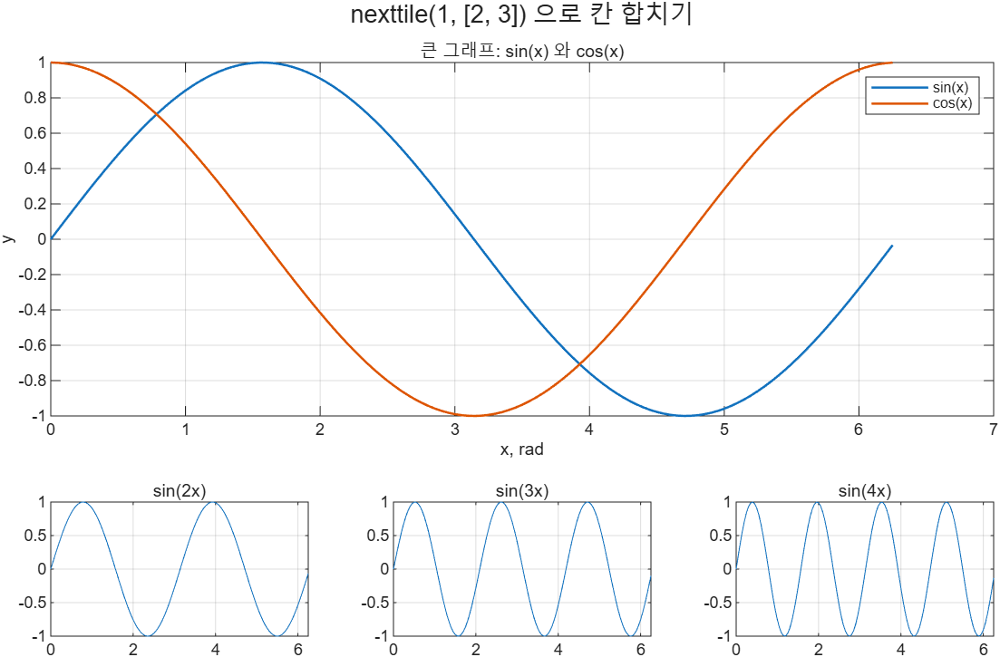

`nexttile(1, [2, 3])`으로 1번 칸에서 시작해 2행 3열을 차지하게 만들면 위 두 줄이 하나의 축이 된다. 그 뒤의 `nexttile`은 남은 7, 8, 9번 칸을 순서대로 채운다.

---

## 5.3.1 극좌표 그래프

### 5.3.1-1 limaçon

```matlab
theta = 0:pi/360:2*pi;
r = 1 + 2*cos(theta);
polarplot(theta, r, LineWidth=1.2)
```

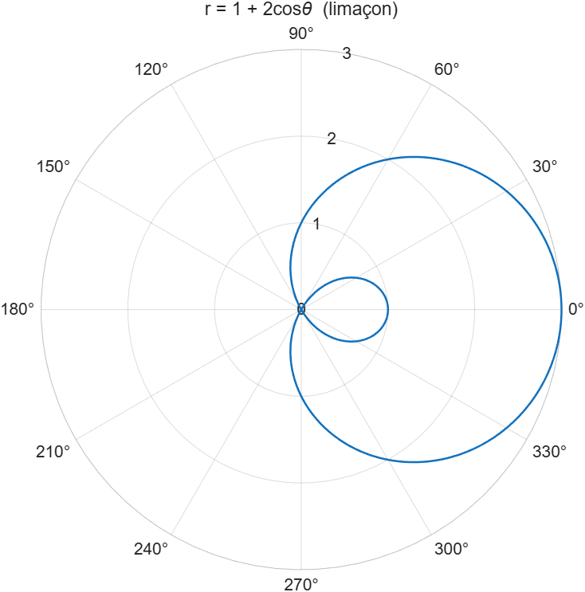

`r < 0`이 되는 조건은 `cos(θ) < −1/2`, 즉 **θ ∈ (2π/3, 4π/3)**이다. `polarplot`은 음수 `r`을 **반대 방향(θ + π)** 에 찍는다. 그래서 이 구간의 점들이 원점을 지나 맞은편으로 넘어가면서 **안쪽 고리**를 만든다.

일반적으로 `r = a + b·cos(θ)`에서 `|b| > |a|`이면 안쪽 고리가 생기고, `|b| = |a|`이면 카디오이드, `|b| < |a|`이면 고리 없는 볼록한 곡선이 된다.

### 5.3.1-2 장미 곡선의 잎 개수

```matlab
theta = 0:pi/720:2*pi;

t = tiledlayout(1, 2);
nexttile, polarplot(theta, cos(2*theta), LineWidth=1.2), title("r = cos(2\theta)")
nexttile, polarplot(theta, cos(5*theta), LineWidth=1.2), title("r = cos(5\theta)")
title(t, "n 이 짝수면 2n 장, 홀수면 n 장")
```

→ [`sol0503_2.m`](../../example/ch05/sol0503_2.m)

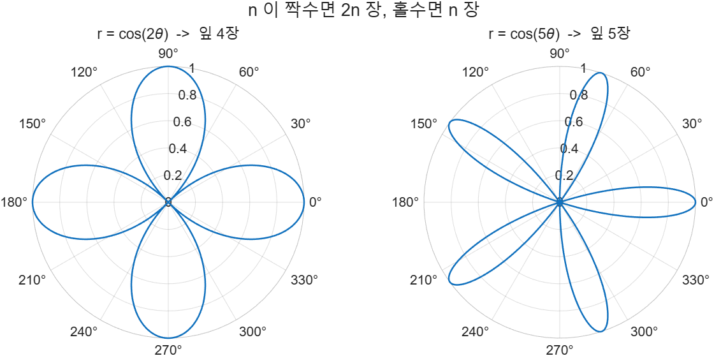

- `r = cos(2θ)` → **잎 4장** (n = 2, 짝수 → 2n)
- `r = cos(5θ)` → **잎 5장** (n = 5, 홀수 → n)

이유: n이 홀수면 θ를 0~2π 도는 동안 후반부가 전반부와 **같은 잎을 덧그린다**. n이 짝수면 음수 `r`이 만드는 잎이 기존 잎 사이 빈 자리에 들어가 겹치지 않는다.

---

## 5.3.2 로그 그래프

### 5.3.2-1 멱함수

```matlab
x = logspace(-1, 3, 100);        % 0.1 ~ 1000
y = 3*x.^1.5;

t = tiledlayout(1, 2);
nexttile, plot(x, y),   title("plot - 선형/선형"),  xlabel("x"), ylabel("y"), grid on
nexttile, loglog(x, y), title("loglog - 로그/로그"), xlabel("x"), ylabel("y"), grid on
title(t, "y = 3x^{1.5}")
```

→ [`sol0503_3.m`](../../example/ch05/sol0503_3.m)

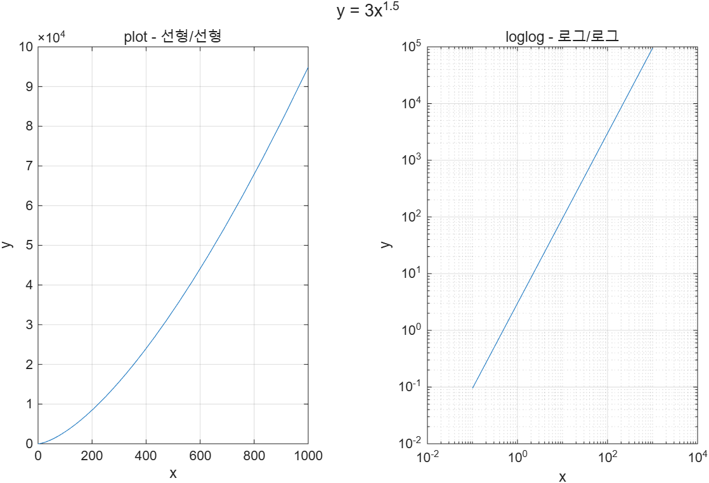

선형 그래프에서는 x = 0.1 ~ 10 구간이 원점 근처에 뭉개져 전혀 보이지 않는다. 네 자릿수(0.1 ~ 1000)에 걸친 데이터이므로 **loglog가 읽기 쉽다**.

덤으로, loglog에서 직선의 기울기를 재면 2.0이 아니라 **1.5** — 정확히 지수와 같다.

```matlab
n = (log10(y(end)) - log10(y(1))) / (log10(x(end)) - log10(x(1)));
% n = 1.5000
```

### 5.3.2-2 지수함수

```matlab
x = 0:0.5:10;
y = 2*exp(0.8*x);

t = tiledlayout(1, 2);
nexttile, plot(x, y),     title("plot - 선형/선형"),   xlabel("x"), ylabel("y"), grid on
nexttile, semilogy(x, y), title("semilogy - 선형/로그"), xlabel("x"), ylabel("y"), grid on
title(t, "y = 2e^{0.8x}")
```

→ [`sol0503_4.m`](../../example/ch05/sol0503_4.m)

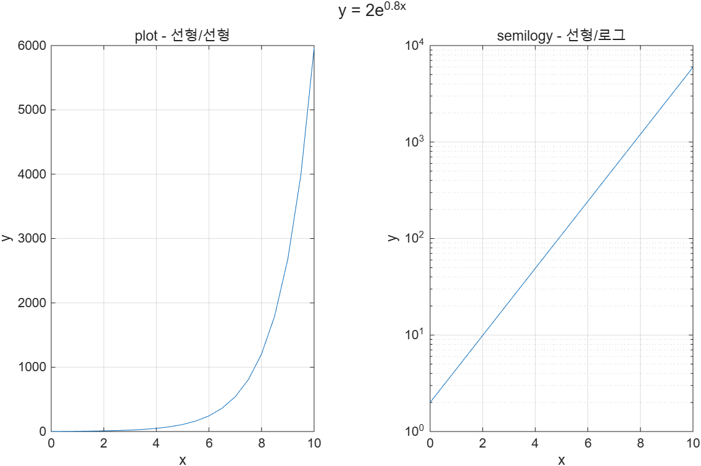

`y = 2e^{0.8x}` 양변에 상용로그를 취하면

```
log₁₀(y) = log₁₀(2) + 0.8x·log₁₀(e)
```

세로축이 `log₁₀(y)`, 가로축이 `x`이므로 **기울기 0.8·log₁₀(e) ≈ 0.3474인 직선**이다. 실행하면 측정 기울기가 이 값과 일치한다.

정리하면,

| 그래프에서 직선이면 | 관계식 | 기울기의 뜻 |
|---|---|---|
| `loglog` | `y = a·xⁿ` (멱함수) | 지수 n |
| `semilogy` | `y = a·10^{bx}` (지수함수) | b |
| `plot` | `y = ax + b` (일차함수) | a |

측정 데이터를 세 방식으로 그려 보고 어느 쪽이 직선인지 보는 것이, 관계식을 추측하는 표준적인 방법이다.
