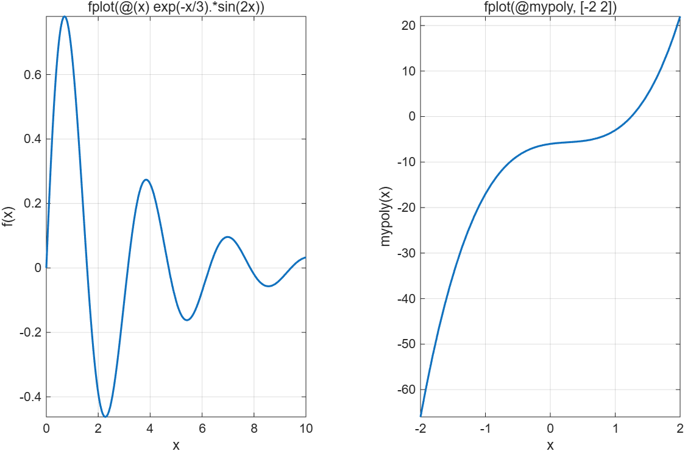
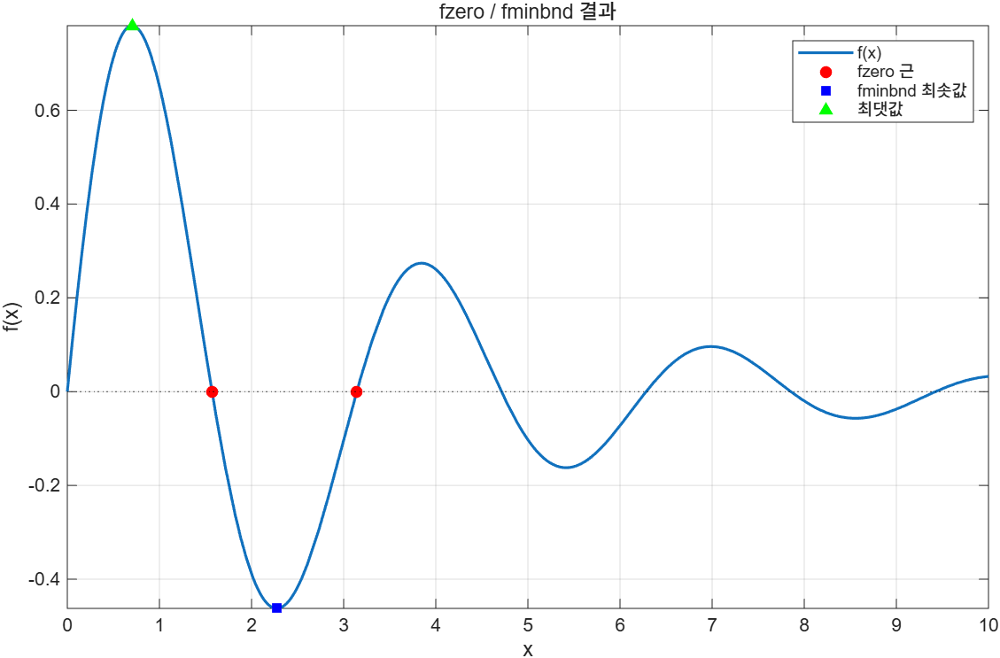

# 6.5 Function function — 함수를 입력으로 받는 함수

이름이 이상하지만 뜻은 그대로다. **다른 함수를 입력으로 요구하는 함수**를 MATLAB에서는 function function이라 부른다. 5장에서 본 `fplot`이 대표적이다.

`fplot`은 두 가지를 받는다.

- **함수 또는 function handle**
- **그릴 구간**

데이터 배열(`x`, `y`)을 미리 만들어 넘기는 `plot`과 달리, **함수 자체**를 넘기면 어디에 점을 몇 개 찍을지는 `fplot`이 알아서 정한다.

## fplot에 handle 넘기기

[`example/ch06/ex0605_fplot.m`](../../example/ch06/ex0605_fplot.m):

```matlab
f = @(x) exp(-x/3) .* sin(2*x);

tiledlayout(1, 2)

nexttile
fplot(f, [0 10], LineWidth=1.5)     % anonymous function

nexttile
fplot(@mypoly, [-2 2], LineWidth=1.5)   % 이름 있는 함수의 handle
```



anonymous function이든 이름 있는 함수의 handle이든 똑같이 넘길 수 있다. 중요한 건 `@`를 빠뜨리지 않는 것이다. `fplot(mypoly, [-2 2])`라고 쓰면 `mypoly`를 **먼저 호출한 결과**가 넘어가서 엉뚱한 일이 벌어진다.

## 다른 function function들

> **[보강]** 아래 세 함수는 슬라이드에 없지만 같은 무리이고 시험·과제에 자주 나온다.

| 함수 | 하는 일 | 호출 형태 |
|---|---|---|
| `fzero` | 함숫값이 0이 되는 `x`(근)를 찾는다 | `fzero(f, x0)` 또는 `fzero(f, [a b])` |
| `fminbnd` | 구간 안의 **최솟값**을 찾는다 | `[x, fval] = fminbnd(f, a, b)` |
| `integral` | 정적분을 수치적으로 계산한다 | `integral(f, a, b)` |

[`example/ch06/ex0605_fzero_fminbnd.m`](../../example/ch06/ex0605_fzero_fminbnd.m):

```matlab
f = @(x) exp(-x/3) .* sin(2*x);

r1 = fzero(f, 1.5);         % 시작점 1.5 근처의 근
r2 = fzero(f, [2 4]);       % 구간 양 끝의 부호가 달라야 한다

[xmin, fmin]   = fminbnd(f, 1, 4);
[xmax, negmax] = fminbnd(@(x) -f(x), 0, 2);   % 최댓값은 부호를 뒤집어 푼다

A = integral(f, 0, 10);
```

```
fzero(f, 1.5)   = 1.570796
fzero(f, [2 4]) = 3.141593
fminbnd(f, 1, 4): x = 2.273620, f = -0.462285
최댓값: x = 0.702821, f = 0.780380
integral(f, 0, 10) = 0.476764
```



- `fzero`의 두 번째 인수가 **스칼라면 "그 근처에서 찾아라"**, **2원소 벡터면 "이 구간 안에서 찾아라"**다. 구간을 줄 때는 양 끝의 함숫값 부호가 서로 달라야 한다.
- `fminbnd`는 **최솟값만** 찾는다. 최댓값은 `-f`의 최솟값을 찾아 부호를 되돌린다.
- 근이 여러 개면 시작점을 바꿔가며 여러 번 불러야 한다. 한 번에 다 주지 않는다.

## arrayfun / cellfun

> **[보강]** 배열의 각 원소에 함수를 적용하는 것도 function function이다.

[`example/ch06/ex0605_arrayfun.m`](../../example/ch06/ex0605_arrayfun.m):

```matlab
arrayfun(@sqrt, [1 4 9 16 25])                      % → [1 2 3 4 5]
arrayfun(@(n) 1:n, 1:4, UniformOutput=false)        % 크기가 다르면 cell 로 받는다
cellfun(@numel, {'alpha', 'be', 'gamma7'})          % → [5 2 6]
```

결과가 원소마다 크기가 다르면 `UniformOutput=false`를 붙여 cell array로 받아야 한다.

## 직접 만드는 function function

특별한 문법이 필요하지 않다. 입력으로 받은 handle을 그냥 호출하면 된다.

```matlab
function y = apply_twice(fh, x)
% APPLY_TWICE  함수 handle fh 를 x 에 두 번 적용한다.
y = fh(fh(x));
end
```

```
apply_twice(@(x) x+3, 10) = 16
apply_twice(@sqrt, 16)    = 2
```

[`example/ch06/sol0605_3.m`](../../example/ch06/sol0605_3.m)의 수치 미분도 같은 구조다. 함수를 인수로 받아두면 **미분 대상이 무엇이든 같은 코드로** 처리할 수 있다.

```
d/dx exp(x) at 1 = 2.7182818283 (정답 2.7182818285)
d/dx mypoly at 2 = 46.0000000047 (정답 46.0000000000)
```

## ⚠️ 함정

- **`@`를 빠뜨리면 함수가 아니라 값이 넘어간다.** `fzero(f, 1)`에서 `f`가 handle이어야지, 이미 계산된 배열이면 안 된다.
- **`fzero`의 구간 지정은 부호가 달라야 한다.** `fzero(f, [0 1])`인데 두 끝의 부호가 같으면 `함수 값이 구간 끝점에서 부호가 같습니다` 오류가 난다.
- **`fminbnd`는 지역 최솟값을 준다.** 구간 안에 골짜기가 여러 개면 어느 것을 줄지 보장되지 않는다. 먼저 `fplot`으로 그려보고 구간을 좁히는 것이 안전하다.
- **수치 미분에서 `h`를 너무 작게 잡으면 오히려 오차가 커진다.** 자리올림(round-off) 때문이다. `h = 1e-5`쯤에서 오차가 최소가 되고 `1e-8`에서는 다시 나빠진다.
- **`arrayfun`은 원소별로 함수를 호출하므로 벡터화 연산보다 느리다.** `arrayfun(@sqrt, v)`보다 `sqrt(v)`가 낫다. 벡터화가 안 되는 함수에만 쓴다.

## 연습문제

1. `damped = @(x) exp(-x/4).*cos(3*x)`와 그 포락선 `±exp(-x/4)`를 `fplot`으로 한 축에 그려라. 범례를 붙이고 PNG로 저장하라.
2. `f = @(x) x.^3 - 6*x.^2 + 9*x - 2`의 근 세 개를 `fzero`로 각각 구하고, 구간 `[2,4]`의 최솟값과 `[0,2]`의 최댓값을 `fminbnd`로 구하라. `integral(f, 0, 2)`도 계산하고 손으로 구한 값과 비교하라.
3. 함수 handle과 점 `x`를 받아 중앙차분 `(f(x+h) - f(x-h)) / (2h)`로 미분값을 근사하는 함수 `numderiv(fh, x, h)`를 작성하라. `h`가 생략되면 `1e-6`을 쓴다. `@sin`, `@exp`, `@mypoly`에 적용해 정답과 비교하고, `h`를 `1e-1`부터 `1e-8`까지 바꿔가며 오차가 어떻게 변하는지 보여라.

해답: [solutions.md](solutions.md#65)
