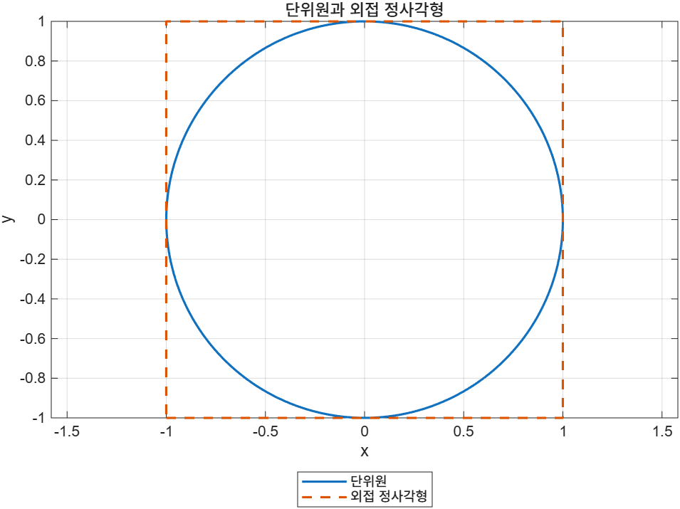
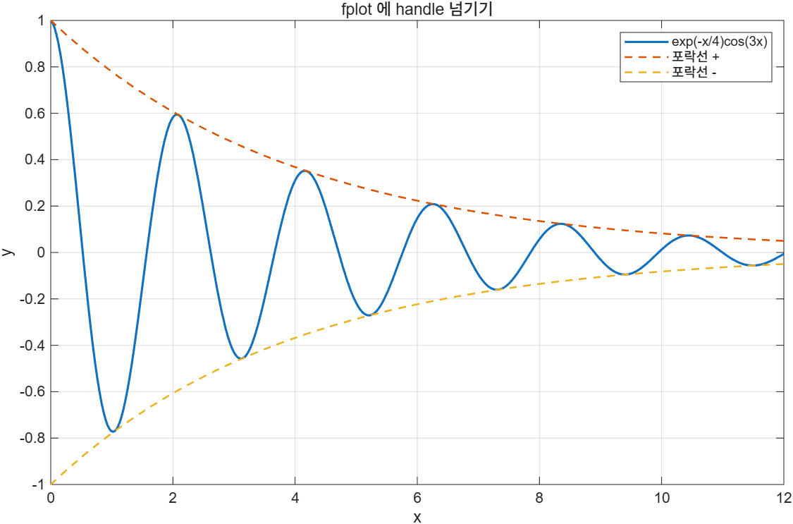

# Chapter 6 연습문제 해답

각 해답 코드는 `example/ch06/solXXYY_N.m`에 있다.

> **[보강]** 이 파일 전체가 슬라이드 밖 내용이다. 연습문제와 해답은 모두 시험 대비용으로 추가한 것이다.

---

## 6.1

### 1. 화씨 → 켈빈 변환 함수

[`sol0601_1.m`](../../example/ch06/sol0601_1.m)

핵심은 **함수를 파일 끝에 두고 `end`로 닫는 것**, 그리고 원소별 연산으로 써서 벡터 입력을 그대로 받는 것이다.

```matlab
function K = f2k(F)
% F2K  화씨를 켈빈으로 변환한다.
%   K = F2K(F) 는 (F-32)*5/9 + 273.15 를 반환한다.
%   F 는 스칼라, 벡터, 행렬 모두 가능하다.
K = (F - 32) * 5/9 + 273.15;
end
```

```
  -40.0 °F =  233.15 K
   32.0 °F =  273.15 K
   98.6 °F =  310.15 K
  212.0 °F =  373.15 K
```

`*`와 `/`는 스칼라와의 연산이라 점을 붙이지 않아도 되지만, `.*`, `./`로 써도 결과는 같다. 별도 파일로 만든다면 파일 이름은 반드시 `f2k.m`이어야 한다.

### 2. H1 line이 있는 도움말

[`sol0601_2.m`](../../example/ch06/sol0601_2.m), [`kinetic_energy.m`](../../example/ch06/kinetic_energy.m)

> **[보강]** `help 이름`은 **파일로 저장된 함수**를 찾는다. 스크립트 끝의 local function은 이름만으로는 조회되지 않고 `help 파일이름>함수이름` 형태로 불러야 하므로, 이 문제는 `kinetic_energy.m`을 별도 파일로 만들어 풀었다. 이 점 자체가 시험 포인트다.

```matlab
function E = kinetic_energy(m, v)
% KINETIC_ENERGY  운동에너지 E = 0.5*m*v^2 을 계산한다.   ← H1 line
%   E = KINETIC_ENERGY(m, v) 는 질량 m(kg)과 속도 v(m/s)로
%   운동에너지(J)를 계산한다. m 과 v 는 크기가 같거나 한쪽이 스칼라여야 한다.
%
%   예: kinetic_energy(2, 3) → 9

% 위의 빈 줄 때문에 이 주석부터는 help 에 나오지 않는다.
E = 0.5 * m .* v.^2;
end
```

```
  KINETIC_ENERGY  운동에너지 E = 0.5*m*v^2 을 계산한다.
    E = KINETIC_ENERGY(m, v) 는 질량 m(kg)과 속도 v(m/s)로
    운동에너지(J)를 계산한다. m 과 v 는 크기가 같거나 한쪽이 스칼라여야 한다.

    예: kinetic_energy(2, 3) → 9

m=2kg, v=3m/s → 9 J
벡터 입력도 됨: [8 16 24] J
H1 line: KINETIC_ENERGY  운동에너지 E = 0.5*m*v^2 을 계산한다.
help 줄 수: 6, 파일 줄 수: 15
```

파일은 15줄인데 `help`는 6줄만 보여준다. 중간의 **빈 줄에서 주석 블록이 끊겼기** 때문이다.

### 3. local function 두 개로 BMI 계산

[`sol0601_3.m`](../../example/ch06/sol0601_3.m)

```matlab
function value = bmi(m, h)
value = m ./ h.^2;
end

function label = bmi_class(b)
label = strings(size(b));
label(b < 18.5)             = "저체중";
label(b >= 18.5 & b < 23)   = "정상";
label(b >= 23   & b < 25)   = "과체중";
label(b >= 25)              = "비만";
end
```

```
A: BMI  20.3 (정상)
B: BMI  22.2 (정상)
C: BMI  28.4 (비만)
D: BMI  26.3 (비만)
```

`strings(size(b))`로 미리 같은 크기의 빈 문자열 배열을 만들어 두고 논리 인덱싱으로 채우면 `for` 없이 벡터 전체를 한 번에 처리할 수 있다.

---

## 6.1.3–6.1.4

### 1. 빗변과 두 예각 (입력 2, 출력 3)

[`sol0613_1.m`](../../example/ch06/sol0613_1.m)

```matlab
function [c, angleA, angleB] = right_triangle(a, b)
c      = sqrt(a.^2 + b.^2);
angleA = atand(a ./ b);
angleB = 90 - angleA;
end
```

```
    a    b     빗변    A각(deg)    B각(deg)
    _    __    ____    ________    ________
    3     4      5       36.87       53.13
    5    12     13       22.62       67.38
    8    15     17      28.072      61.928

빗변만: [5 13 17]
```

`atand`는 결과를 **도(degree)** 로 준다. `atan`을 쓰면 라디안이 나오므로 `rad2deg`가 필요하다. 출력을 하나만 받으면 첫 번째 출력인 빗변만 돌아온다.

### 2. 평균·표준편차·개수

[`sol0613_2.m`](../../example/ch06/sol0613_2.m)

```
평균 12.5714, 표준편차 7.5467, 개수 7
출력 1개만 받으면 평균: 12.5714
~ 로 건너뛰고 표준편차: 7.5467
```

`[~, only_std] = stats(v)`의 `~`는 "이 자리의 출력은 버린다"는 뜻이다. 자리를 지키지 않고 `only_std = stats(v)`라고 쓰면 평균이 들어간다.

### 3. 입출력 없는 함수로 단위원 그리기

[`sol0613_3.m`](../../example/ch06/sol0613_3.m)

```matlab
function [] = unit_circle_box()
% UNIT_CIRCLE_BOX  단위원과 외접 정사각형을 그린다. 입력·출력 없음.
t = linspace(0, 2*pi, 400);
plot(cos(t), sin(t), LineWidth=1.5); hold on
plot([-1 1 1 -1 -1], [-1 -1 1 1 -1], '--', LineWidth=1.5); hold off
axis equal
...
end
```



```
예상된 오류: 출력 인수가 너무 많습니다.
```

`axis equal`이 없으면 원이 타원으로 찌그러진다. 정사각형은 꼭짓점 네 개에 **첫 점을 한 번 더** 적어 닫는다.

---

## 6.1.5

### 1. nargin으로 기본값 채우기

[`sol0615_1.m`](../../example/ch06/sol0615_1.m)

```matlab
function V = cyl_volume(r, h, r_inner)
if nargin < 2
    h = 1;
end
if nargin < 3
    r_inner = 0;
end
V = pi * (r.^2 - r_inner.^2) .* h;
end
```

```
cyl_volume(2)        = 12.5664  (h 기본값 1)
cyl_volume(2, 5)     = 62.8319
cyl_volume(2, 5, 1)  = 47.1239  (속이 빈 관)
예상된 오류: 입력 인수가 너무 많습니다.
```

`nargin < 2`를 `nargin == 1`로 써도 되지만, `<`를 쓰면 위에서부터 차례로 채워지는 구조가 더 분명하다. 입력이 정의보다 많으면 함수 본문이 실행되기도 전에 MATLAB이 막는다.

### 2. varargout과 varargin

[`sol0615_2.m`](../../example/ch06/sol0615_2.m)

```matlab
function varargout = describe(v)
values = {mean(v), std(v), min(v), max(v)};
for k = 1:nargout
    varargout{k} = values{k};
end
end
```

```
출력 1개: 평균 18.0000
출력 2개: 18.0000, 13.4907
출력 4개: 18.0000, 13.4907, 4.0000, 42.0000
mean_all(1:3, [10 20], 100) = 22.6667
```

`nargout`만큼만 채우는 것이 요점이다. `mean_all`은 전체 합과 전체 개수를 따로 누적해야 한다. 각 벡터의 평균을 다시 평균 내면 **원소 개수가 다를 때 틀린 값**이 나온다.

---

## 6.1.6–6.1.8

### 1. local variable은 workspace에 없다

[`sol0616_1.m`](../../example/ch06/sol0616_1.m)

```
넓이 = 28.2743
호출 후 workspace:
area    radius

exist('tau', 'var') = 0
exist('half', 'var') = 0
exist('r', 'var') = 0
```

함수 안에서 쓴 `tau`, `half`는 물론이고 **입력 변수 이름 `r`도** workspace에 없다. 호출한 쪽의 변수 이름은 `radius`이고, `r`은 함수 안에서만 존재하는 별개의 이름이다.

### 2. global 대신 입력으로

[`sol0616_2.m`](../../example/ch06/sol0616_2.m)

```matlab
function m = mass_global(V)
global RHO            % 권장하지 않는 방식
m = RHO * V;
end

function m = mass_arg(V, rho)
m = rho * V;          % 자기완결적 — 권장
end
```

```
    부피(m^3)    global 방식    입력 방식
    _________    ___________    ________
      0.001            1            1
       0.01           10           10
        0.1          100          100

두 결과가 같은가? 1
에탄올(789)로: [0.789 7.89 78.9]
```

결과는 같지만 입력 방식이 낫다. 호출부만 봐도 어떤 밀도가 쓰였는지 드러나고, 밀도를 바꾸려고 전역 상태를 건드릴 필요가 없다. `mass_arg`는 따로 떼어 테스트할 수도 있다.

---

## 6.2

### 1. subfunction끼리 호출하기

[`sol0602_1.m`](../../example/ch06/sol0602_1.m)

```matlab
function p = perimeter(s)
p = sum(s);
end

function A = heron_area(s)
hp = perimeter(s) / 2;                       % 반둘레 — perimeter 를 재사용
A  = sqrt(hp * prod(hp - s));
end
```

```
변 [3 4 5] → 둘레 12.00, 넓이  6.0000
변 [6 8 10] → 둘레 24.00, 넓이 24.0000
변 [2 3 4] → 둘레  9.00, 넓이  2.9047
```

`prod(hp - s)`가 헤론 공식의 `(s-a)(s-b)(s-c)`를 한 번에 처리한다. 공통 계산을 `perimeter`에 모아두면 반둘레 정의를 고칠 일이 생겨도 한 곳만 고치면 된다.

### 2. local function의 통용 범위

[`sol0602_2.m`](../../example/ch06/sol0602_2.m), [`call_by_name.m`](../../example/ch06/call_by_name.m)

```
같은 파일 안에서는 호출된다: secret_double(21) = 42
다른 파일에서 호출 → 오류: 함수 'secret_double'이(가) ... 정의되지 않았습니다.
call_by_name('mypoly', 2) = 22
handle 로 넘기면 동작: 42
```

세 가지가 모두 드러난다.

1. 같은 파일 안에서는 그냥 보인다.
2. `call_by_name.m`이라는 **다른 파일**에서 `str2func`로 찾으면 없다. 별도 파일인 `mypoly`는 같은 방식으로 잘 찾힌다.
3. 하지만 같은 파일에서 만든 `@secret_double` handle을 넘기면 다른 함수 안에서도 실행된다. handle은 이름이 아니라 함수 자체를 들고 다니기 때문이다.

---

## 6.3

### 1. mytoolbox를 path에 추가하기

[`sol0603_1.m`](../../example/ch06/sol0603_1.m)

```
추가 전: exist('k2c') = 0, which = ""
추가 후: exist('k2c') = 2
which k2c → ...\example\ch06\mytoolbox\k2c.m
200.00 K =  -73.15 °C =  -99.67 °F
273.15 K =    0.00 °C =   32.00 °F
300.00 K =   26.85 °C =   80.33 °F
400.00 K =  126.85 °C =  260.33 °F
mytoolbox 목차:
  c2f    C2F  섭씨를 화씨로 변환한다.
  f2c    F2C  화씨를 섭씨로 변환한다.
  k2c    K2C  켈빈을 섭씨로 변환한다.
```

`c2f(k2c(K))`처럼 내 함수끼리 이어 쓸 수 있다는 점이 toolbox의 이점이다. `oldPath = path` → `path(oldPath)`로 되돌리면 MATLAB 환경을 원래대로 유지할 수 있다.

### 2. 같은 이름의 우선순위

[`sol0603_2.m`](../../example/ch06/sol0603_2.m)

```
which c2f  → ...\example\ch06\sol0603_2.m
c2f(100)   = -999   ← 같은 파일의 local function 이 이긴다
call_by_name('c2f', 100) = 212   ← mytoolbox 쪽 c2f
which -all c2f:
    "...\example\ch06\sol0603_2.m"
    "...\example\ch06\mytoolbox\c2f.m"
```

`-999`가 나왔다는 것은 local function이 이겼다는 뜻이다. 반면 `call_by_name.m`은 다른 파일이라 그 파일에서는 local function이 보이지 않고, path 위의 `mytoolbox\c2f.m`이 쓰여 `212`가 나온다. 같은 이름이 어디어디 있는지는 `which -all`로 한눈에 확인한다.

---

## 6.4

### 1. anonymous function 세 개

[`sol0604_1.m`](../../example/ch06/sol0604_1.m)

```matlab
deg2radf = @(d) d * pi / 180;
circ     = @(r) 2 * pi * r;
dist2    = @(x1, y1, x2, y2) hypot(x2-x1, y2-y1);
```

```
deg2radf(180)          = 3.141593
circ([1 2 3])          = [6.28319 12.5664 18.8496]
dist2(0, 0, 3, 4)      = 5
  Name          Size            Bytes  Class              Attributes
  circ          1x1                32  function_handle
  deg2radf      1x1                32  function_handle
  dist2         1x1                32  function_handle

circ 의 정의: @(r)2*pi*r
```

세 변수 모두 클래스가 `function_handle`이다. `func2str`이 돌려주는 문자열에서는 공백이 제거되어 있다.

> 이름을 `deg2rad`로 하지 않은 이유는 MATLAB에 같은 이름의 내장 함수가 있어 가려버리기 때문이다.

### 2. 값이 박제되는 성질

[`sol0604_2.m`](../../example/ch06/sol0604_2.m)

```
k=2 일 때 f(10) = 20
k 를 10 으로 바꾼 뒤 f(10) = 20  ← 여전히 2 배
k 를 지운 뒤 f(10) = 20
f 가 붙잡고 있는 변수:
    k: 2

g(10, 10) = 100
```

`functions(f).workspace{1}`을 보면 `k: 2`가 그대로 들어 있다. 만들어질 때의 값이 함수 안에 복사되어 보관되므로, 바깥 `k`를 바꾸거나 지워도 영향이 없다. 최신 값을 쓰려면 `g = @(x, k) k*x`처럼 **입력으로 받아야** 한다.

### 3. .mat으로 저장·복원

[`sol0604_3.m`](../../example/ch06/sol0604_3.m)

```
clear 직후: exist('parabola', 'var') = 0
mat 파일 안의 변수:
    {'gauss'   }
    {'parabola'}

parabola(3)         = 5
gauss(0, 0, 1)      = 0.398942
class(S.gauss)      = function_handle
```

`S = load(파일)`로 구조체에 받으면 workspace를 덮어쓰지 않고 `fieldnames(S)`로 내용을 먼저 확인할 수 있다. `gauss(0,0,1)`의 0.398942는 표준정규분포의 최댓값 `1/sqrt(2*pi)`다.

---

## 6.5

### 1. fplot으로 감쇠 진동과 포락선

[`sol0605_1.m`](../../example/ch06/sol0605_1.m)

```matlab
damped = @(x) exp(-x/4) .* cos(3*x);
envel  = @(x) exp(-x/4);

fplot(damped, [0 12], LineWidth=1.5); hold on
fplot(envel,  [0 12], '--', LineWidth=1.2)
fplot(@(x) -envel(x), [0 12], '--', LineWidth=1.2)
hold off
```



세 번째 곡선은 `-envel`처럼 쓸 수 없고 `@(x) -envel(x)`로 **새 handle을 만들어** 넘겨야 한다. `x` 배열을 한 번도 만들지 않은 점이 `plot`과의 차이다.

### 2. fzero, fminbnd, integral

[`sol0605_2.m`](../../example/ch06/sol0605_2.m)

```
근 세 개: 0.267949, 2.000000, 3.732051
구간 [2,4] 최솟값: x = 3.000015, f = -2.000000
구간 [0,2] 최댓값: x = 0.999985, f = 2.000000
integral(f, 0, 2) = 2.000000
f(r2) = 0.000e+00 (0 에 가까움)
```

`f = x³ - 6x² + 9x - 2`는 근이 셋이므로 시작점을 0, 2, 4로 바꿔가며 세 번 불러야 한다. 한 번 호출로 모든 근이 나오지 않는다.

손으로 검산하면 `∫₀² f dx = [x⁴/4 - 2x³ + 4.5x² - 2x]₀² = 4 - 16 + 18 - 4 = 2`로 일치한다. `fminbnd`가 준 `x = 3.000015`가 정확히 3이 아닌 것은 수치 반복법이기 때문이며, 기본 허용오차 안의 정상적인 결과다.

### 3. 직접 만든 function function — 수치 미분

[`sol0605_3.m`](../../example/ch06/sol0605_3.m)

```matlab
function d = numderiv(fh, x, h)
% NUMDERIV  중앙차분으로 fh 의 x 에서의 미분값을 근사한다.
if nargin < 3
    h = 1e-6;
end
d = (fh(x + h) - fh(x - h)) / (2*h);
end
```

```
중앙차분 f'(pi/3)  = 0.5000000000
정확한 값 cos(pi/3) = 0.5000000000
오차              = 4.113e-11

d/dx exp(x) at 1 = 2.7182818283 (정답 2.7182818285)
d/dx mypoly at 2 = 46.0000000047 (정답 46.0000000000)

     h          오차
 1.0e-01   8.329e-04
 1.0e-03   8.333e-08
 1.0e-05   7.827e-12
 1.0e-08   3.039e-09
```

함수를 인수로 받아두면 `@sin`, `@exp`, `@mypoly` 어느 것에도 같은 코드가 통한다. 이것이 function function을 쓰는 이유다.

`h`에 대한 오차 표가 중요하다. `h`를 줄일수록 오차가 줄다가 **`1e-8`에서 오히려 커진다.** 중앙차분의 이론적 오차는 `h²`에 비례해 줄지만, `h`가 너무 작으면 `f(x+h)`와 `f(x-h)`가 거의 같은 값이 되어 뺄셈에서 유효숫자가 날아간다(catastrophic cancellation). 두 효과가 균형을 이루는 `h ≈ 1e-5` 부근이 가장 정확하다.
