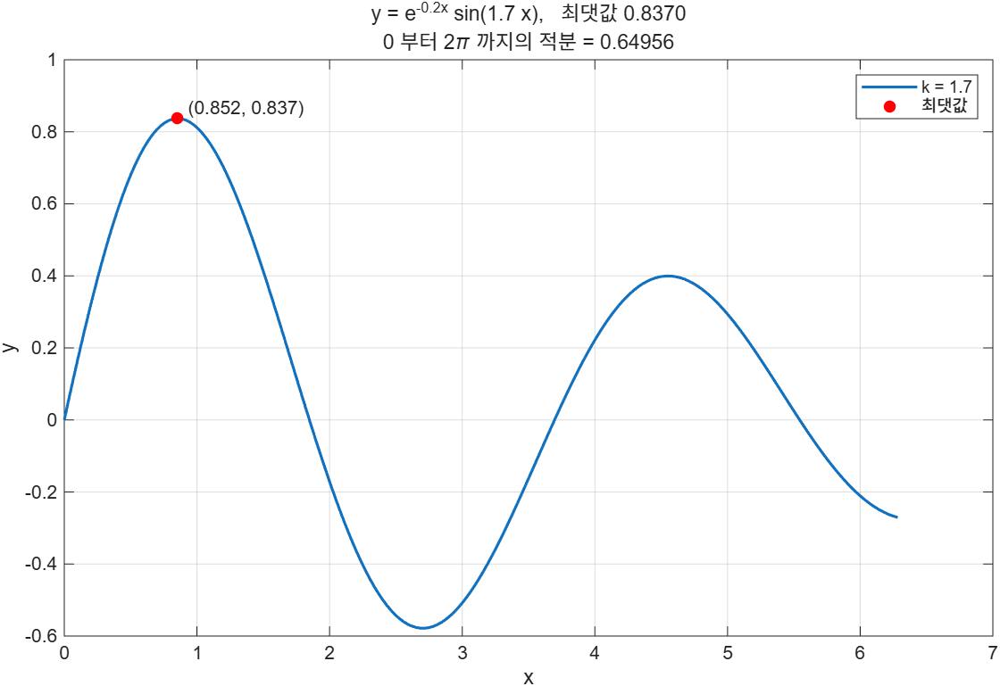

# 7.2.3 출력 (3) — `sprintf`

## `fprintf`와 무엇이 다른가

형식 규칙은 `fprintf`와 **완전히 같다**. 차이는 결과를 어디로 보내느냐 하나뿐이다.

| 함수 | 결과를 보내는 곳 |
|---|---|
| `fprintf` | 화면(또는 fid가 가리키는 파일) |
| `sprintf` | **돌려준다**. 변수에 담긴다 |

```matlab
a = sprintf("Some example output is %4.2f \n", pi*1000)
```
```
a =
    "Some example output is 3141.59 
     "
```

만들어진 문자열은 workspace에 남아 나중에 다시 쓸 수 있다. 이것이 `sprintf`의 전부이자 쓸모다.

[`example/ch07/ex0723_sprintf_basics.m`](../../example/ch07/ex0723_sprintf_basics.m):

```
class(a) = string   ← format 을 string 으로 줬으므로 string
strlength(a) = 32  (끝의 줄바꿈도 한 글자)

format 이 char 면 결과도 char: char
```

> **[보강]** **형식 문자열의 자료형이 결과의 자료형을 정한다.** `sprintf("...")`는 string을, `sprintf('...')`는 char를 돌려준다. 이 차이가 바로 뒤에서 문제가 된다. string끼리는 `+`가 이어 붙이기지만 char끼리는 덧셈이기 때문이다.
>
> ```matlab
> sprintf('ab') + sprintf('cd')   % [196 198]  ← ASCII 덧셈
> sprintf("ab") + sprintf("cd")   % "abcd"     ← 이어 붙이기
> ```
>
> 조각들을 `+`로 이어 긴 문자열을 조립할 생각이라면 형식을 **큰따옴표**로 쓸 것.

---

## 가장 흔한 쓰임 — 그래프 제목과 주석

`title`, `subtitle`, `xlabel`, `ylabel`, `legend`, `text`는 모두 문자열을 받는다. 계산 결과를 제목에 넣어야 할 때 `sprintf`가 제격이다.

[`example/ch07/ex0723_sprintf_title.m`](../../example/ch07/ex0723_sprintf_title.m):

```matlab
[ymax, idx] = max(y);
xmax = x(idx);
area = trapz(x, y);

title(sprintf('y = e^{-0.2x} sin(%.1f x),   최댓값 %.4f', k, ymax))
subtitle(sprintf('0 부터 2\\pi 까지의 적분 = %.5f', area))
text(xmax, ymax, sprintf('  (%.3f, %.3f)', xmax, ymax), VerticalAlignment='bottom')
legend(sprintf('k = %.1f', k), '최댓값', Location='northeast')
```



```
최댓값 0.8370 (x = 0.8525), 적분 0.64956
```

> **[보강]** 그래프 글자는 기본적으로 TeX로 해석된다. 그래서 `\pi`는 π로, `^{-0.2x}`는 위첨자로 나온다. 그런데 `sprintf`의 형식 문자열에서는 `\p`가 이스케이프 후보라 **`\\pi`로 두 번** 써야 TeX에 `\pi`가 전달된다. 역슬래시를 두 번 치는 이유가 여기에 있다.

---

## 배열을 주면 한 덩어리 글자가 된다

`fprintf`와 똑같이 형식이 반복되는데, 결과가 화면이 아니라 **하나의 문자열**로 뭉쳐 돌아온다.

```matlab
c = sprintf('%d ', 1:5);     % "1 2 3 4 5 "  (1x10 char)
```

여러 줄짜리 문자열도 이렇게 한 번에 만들 수 있다.

---

## 숫자를 글자로 바꾸는 세 가지

| 방법 | 결과 | 자릿수 제어 |
|---|---|---|
| `num2str(x)` | char | 유효숫자 개수 또는 형식 문자열 |
| `string(x)` | string | 없음 (기본 표시) |
| `sprintf('%10.3f', x)` | char/string | 폭·정밀도·정렬까지 전부 |

```
num2str(1234.5678)           = 1234.5678
string(1234.5678)            = 1234.5678
sprintf('%10.3f', 1234.5678) =   1234.568
```

열을 맞춰야 하면 `sprintf`밖에 답이 없다.

---

## ⚠️ 함정

- **형식을 작은따옴표로 주면 char가 돌아온다.** 조각을 `+`로 이을 생각이면 큰따옴표를 쓸 것. char끼리 `+`는 조용히 ASCII 덧셈이 된다.
- **TeX 기호를 쓰려면 역슬래시를 두 번.** `sprintf('\\pi')`.
- **`%d` 자리에 string을 주면 오류다.** `sprintf('%d', string(5))`는 `string에서 int64(으)로 변환될 수 없습니다`를 낸다. 숫자는 숫자로 넘길 것.
- **`sprintf`는 아무것도 찍지 않는다.** 결과를 받아서 쓰지 않으면 한 일이 없다. 반환값을 버린 채 `sprintf(...)`라고만 쓰면 `ans`에 담길 뿐이다.

---

## 연습문제

> **[보강]** 아래 연습문제와 그 해답은 슬라이드에 없다. 시험 대비용으로 추가한 것이다.

1. 감쇠 자유진동 `x(t) = e^{-ζω_n t} cos(ω_d t)`를 그리시오. `m = 2 kg`, `k = 50 N/m`, `c = 1.5 N·s/m`에서 `ω_n`, `ζ`, `ω_d`, 감쇠 주기를 계산해 제목·부제·축이름·범례에 `sprintf`로 넣으시오. 포락선 `±e^{-ζω_n t}`도 같이 그리시오.
2. 품목·수량·단가·금액이 열 맞춰 찍히는 영수증 문자열을 `sprintf`로 **만들어 두었다가** 화면과 파일에 각각 보내시오. 형식을 작은따옴표로 줬을 때 `+`가 왜 깨지는지도 확인하시오.

해답: [solutions.md](solutions.md#723)
