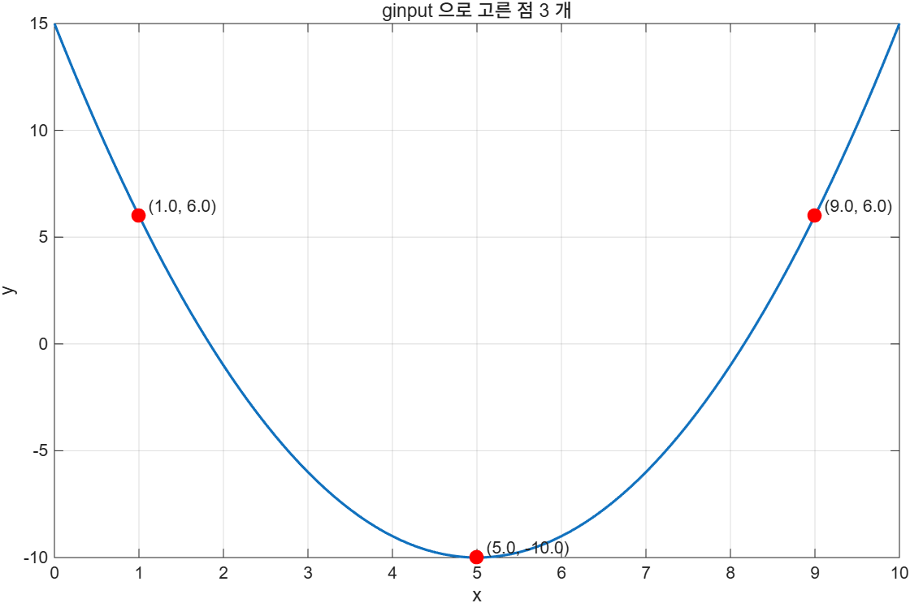

# 7.3 그래프로 입력받기 — `ginput`

## 쓰는 법

`ginput`은 **그림창에서 마우스로 찍은 점**을 x, y 좌표로 바꿔 준다. 키보드로 숫자를 치는 것보다 그래프 위의 위치를 직접 고르는 편이 자연스러운 경우에 쓴다.

```matlab
[x, y] = ginput(n)    % 점 n 개를 고를 때까지 기다린다
[x, y] = ginput       % Enter 를 누를 때까지 몇 개든 받는다
```

- 개수 `n`을 주면 **정확히 `n`개**를 고를 때까지 멈춘다.
- 개수를 생략하면 사용자가 **Enter**를 칠 때까지 계속 받는다.
- 돌아오는 `x`, `y`는 **그래프 좌표**다. 픽셀이 아니다. 축 범위가 0~10이면 좌표도 그 범위 안의 값이다.
- 둘 다 **열 벡터**로 돌아온다.

[`example/ch07/ex0703_ginput.m`](../../example/ch07/ex0703_ginput.m):

```matlab
x = 0:0.1:10;
y = x.^2 - 10*x + 15;
plot(x, y)

[a, b] = ginput;        % 그림창에서 점을 찍는다
```

```
고른 점의 개수: 3
a(=x) 의 크기 = [3 1], b(=y) 의 크기 = [3 1]  ← 둘 다 열 벡터
  점 1: ( 1.000,    6.000)
  점 2: ( 5.000,  -10.000)
  점 3: ( 9.000,    6.000)
```



`a`와 `b`는 그래프 위의 x, y 좌표에 대응한다. 점을 찍은 뒤에는 보통 그 점들을 다시 그려서 제대로 골랐는지 확인한다.

> **[보강]** `ginput`은 사람이 마우스로 찍어야 하므로 `-batch`에서 쓸 수 없다. 이 저장소의 예제는 `usejava('desktop')`으로 갈라, 배치 실행에서는 미리 정한 좌표를 써서 뒷부분(점 표시·계산·저장)을 그대로 보여 준다.
>
> ```matlab
> if usejava('desktop')
>     [a, b] = ginput;
> else
>     a = [1.0; 5.0; 9.0];
>     b = interp1(x, y, a);
> end
> ```

---

## 전형적인 쓰임새

### 1. 두 점을 골라 거리·기울기 구하기

`ginput(2)`로 정확히 두 점만 받고, `hypot`으로 거리를, 차분으로 기울기를 구한다. 곡선의 할선(secant)을 그려 보는 데 쓴다.

### 2. 손으로 찍은 점에 곡선 맞추기

개수 제한 없이 점을 받아 `polyfit`에 넘기면, 마우스로 대충 찍은 자료에 다항식을 맞출 수 있다. 실험 그래프 사진에서 값을 뽑아낼 때(digitizing) 쓰는 수법이다.

### 3. 관심 영역 고르기

두 점으로 사각형을 정해 `xlim`, `ylim`을 다시 잡거나, 그 범위의 자료만 골라낸다.

---

## 비슷한 함수들

| 함수 | 하는 일 |
|---|---|
| `ginput` | 그림창에서 점의 좌표를 받는다 |
| `gtext('글')` | 마우스로 찍은 자리에 글자를 놓는다 |
| `waitforbuttonpress` | 키나 마우스 입력 하나를 기다린다 |
| `datacursormode` | 데이터 점에 붙는 값 표시 커서를 켠다 |
| `drawpoint`, `drawline`, `drawrectangle` | 마우스로 도형을 그려 그 객체를 돌려준다 (R2018b~) |

> **[보강]** `ginput`은 축의 아무 데나 찍을 수 있어 **곡선 위의 점이라는 보장이 없다**. 곡선 위 점을 원한다면 찍은 x에 대해 `interp1`로 y를 다시 계산하거나, `drawpoint`처럼 데이터에 스냅되는 도구를 쓰는 편이 낫다.

---

## ⚠️ 함정

- **`-batch`에서는 못 쓴다.** 데스크톱 전용이다.
- **개수를 안 주면 Enter를 칠 때까지 멈춘다.** 스크립트가 멈춘 것처럼 보이면 그림창을 확인할 것.
- **돌아오는 값은 그래프 좌표이지 픽셀이 아니다.** 축 범위를 바꾸면 같은 자리를 찍어도 다른 값이 나온다.
- **축 바깥을 찍어도 받는다.** 범위를 벗어난 값이 섞일 수 있으니 필요하면 걸러야 한다.
- **그림창이 여러 개면 어느 창에서 찍는지 주의할 것.** `figure(h)`로 원하는 창을 먼저 앞으로 가져온다.
- **점을 안 찍고 Enter를 누르면 빈 배열이 돌아온다.** 뒤에서 `numel`을 확인하지 않으면 `polyfit` 같은 함수에서 오류가 난다.

---

## 연습문제

1. `y = x^3 - 3x^2 + 2`를 `-2 ≤ x ≤ 4`에서 그리고, `ginput(2)`로 두 점을 골라 두 점 사이 거리와 할선의 기울기·절편을 구하시오. 할선도 같이 그리시오.
2. 빈 축(`axis([0 10 0 100])`)에 `ginput`으로 점을 여러 개 찍고, 그 점들에 2차 다항식을 맞추시오. 결정계수 `R²`를 계산해 제목이나 범례에 넣고, 점이 셋 미만이면 `error`로 멈추게 하시오.

해답: [solutions.md](solutions.md#73)
