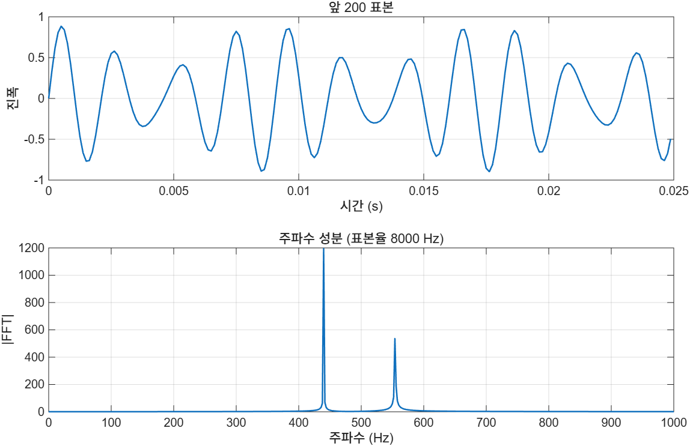

# 7.4 파일 읽고 쓰기

## 자료는 여러 형식으로 저장된다

자료를 만든 장치와 프로그램에 따라 저장 형식이 다르다. 소리는 `.wav`, 그림은 `.jpg`, 스프레드시트는 `.xlsx`에 담긴다. 그중 가장 범용적인 것은 **ASCII 파일**로, 보통 `.dat`이나 `.txt`로 저장된다.

MATLAB으로 분석하려면 이 파일들을 **가져와야(import)** 하고, 결과를 다른 프로그램에 넘기려면 **내보내야(export)** 한다.

### MATLAB이 지원하는 주요 형식 (원서 Table 7.3)

| 종류 | 확장자 | 비고 |
|---|---|---|
| 텍스트 | `.mat` | MATLAB workspace |
| | `.dat` | ASCII data |
| | `.txt` | ASCII data |
| | `.csv` | 쉼표로 구분된 값 |
| 과학 자료 형식 | `.cdf` | common data format |
| | `.fits` | flexible image transport system data |
| | `.hdf` | hierarchical data format |
| 스프레드시트 | `.xls`, `.xlsx` | Excel |
| 그림 | `.tiff` | tagged image file format |
| | `.bmp` | bitmap |
| | `.jpeg`, `.jpg` | joint photographic expert group |
| | `.gif` | graphics interchange format |
| 소리 | `.au`, `.snd` | audio |
| | `.wav` | Microsoft wave file |
| | `.mp4` | MPEG-4 |
| 동영상 | `.avi` | audio/video interleaved file |
| | `.mpg` | motion picture experts group |

전체 목록은 help에서 "supported file formats"로 찾을 수 있다.

---

## 7.4.1 가져오기 (import)

### Import Wizard

current folder에서 자료 파일을 **더블클릭**하면 Import Wizard가 뜬다. 파일에 어떤 자료가 들었는지 알아보고 MATLAB에서 어떤 변수로 만들지 제안한다. 안내를 따라가면 원하는 변수가 workspace에 만들어진다.

명령으로 띄우려면 `uiimport`를 쓴다.

```matlab
uiimport("data.txt")              % current folder 에 있으면 이름만
uiimport("C:\자료\data.txt")       % 아니면 전체 경로
```

슬라이드의 예는 `.wav` 파일을 Wizard로 연 화면이다. 체크박스 목록에 `data`(표본값, double 배열)와 `fs`(표본율, `1×1` double)가 보이고, Finish를 누르면 **double 배열 두 개**가 workspace에 생긴다. Finish 옆에는 **Generate MATLAB code** 체크박스가 있다. 체크하면 같은 작업을 자동으로 하는 코드가 생성되므로, 같은 형식의 파일을 반복해서 읽을 일이라면 한 번 생성해 두고 쓰면 된다.

Wizard는 어떻게 띄우든 **사람과의 상호작용을 요구한다**. 프로그램 안에서 자동으로 자료를 읽어야 한다면 Wizard가 아니라 아래의 전용 함수를 써야 한다.

> **[보강]** `uiimport`는 `-batch`에서 쓸 수 없다.

### 형식별 전용 함수

> **[보강]** 슬라이드는 `audioread`, `readtable`, `writetable` 셋만 이름을 든다. 아래 표의 `readmatrix`/`readcell`/`imread`/`load`·`save` 쌍은 추가한 것이다.

Wizard를 건너뛰고 형식에 맞는 함수를 직접 부르는 편이 보통 낫다.

| 읽기 | 쓰기 | 대상 |
|---|---|---|
| `readtable` | `writetable` | `.dat` `.txt` `.csv` `.xls` `.xlsx` → table |
| `readmatrix` | `writematrix` | 같은 파일들 → 숫자 행렬 |
| `readcell` | `writecell` | 같은 파일들 → cell array |
| `audioread` | `audiowrite` | `.wav` `.mp3` `.m4a` … |
| `imread` | `imwrite` | `.png` `.jpg` `.tif` … |
| `load` | `save` | `.mat` |

내보내기 함수를 찾는 가장 쉬운 방법은 **읽기 함수의 도움말을 찾아 끝까지 보는 것**이다. 도움말 끝에서 짝이 되는 쓰기 함수로 안내한다. 예를 들어 `readtable` 도움말 끝에서 `writetable`로 넘어간다(아래 "내보내기" 참조).

> **[보강]** R2026a 도움말에서는 이 안내가 맨 아래 **"참고 항목"(See Also)** 목록에 있다. `doc readtable` → 맨 아래 `writetable`.

---

## 소리 파일 — `audioread`, `sound`

```matlab
[data, fs] = audioread("dave.wav")
sound(data, fs)
```

- `data`는 표본값 배열, `fs`는 표본율(Hz)이다.
- `sound(data, fs)`로 재생한다. 표본율을 틀리게 주면 속도와 음높이가 달라진다.

**어떤 자료가 나올지 알고 변수 이름을 지어야 한다.** 가져온 뒤에는 그 자료형에 맞는 함수를 써야 한다. `.wav`라면 `sound`가 맞는 함수다.

[`example/ch07/ex0704_audio_import.m`](../../example/ch07/ex0704_audio_import.m)은 `audiowrite`로 440 Hz + 554.37 Hz 화음을 만들어 저장한 뒤 다시 읽어 파형과 주파수 성분을 그린다.

```
만든 파일: ...\chord.wav (8046 바이트)
audioread 결과: size(data) = [4001 1], fs = 8000 Hz
표본 수 4001 / 표본율 8000 = 0.500 초
audioinfo: 1 채널, 16 bit, 0.500 초
```



재생하지 않고 파일 정보만 보려면 `audioinfo`를 쓴다.

> **[보강]** R2026a에는 바로 쓸 수 있는 `.wav` 예제 파일이 search path에 없다(`which('handel.wav')`가 빈값이다). 슬라이드의 `dave.wav`도 교재 부속 파일이다. 그래서 예제에서는 `audiowrite`로 파일을 만들어 읽는 왕복(round trip)으로 바꿨다. `sound`는 소리 장치가 필요해 `-batch`에서는 건너뛴다.

---

## 표 형식 자료 — `readtable`

가장 쓸모 있는 가져오기 함수다. **표 형태로 저장된 자료를 읽어 table 배열로 만든다.**

- `.dat`, `.txt`, `.csv`, `.xlsx`를 모두 읽는다. 실험 자료가 저장되는 형식 대부분이 여기 들어간다.
- **파일을 어떤 종류로 읽을지는 확장자가 정한다.** 아래 원서 Table 7.4가 그 대응표다.
- **열 이름은 파일 첫 줄**에서 가져온다.
- **열마다 자료형을 알아서 정한다.**

### `readtable`이 읽는 형식 (원서 Table 7.4)

| 확장자 | 자료 종류 |
|---|---|
| `.txt`, `.dat`, `.csv` | 구분자로 나뉜 텍스트 파일 (delimited text) |
| `.xls`, `.xlsb`, `.xlsm`, `.xlsx`, `.xltm`, `.xltx`, `.ods` | 스프레드시트 파일 |
| `.xml` | XML(Extensible Markup Language) 파일 |

> **[보강]** R2026a에서 확인한 결과, 표에 없는 확장자(예: `.log`)는 텍스트 파일로 간주해 그대로 읽었다. 확장자와 실제 내용이 다를 때는 `FileType="text"` / `"spreadsheet"`로 종류를 직접 지정한다. `writetable(T, "t.xml")`로 쓴 파일도 `readtable`로 되읽힌다. 확장자가 형식을 정한다는 규칙은 `writetable`에도 그대로 적용된다.

table 배열은 원서 뒤 장에서 더 자세히 다룬다. 읽은 표에 어떤 열 이름이 붙었는지는 workspace 창에서 변수를 더블클릭해 확인하면 된다.

MATLAB에는 연습용 내장 자료 파일이 있다. `patients.dat`은 MATLAB이 자동으로 뒤지는 **search path** 위에 있으므로, current folder에 없어도 이름만으로 읽힌다.

```matlab
T = readtable("patients.dat");
```

[`example/ch07/ex0704_readtable_patients.m`](../../example/ch07/ex0704_readtable_patients.m):

```
patients.dat 의 위치:
  C:\Program Files\MATLAB\R2026a\toolbox\matlab\demos\patients.dat

class(T) = table,  size(T) = [100 10]

--- 열마다 자료형이 다르게 잡힌다 ---
  LastName               cell
  Gender                 cell
  Age                    double
  Location               cell
  Height                 double
  Weight                 double
  Smoker                 double
  Systolic               double
  Diastolic              double
  SelfAssessedHealthStatus cell
```

읽고 나면 평범한 table이므로 7.2.4에서 본 것을 그대로 쓸 수 있다.

```matlab
mean(T.Age)                              % 38.28
sum(T.Smoker)                            % 34
T(T.Smoker == 1 & T.Age > 40, {'LastName', 'Age', 'Systolic'})
```

> **[보강]** 글자 열이 기본값으로는 `cell` of char로 들어온다. string으로 받으려면 `readtable(파일, TextType="string")`을 쓴다. 최신 코드를 쓸 생각이면 이 옵션을 습관처럼 붙이는 편이 낫다.

100행짜리 표는 command window보다 **Variable Editor**로 보는 편이 낫다. workspace에서 `T`를 더블클릭하면 열린다.

---

## 세 가지 읽기 함수의 차이

> **[보강]** 이 절 전체가 슬라이드 밖 내용이다. 슬라이드는 `readtable`만 다루지만, 어떤 함수를 골라야 하는지는 시험에 나오기 좋다.

같은 CSV를 세 함수로 읽으면 결과가 전혀 다르다. [`example/ch07/sol0704_3.m`](../../example/ch07/sol0704_3.m)에서:

```
Name,Score,Pass
Ann,88,1
Bob,72,0
Cid,95,1
```

| 함수 | 결과 | 크기 |
|---|---|---|
| `readtable` | 열 이름 보존, 열마다 자료형 | `3×3 table` |
| `readmatrix` | 숫자만. 글자는 `NaN` | `3×3 double` |
| `readcell` | 모든 칸을 그대로. 머리글 포함 | `4×3 cell` |

- 글자와 숫자가 섞여 있으면 **`readtable`**
- 순수 숫자 행렬이면 **`readmatrix`**가 가장 간단하다
- 아무것도 해석하지 말고 날것으로 받고 싶으면 **`readcell`**

---

## 내보내기 — `writetable`

```matlab
writetable(T, "filename.xlsx")
```

`T`는 저장할 표, 둘째 인수는 파일 이름이다. **확장자가 저장 형식을 정한다.**

[`example/ch07/ex0704_writetable.m`](../../example/ch07/ex0704_writetable.m)과 [`sol0704_2.m`](../../example/ch07/sol0704_2.m)에서:

```
CSV  로 저장: 1468 바이트
XLSX 로 저장: 4625 바이트  ← 확장자만 바꾸면 형식이 바뀐다
```

읽기 → 고르기 → 쓰기가 자료 처리의 기본 흐름이다.

```matlab
T   = readtable("patients.dat", TextType="string");
sel = T(T.Smoker == 0 & T.Systolic < 120, ["LastName", "Age", "Height", "Weight"]);
sel.BMI = 703 * sel.Weight ./ sel.Height.^2;
writetable(sel, "healthy.csv");
```

> **[보강]** 왕복이 완전히 무손실은 아니다. `string` 열로 쓴 표를 `readtable`로 되읽으면 기본값으로는 `cell` of char로 돌아온다. 숫자 열은 값이 보존된다. 자료형까지 그대로 보존하고 싶다면 `.mat`에 `save`하는 편이 확실하다.

---

## ⚠️ 함정

- **`uiimport`와 Import Wizard는 사람 손이 필요하다.** 자동화에는 전용 함수를 쓸 것.
- **`readtable`은 첫 줄을 열 이름으로 쓴다.** 머리글이 없는 파일이면 `ReadVariableNames=false`를 줘야 한다.
- **`readmatrix`는 글자를 `NaN`으로 만든다.** 글자 열이 있는데 숫자만 나왔다면 함수를 잘못 고른 것이다.
- **글자 열의 기본 자료형은 `cell`이다.** string을 원하면 `TextType="string"`.
- **확장자가 형식을 정한다.** `writetable(T, "out")`처럼 확장자를 빼면 `.txt`가 된다.
- **`sound`는 소리 장치가 필요하다.** `-batch`에서는 건너뛸 것.
- **상대 경로는 current folder 기준이다.** 파일을 못 찾으면 `pwd`와 `which`로 먼저 확인할 것.

---

## 연습문제

> **[보강]** 아래 연습문제와 그 해답은 슬라이드에 없다. 시험 대비용으로 추가한 것이다.

1. 날짜·지점·강우량·기온이 든 CSV를 직접 만들고 `readtable`로 읽으시오. 각 열의 자료형을 출력하고, 전체 통계와 `groupsummary`로 지점별 통계를 내시오. 강우량 10 mm를 넘는 날만 골라 보이시오.
2. `patients.dat`에서 **비흡연자이면서 수축기 혈압이 120 미만**인 환자만 골라 BMI 열을 추가한 뒤 `.csv`와 `.xlsx`로 각각 내보내시오(`BMI = 703 × 체중[lb] / 키[in]²`). 되읽어 값이 보존됐는지 확인하시오.
3. 글자와 숫자가 섞인 CSV 하나를 `readtable`, `readmatrix`, `readcell`로 각각 읽어 결과의 클래스·크기·내용을 비교하시오. 어떤 상황에 어느 함수를 써야 하는지 정리하시오.

해답: [solutions.md](solutions.md#74)
