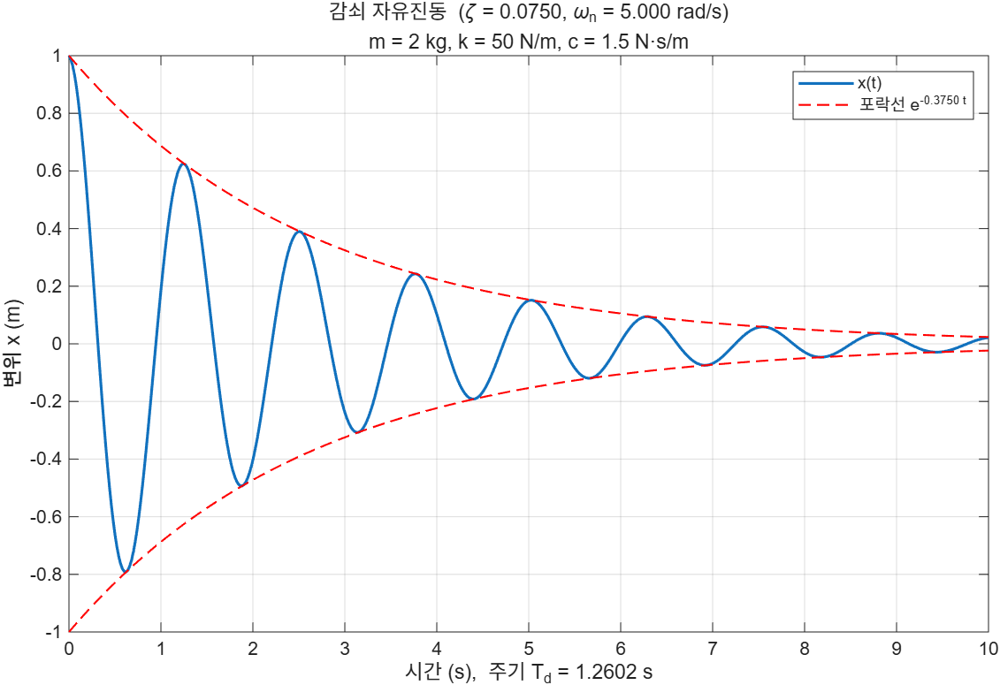
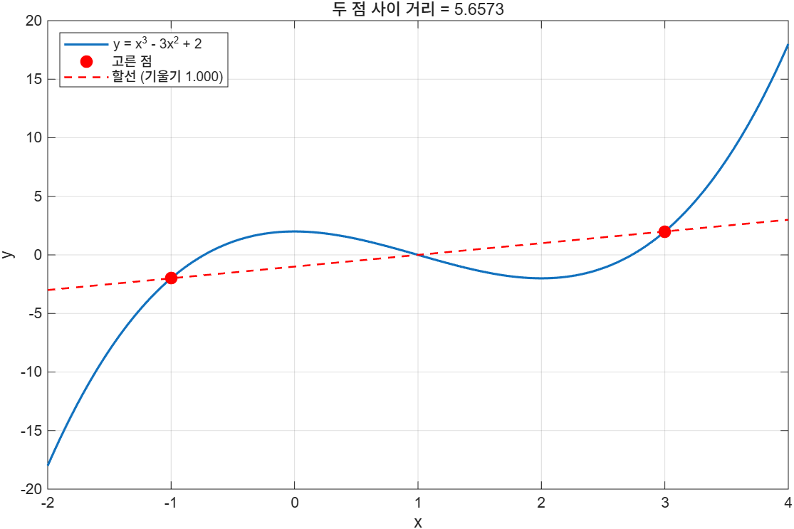
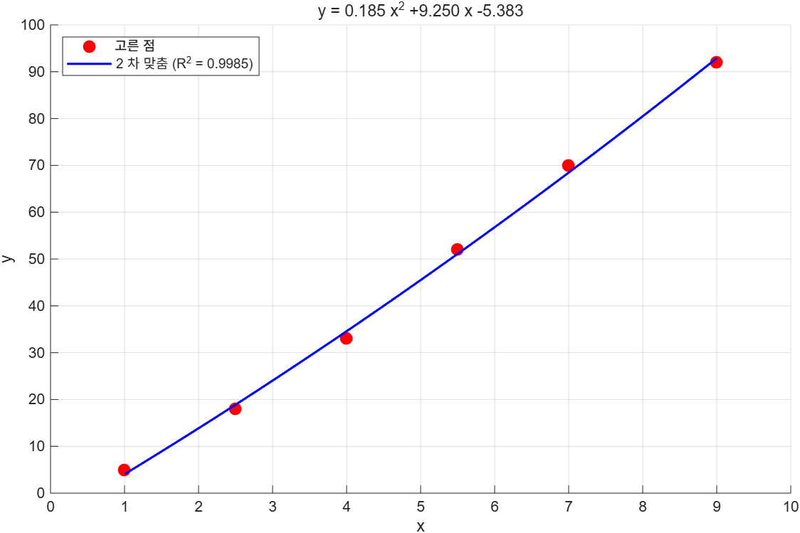

# Chapter 7 연습문제 해답

각 해답 코드는 `example/ch07/solXXYY_N.m`에 있다.

> **[보강]** 이 파일 전체가 슬라이드 밖 내용이다. 연습문제와 해답은 모두 시험 대비용으로 추가한 것이다.

---

## 7.1

### 1. 반지름을 입력받아 넓이와 둘레

[`sol0701_1.m`](../../example/ch07/sol0701_1.m)

`input`은 사용자가 친 것을 코드로 해석할 뿐 **검사는 하지 않는다**. 음수든 글자든 그대로 들어오므로 쓰는 쪽에서 확인해야 한다.

```matlab
r = input('반지름을 입력하시오: ');

if ~isnumeric(r) || ~isscalar(r) || r <= 0
    error('양수인 스칼라를 입력해야 한다.');
end

fprintf('  넓이 = %.4f\n', pi * r^2);
fprintf('  둘레 = %.4f\n', 2 * pi * r);
```

```
반지름을 입력하시오: 2.5
반지름 2.5 인 원
  넓이 = 19.6350
  둘레 = 15.7080
```

`input`은 배열도 그대로 받으므로 벡터를 넣으면 한 번에 여러 원을 처리할 수 있다. 7.2.2의 **행으로 쌓기**를 그대로 쓴다.

```matlab
rv = [1 2 3];
fprintf('  r = %g → 넓이 %8.4f, 둘레 %8.4f\n', [rv; pi*rv.^2; 2*pi*rv]);
```

```
  r = 1 → 넓이   3.1416, 둘레   6.2832
  r = 2 → 넓이  12.5664, 둘레  12.5664
  r = 3 → 넓이  28.2743, 둘레  18.8496
```

### 2. `'s'` 옵션과 자료형

[`sol0701_2.m`](../../example/ch07/sol0701_2.m)

```
변수                     클래스      크기       길이
a (작은따옴표 입력)           char     [1 4]    4
b (큰따옴표 입력)            string   [1 1]    4
c ("s" 옵션)             char     [1 4]    4
```

- `'Hong'`을 치면 **char**, `"Hong"`을 치면 **string**이 된다. `input`이 정하는 것이 아니라 **사용자가 친 모양**이 정한다.
- `"s"` 옵션은 따옴표 없이 받되 **언제나 char**를 준다. 이름이 string인데 char를 주는 것이 함정이다.
- 길이를 재는 함수가 다르다. char는 `numel`, string은 `strlength`.

비교하면 이렇게 나온다.

```
isequal(a, c) = 1  (둘 다 char 'Hong')
isequal(a, b) = 1  (isequal 은 내용만 보므로 char 와 string 도 같다고 한다)
a == b        = true
하지만 class 와 size 는 다르다: char [1 4] vs string [1 1]
```

**`isequal`은 내용만 본다.** 자료형까지 따지려면 `class`를 직접 봐야 한다.

### 3. 벡터 통계, 빈 입력 처리

[`sol0701_3.m`](../../example/ch07/sol0701_3.m)

사용자가 그냥 Enter를 누르면 `input`은 **오류가 아니라 빈 배열 `[]`**을 돌려준다. `isempty`로 걸러 기본값을 채운다.

```matlab
v = input('벡터를 대괄호로 입력하시오 (그냥 Enter 면 기본값): ');
if isempty(v)
    v = [4 8 15 16 23 42];
end
```

```
개수   = 6
합계   = 108
평균   = 18.0000
최댓값 = 42 (6 번째)
최솟값 = 4 (1 번째)
표준편차 = 13.4907
```

위치를 찾을 때 `find(v == max(v), 1)`처럼 **개수를 1로 제한**하면 최댓값이 여럿일 때도 하나만 돌아온다.

---

## 7.2.1

### 1. 이름과 점수를 한 줄로

[`sol0721_1.m`](../../example/ch07/sol0721_1.m)

```matlab
name = "김공학";  score = 93.5;

disp(name + " 의 점수는 " + score + " 점이다")                      % string +
disp(name + " 의 점수는 " + num2str(score, '%.1f') + " 점이다")     % 자릿수 지정
disp(['김공학' ' 의 점수는 ' num2str(score, '%.1f') ' 점이다'])      % char 대괄호
fprintf('%s 의 점수는 %.1f 점이다\n', name, score);                 % fprintf
```

넷 다 같은 줄을 만든다. string `+`는 숫자를 알아서 글자로 바꿔 주지만 **자릿수는 손댈 수 없다**. 자릿수를 정하려면 `num2str`에 형식을 주거나 `fprintf`를 쓴다.

### 2. 벡터를 한 줄로

[`sol0721_2.m`](../../example/ch07/sol0721_2.m)

```
--- 그냥 이으면 원소마다 한 줄씩 ---
    "값: 2"    "값: 4"    "값: 6"    "값: 8"    "값: 10"
("값: " + v) 의 크기 = [1 5]  ← 1x5 string 배열이라 5 줄
```

`"값: "`은 1×1, `v`는 1×5다. `+`가 짝을 맞춰 **1×5 string 배열**을 만들기 때문에 다섯 줄이 된다. 한 줄로 만들려면 **배열을 먼저 하나의 덩어리로** 바꿔야 한다.

| 방법 | 결과 |
|---|---|
| `num2str(v)` | `값: 2   4   6   8  10` |
| `join(string(v), ", ")` | `값: 2, 4, 6, 8, 10` |
| `strjoin(cellstr(num2str(v')), ' │ ')` | `값:  2 │  4 │  6 │  8 │ 10` |
| `sprintf('%9.3f', w)` | 폭까지 맞춰 정렬 |

`num2str(v)`의 크기는 `[1 17]`로 **한 줄짜리 char**다. 그래서 `+`로 이어도 결과가 하나다.

### 3. 따옴표가 든 문장

[`sol0721_3.m`](../../example/ch07/sol0721_3.m)

```matlab
disp('It''s a trap!')                    % char 안의 ' 는 두 번
disp("It's a trap!")                     % string 안이면 한 번

disp("She said ""no"" twice.")            % string 안의 " 는 두 번
disp('She said "no" twice.')              % char 안이면 한 번

disp('He said "it''s fine" and left')     % 둘 다 들어가면 하나는 두 번
disp("He said ""it's fine"" and left")
```

규칙은 하나다. **자기를 감싼 기호는 두 번, 반대쪽 기호는 한 번.** 아예 피하려면 따옴표를 변수로 넘기면 된다.

```matlab
fprintf('%s %s\n', '"', char(39));       % "  '
```

---

## 7.2.2

### 1. 화씨-섭씨-켈빈 변환표

[`sol0722_1.m`](../../example/ch07/sol0722_1.m)

```matlab
F = 0:10:100;  C = (F - 32) * 5/9;  K = C + 273.15;

fprintf('%8s %9s %9s\n', 'F', 'C', 'K');
fprintf('%s\n', repmat('-', 1, 28));
fprintf('%8.1f %9.2f %9.2f\n', [F; C; K]);
```

```
       F         C         K
----------------------------
     0.0    -17.78    255.37
    10.0    -12.22    260.93
    ...
   100.0     37.78    310.93
```

두 가지가 핵심이다.

1. **`[F; C; K]`로 행으로 쌓는다.** `fprintf`가 열 우선으로 소비하므로, 한 줄에 들어갈 값 셋이 한 열에 모여야 한다.
2. **머리글 폭을 숫자 폭과 맞춘다.** `%8s %9s %9s`와 `%8.1f %9.2f %9.2f`의 폭이 같아야 열이 선다.

잘못 쌓으면(`[F', C', K']`, 11×3) 이렇게 어긋난다.

```
     0.0     10.00    -17.78
   -12.2    255.37    260.93
```

F끼리 먼저 소비되어 한 줄에 F가 셋 들어가 버렸다.

### 2. `%f`, `%e`, `%g` 비교

[`sol0722_2.m`](../../example/ch07/sol0722_2.m)

```
             값                 %f                 %e             %g
--------------------------------------------------------------------
      0.000123           0.000123       1.230000e-04       0.000123
           1.5           1.500000       1.500000e+00            1.5
       12345.7       12345.678900       1.234568e+04        12345.7
   1.23457e+09  1234567890.000000       1.234568e+09    1.23457e+09
       3.14159           3.141593       3.141593e+00        3.14159
```

- **`%f`**: 언제나 고정소수점. 큰 수는 한없이 길어지고, 아주 작은 수는 0만 보인다.
- **`%e`**: 언제나 지수 표기. 자릿수가 일정해 **열 맞추기에 좋다**.
- **`%g`**: 둘 중 짧은 쪽. 기본 유효숫자는 6개.

정밀도를 주면 **세 형식에서 뜻이 조금씩 다르다**.

```
%.3f → 12345.679   (소수점 아래 3 자리)
%.3e → 1.235e+04   (가수의 소수점 아래 3 자리)
%.3g → 1.23e+04    (유효숫자 전체가 3 개)
```

`%d`에 정수가 아닌 값을 주면 반올림이 아니라 **형식 자체가 바뀐다**.

```
%d 에 42   → 42
%d 에 42.5 → 4.250000e+01
```

### 3. 파일로 내보내고 바이트 수 확인

[`sol0722_3.m`](../../example/ch07/sol0722_3.m)

```
머리글 20 바이트 + 구분선 20 바이트 + 본문 140 바이트 = 180 바이트
실제 파일 크기 = 189 바이트
```

**9바이트 차이가 난다.** 줄이 모두 9줄이기 때문이다.

- `fprintf`의 반환값은 **형식을 펼친 뒤의 문자 수**다. `\n`은 1글자로 센다.
- `"wt"`(텍스트 모드)로 열면 윈도우에서는 `\n`이 **CR+LF 2바이트**로 저장된다.

그래서 줄 수만큼 어긋난다. `"wb"`(바이너리 모드)로 열면 둘이 일치한다.

되읽을 때는 머리글 두 줄을 건너뛴다.

```matlab
M = readmatrix(fname, 'NumHeaderLines', 2);
```

```
readmatrix 로 읽은 크기 = [7 2]
최고 높이 = 20.380 m (t = 2.0 s)
```

---

## 7.2.3

### 1. 감쇠 진동 그래프와 `sprintf`

[`sol0723_1.m`](../../example/ch07/sol0723_1.m)

```matlab
wn = sqrt(k/m);                      % 고유진동수
zeta = c / (2*sqrt(k*m));            % 감쇠비
wd = wn * sqrt(1 - zeta^2);          % 감쇠 고유진동수

title(sprintf('감쇠 자유진동  (\\zeta = %.4f, \\omega_n = %.3f rad/s)', zeta, wn))
subtitle(sprintf('m = %g kg, k = %g N/m, c = %g N·s/m', m, k, c))
xlabel(sprintf('시간 (s),  주기 T_d = %.4f s', 2*pi/wd))
legend('x(t)', sprintf('포락선 e^{-%.4f t}', zeta*wn), Location='northeast')
```



```
고유진동수   wn = 5.0000 rad/s
감쇠비       zeta = 0.0750
감쇠 진동수  wd = 4.9859 rad/s
감쇠 주기    Td = 1.2602 s
```

**TeX 기호를 쓰려면 역슬래시를 두 번** 친다. `'\\zeta'`가 `sprintf`를 거치면 `\zeta`가 되고, 그것을 `title`이 TeX로 해석해 ζ를 그린다. 한 번만 쓰면 `sprintf`가 `\z`를 이스케이프 후보로 보고 경고를 낸다.

### 2. 영수증 문자열 조립

[`sol0723_2.m`](../../example/ch07/sol0723_2.m)

```
=================================
품목         수량       단가        금액
=================================
연필         12      300      3600
공책          3     1200      3600
지우개         2      500      1000
=================================
합계                          8200
=================================
```

조각을 만들어 두었다가 `+`로 잇는데, **형식을 큰따옴표로 줘야** 한다.

```matlab
header  = sprintf("%-8s %4s %8s %9s\n", '품목', '수량', '단가', '금액');
divider = sprintf("%s\n", repmat('=', 1, 33));
receipt = divider + header + divider + lines + divider + footer + divider;
```

작은따옴표로 주면 char가 돌아와 `+`가 **ASCII 덧셈**이 된다.

```
sprintf('ab') + sprintf('cd') = [196 198]   ← 덧셈
sprintf("ab") + sprintf("cd") = abcd        ← 이어 붙이기
```

한 줄씩은 반복문으로 만들었다. 한 줄에 글자(`%s`)와 숫자(`%d`)가 섞여 있어서 배열 하나로 쌓을 수 없기 때문이다.

```matlab
for k = 1:numel(item)
    rows(k) = sprintf("%-8s %4d %8d %9d", item(k), qty(k), price(k), total(k));
end
lines = join(rows, newline) + newline;
```

**`%d` 자리에 string을 주면 오류다.**

```
sprintf('%d', string(qty)) → string에서 int64(으)로 변환될 수 없습니다.
```

반대로 `%s` 자리에 숫자를 주면 **문자 코드로 해석된다**. `sprintf('%s', 65:67)`은 `ABC`가 된다.

만들어 둔 문자열은 화면·파일·그래프 제목 어디로든 보낼 수 있다. 그것이 `fprintf` 대신 `sprintf`를 쓰는 이유다.

---

## 7.2.4

### 1. 성적표 table

[`sol0724_1.m`](../../example/ch07/sol0724_1.m)

```
     Name      Mid    Final    HW     Total    Grade
    _______    ___    _____    ___    _____    _____

    "김하늘"    88      91      100    91.75     "A" 
    "박구름"    95      89       92     91.7     "A" 
    "이바다"    72      80       85     78.2     "C" 
    "최바람"    61      77       70       70     "C" 
```

열 추가는 그냥 대입이다. 숫자 열이든 string 열이든 똑같다.

```matlab
T.Total = 0.35*T.Mid + 0.45*T.Final + 0.20*T.HW;

grade = strings(height(T), 1);
grade(T.Total >= 90) = "A";
grade(T.Total >= 80 & T.Total < 90) = "B";
grade(T.Total <  80) = "C";
T.Grade = grade;

T = sortrows(T, "Total", "descend");
```

```
열의 자료형이 섞여 있다: Name(string) Mid(double) Final(double) HW(double) Total(double) Grade(string)
```

**이것이 table을 쓰는 이유다.** 숫자 행렬 하나로는 할 수 없다.

열 이름을 한글로 바꾸면 **점 표기를 쓸 수 없게 된다**.

```matlab
T.Properties.VariableNames = ["이름", "중간", "기말", "과제", "총점", "학점"];
mean(T.("총점"))        % T.총점 은 문법 오류
```

MATLAB 식별자는 ASCII 글자로 시작해야 하므로 `T.총점`은 파싱 단계에서 거부된다. 그래서 **계산에 쓸 열 이름은 ASCII로 두고, 보여 줄 때만 바꾸는** 편이 편하다.

### 2. 표의 메타정보

[`sol0724_2.m`](../../example/ch07/sol0724_2.m)

```matlab
T.Properties.VariableUnits = ["", "degC", "kPa"];
T.Properties.VariableDescriptions = ["시료 번호", "측정 온도", "측정 압력"];
T.Properties.Description = "7.2.4 연습문제용 측정 자료";
```

```
  Sample  단위=      설명=시료 번호
  Temp    단위=degC  설명=측정 온도
  Press   단위=kPa   설명=측정 압력
```

행 이름을 붙이면 **이름으로 행을 고를 수 있다**.

```matlab
T2.Properties.RowNames = cellstr(T2.Sample);
T2.Sample = [];           % 이름이 행 이름으로 갔으니 열은 지운다
T2("S3", :)
```

```
          Temp    Press
          ____    _____

    S3    30.2     105 
```

표 안의 열은 평범한 배열이므로 그대로 계산에 쓴다.

```
온도-압력 상관계수 = 0.997887
직선 맞춤: 압력 = 0.4138 * 온도 + 92.7452
```

이름에 **공백이나 괄호**가 들어가도 점 표기를 못 쓴다. 한글과 같은 상황이다.

```matlab
T3.Properties.VariableNames = ["Sample", "Temp (degC)", "Press (kPa)"];
mean(T3.("Temp (degC)"))
```

---

## 7.3

### 1. 두 점의 거리와 할선

[`sol0703_1.m`](../../example/ch07/sol0703_1.m)

```matlab
[a, b] = ginput(2);            % 정확히 두 점만 받는다

d = hypot(a(2)-a(1), b(2)-b(1));
m = (b(2)-b(1)) / (a(2)-a(1));
c = b(1) - m*a(1);
```



```
점 1 = (-1.0000, -2.0003)
점 2 = (3.0000, 2.0003)
거리   = 5.6573
기울기 = 1.0002
할선   : y = 1.0002 x -1.0002
```

`hypot(dx, dy)`는 `sqrt(dx^2 + dy^2)`인데 중간 계산에서 넘침이 생기지 않는다.

좌표가 `-1.0000`이 아니라 `-2.0003`처럼 끝자리가 어긋나는 것은, `ginput` 대신 `interp1`로 곡선 위 값을 **보간**해 썼기 때문이다. 실제로 마우스로 찍어도 정확한 값이 나오지는 않는다. **`ginput`은 축의 아무 데나 찍을 수 있어 곡선 위라는 보장이 없다**는 점을 기억할 것.

### 2. 찍은 점에 다항식 맞추기

[`sol0703_2.m`](../../example/ch07/sol0703_2.m)

```matlab
[a, b] = ginput;               % 개수 제한 없이 Enter 까지

if numel(a) < 3
    error('2 차 다항식을 맞추려면 점이 셋 이상 필요하다.');
end

p = polyfit(a, b, 2);
resid = b - polyval(p, a);
R2 = 1 - sum(resid.^2) / sum((b - mean(b)).^2);
```



```
찍은 점 6 개
2 차 맞춤: y = 0.1855 x^2 +9.2505 x -5.3835
R^2 = 0.998468
```

점을 안 찍고 Enter를 누르면 빈 배열이 돌아오므로 **개수 확인이 꼭 필요하다**. `polyfit`에 빈 배열을 주면 오류가 난다.

`R²`는 `1 - (잔차 제곱합) / (전체 제곱합)`이다. 1에 가까울수록 잘 맞는다.

---

## 7.4

### 1. CSV 만들고 `readtable`로 읽기

[`sol0704_1.m`](../../example/ch07/sol0704_1.m)

```
    Day    Site    Rainfall    Temp
    ___    ____    ________    ____

     1     "A"       12.5      18.2
     2     "A"          0      21.4
     ...
```

```
  Day        double
  Site       string
  Rainfall   double
  Temp       double
```

`'TextType', 'string'`을 줬기 때문에 `Site`가 `cell`이 아니라 `string`으로 들어왔다. 기본값은 `cell` of char다.

`groupsummary`로 묶어서 통계를 낸다.

```matlab
G = groupsummary(T, "Site", ["sum" "mean"], ["Rainfall" "Temp"]);
```

```
    Site    GroupCount    sum_Rainfall    mean_Rainfall    sum_Temp    mean_Temp
    ____    __________    ____________    _____________    ________    _________

    "A"         3             45.6             15.2          56.5       18.833  
    "B"         3             51.7           17.233          56.6       18.867  
```

### 2. `patients.dat` 고르고 내보내기

[`sol0704_2.m`](../../example/ch07/sol0704_2.m)

**읽기 → 고르기 → 열 추가 → 쓰기**가 자료 처리의 기본 흐름이다.

```matlab
T = readtable("patients.dat", 'TextType', 'string');

sel = T(T.Smoker == 0 & T.Systolic < 120, ...
        ["LastName", "Age", "Height", "Weight", "Systolic", "Diastolic"]);

sel.BMI = 703 * sel.Weight ./ sel.Height.^2;   % Height 는 인치, Weight 는 파운드

writetable(sel, "healthy.csv");
writetable(sel, "healthy.xlsx");
```

```
원본: 100 행 x 10 열
조건에 맞는 환자 = 34 명
평균 나이 37.68 세, 평균 BMI 23.83

CSV  로 저장: 1468 바이트
XLSX 로 저장: 4625 바이트  ← 확장자만 바꾸면 형식이 바뀐다
```

행 고르기는 **논리 인덱싱**이다. `T.Smoker == 0 & T.Systolic < 120`이 100개짜리 논리 벡터를 만들고, 그것이 참인 행만 남는다. 열은 이름 배열로 고른다.

되읽어 확인하면 숫자 열은 값이 그대로다.

```
되읽은 크기 = [34 7], 원본과 같은가? 1
BMI 가 그대로인가? 1
```

### 3. `readtable` / `readmatrix` / `readcell`

[`sol0704_3.m`](../../example/ch07/sol0704_3.m)

같은 CSV를 세 함수로 읽은 결과다.

```
=== readtable ===               === readmatrix ===        === readcell ===
    Name     Score    Pass         NaN    88     1        {'Name'} {'Score'} {'Pass'}
    "Ann"     88       1           NaN    72     0        {'Ann' } {[   88]} {[   1]}
    "Bob"     72       0           NaN    95     1        {'Bob' } {[   72]} {[   0]}
    "Cid"     95       1                                  {'Cid' } {[   95]} {[   1]}

table, [3 3]                    double, [3 3]             cell, [4 3]
```

| 상황 | 쓸 함수 |
|---|---|
| 글자와 숫자가 섞여 있다 | `readtable` |
| 순수 숫자 행렬이다 | `readmatrix` |
| 해석하지 말고 날것으로 받고 싶다 | `readcell` |

`readmatrix`는 **머리글 줄을 자동으로 건너뛰고**, 숫자가 아닌 칸은 `NaN`으로 만든다. `readcell`은 머리글 줄까지 포함해 4행이 된다.

짝이 되는 쓰기 함수는 이름에서 바로 보인다.

```
readtable  ↔  writetable
readmatrix ↔  writematrix
readcell   ↔  writecell
audioread  ↔  audiowrite
imread     ↔  imwrite
```

---

## 7.5

### 1. `checkcode`로 경고 잡고 고치기

[`sol0705_1.m`](../../example/ch07/sol0705_1.m), [`warn_demo.m`](../../example/ch07/warn_demo.m)

```
=== 고치기 전: warn_demo.m ===
경고 3 건
    5 행 [NOPTS] 스크립트의 출력을 숨기려면 명령문 다음에 세미콜론을 추가하십시오.
    6 행 [NOPTS] 스크립트의 출력을 숨기려면 명령문 다음에 세미콜론을 추가하십시오.
   13 행 [SAGROW] 스크립트 내에서 루프가 반복될 때마다 변수의 크기가 바뀌는 듯합니다.

=== 고친 뒤 ===
경고 0 건
  (없음)
```

고친 내용은 셋이다.

| 경고 | 원인 | 고친 방법 |
|---|---|---|
| `NOPTS` | 세미콜론을 빼서 결과가 출력됨 | 세미콜론을 붙였다 |
| `SAGROW` | 반복문 안에서 `v(k) = ...`로 배열이 자람 | `v = (1:5).^2`로 한 번에 |
| (경고 아님) | `area == pi*9`로 실수를 `==` 비교 | `abs(area - pi*9) < 1e-12` |

세 번째는 Code Analyzer가 잡아 주지 않지만 **고쳐야 할 진짜 버그**다. 부동소수점 비교는 허용오차로 해야 한다. 반대로 `NOPTS`는 **일부러 결과를 보여 주려던 것이라면 경고일 뿐 문제가 아니다.**

억제하려면 줄 끝에 ID를 적는다.

```matlab
x = 1:5    %#ok<NOPTS>
```

억제는 "이건 내가 의도한 것"이라는 표시다. 이해하지 못한 경고를 덮는 데 쓰면 안 된다.

### 2. 오류를 보고하는 함수

[`sol0705_2.m`](../../example/ch07/sol0705_2.m), [`fall_distance.m`](../../example/ch07/fall_distance.m)

```matlab
function report_call(fh, args)
try
    out = fh(args{:});
    fprintf('  오류 없음: 결과 = %s\n', mat2str(out, 5));
    if ~isscalar(out)
        fprintf('  (!) 스칼라를 기대했는데 %s 짜리가 돌아왔다.\n', mat2str(size(out)));
    end
catch err
    fprintf('  오류: %s\n', err.message);
    fprintf('  식별자: %s\n', err.identifier);
    for k = 1:numel(err.stack)
        fprintf('    %s (%d 행)\n', err.stack(k).name, err.stack(k).line);
    end
end
end
```

네 경우의 결과다.

```
--- g 와 t 를 제대로 준 경우 ---
  오류 없음: 결과 = 44.145

--- t 를 빠뜨린 경우 ---
  오류: 입력 인수가 부족합니다.
  식별자: MATLAB:minrhs
    fall_distance (5 행)
    report_call (31 행)
    sol0705_2 (15 행)

--- g 에 글자를 준 경우 (오류가 안 난다!) ---
  오류 없음: 결과 = [522 454.5 495]
  (!) 스칼라를 기대했는데 [1 3] 짜리가 돌아왔다.

--- 인수를 너무 많이 준 경우 ---
  오류: 입력 인수가 너무 많습니다.
  식별자: MATLAB:TooManyInputs
```

**세 번째가 이 문제의 핵심이다.** `fall_distance('ten', 3)`은 오류를 내지 않는다.

- `'ten'`은 char 배열이고, MATLAB은 산술 연산에서 char를 **ASCII 코드**로 바꾼다.
- `'ten'` → `[116 101 110]`
- `0.5 * [116 101 110] * 9` → `[522 454.5 495]`

오류 없이 틀린 답이 나오는 **logic error**다. `try/catch`로는 잡히지 않는다. 잡으려면 결과의 크기와 값을 직접 확인해야 한다.

```matlab
assert(isscalar(out), '스칼라를 기대했는데 %s 가 나왔다', mat2str(size(out)));
```

함수 입구에서 미리 막는 쪽이 더 낫다.

```matlab
arguments
    g (1,1) double
    t double
end
```

`err.stack`은 **안쪽 함수부터 바깥쪽으로** 나열된다. 가장 위가 오류가 실제로 난 자리다.
