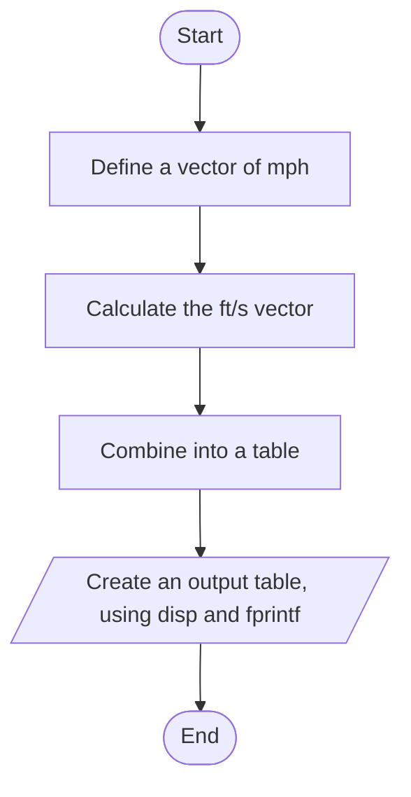

# 8.2 Flowchart와 Pseudocode

## 코딩 전에 계획부터

프로그래밍 작업을 계획하는 흔한 방법이 두 가지다.

- **flowchart**: 그림으로 계획한다.
- **pseudocode**: 말로 계획한다. pseudocode는 그대로 **프로그램 주석 목록**으로 바뀐다.

### HINT — Documentation

학생들은 앞 장의 방식(코드 한 줄마다 설명 주석을 다는 것)을 "과하다"고 여겨 건너뛰곤 한다. 그러나 처음 프로그램을 짤 때는 각 단계에서 무슨 일이 일어나는지 따라가기가 생각보다 어렵다. **간단한 코드라도 체계적으로 계획하면 전체 작업 시간이 줄어든다.** 익숙해지면 주석을 짧게 쓸 수는 있지만, 좋은 문서화의 필요성은 사라지지 않는다.

---

## Pseudocode 만드는 법

1. 문제를 풀 단계를 문장으로 늘어놓는다.
2. 그 문장들을 **주석**으로 바꿔 MATLAB 프로그램에 넣는다.
3. 주석 줄 사이에 알맞은 MATLAB 코드를 채운다.

### 예: mph → ft/s 변환표

"mph를 ft/s로 바꾸는 프로그램을 만들라. 출력은 제목과 열 머리글이 있는 표여야 한다."

단계를 적으면 이렇다.

- Define a vector of mph values.
- Convert mph to ft/s.
- Combine the mph and ft/s vectors into an array.
- Create a chart title.
- Create column headings.
- Display the chart.

**① 주석으로 옮긴다.** 편집창에 코드 없이 주석만 여섯 줄 쓴다.

```matlab
% Define a vector of mph values
% Convert mph to ft/s
% Combine the mph and ft/s vectors into a chart
% Create a chart title
% Create column headings
% Display the chart
```

**② 주석 사이에 코드를 채운다.**

[`example/ch08/ex0802_mph_table.m`](../../example/ch08/ex0802_mph_table.m):

```matlab
%% Define a vector of mph values
mph = 0:10:100;

%% Convert mph to ft/s  (1 mile = 5280 ft, 1 h = 3600 s)
fps = mph * 5280 / 3600;

%% Combine the mph and ft/s vectors into a chart
chart = [mph; fps];

%% Create a chart title
disp("Velocity Conversion Table")

%% Create column headings
disp("     mph      f/s")

%% Display the chart
fprintf("%8.0f %8.2f\n", chart)
```
```
Velocity Conversion Table
     mph      f/s
       0     0.00
      10    14.67
      20    29.33
      ...
     100   146.67
```

`chart`를 `[mph; fps]`처럼 **행으로 쌓은** 이유는 7.2.2에서 본 대로 `fprintf`가 배열을 **열 순서로** 소비하기 때문이다. 한 줄에 찍힐 두 값(mph, ft/s)이 한 열에 모여 있어야 한다.

> **[보강]** 슬라이드의 코드는 첫 주석만 `%%`(섹션)이고 나머지는 `%`다. 주석을 전부 `%%`로 바꾸면 단계마다 섹션이 되어 Run Section(7.5)으로 한 단계씩 돌려 볼 수 있다. 위 코드는 그렇게 바꿨다.

---

## Flowchart

flowchart, 또는 flowchart와 pseudocode를 함께 쓰는 방법은 **큰 프로그램**에 더 알맞다. 프로그램의 큰 그림을 보여 주고, 실제 코드보다 이해하기 쉬운 경우가 많다.

**Table 8.3** — 프로그램 설계용 flowchart 기호

| 기호 | 모양 | 뜻 |
|---|---|---|
| 타원 (oval) | ⬭ | 코드 토막의 **시작 또는 끝** |
| 평행사변형 (parallelogram) | ▱ | **입력 또는 출력** |
| 마름모 (diamond) | ◇ | **결정** 지점 (조건 분기) |
| 직사각형 (rectangle) | ▭ | **계산** |

### Pseudocode와 Flowchart 비교

mph 예제를 flowchart로 그리면 이렇다.



이 정도로 단순한 문제라면 실제로 flowchart를 그릴 일은 거의 없다. 그러나 문제가 복잡해질수록 flowchart는 생각을 정리하는 데 아주 쓸모 있는 도구가 된다. 마름모(결정)가 들어가는 flowchart는 8.3의 `find` 예제와 8.5.3의 `elseif` 예제에서 다시 나온다.

> **[보강]** 위 그림은 GitHub이 렌더링하는 Mermaid 문법으로 그렸다. `([...])`가 타원, `[/.../]`가 평행사변형, `{...}`가 마름모, `[...]`가 직사각형이다. 종이 시험에서는 기호 모양과 뜻의 짝을 묻기 쉽다.

---

## ⚠️ 함정

- **평행사변형 = 입력/출력, 직사각형 = 계산.** 둘을 바꿔 그리기 쉽다. `disp`, `fprintf`, `input`은 평행사변형이다.
- **마름모에서는 화살표가 둘 이상 나간다**(True/False). 화살표가 하나뿐인 마름모는 결정이 아니다.
- **pseudocode는 특정 언어 문법이 아니다.** "Convert mph to ft/s"처럼 사람 말로 쓰고, 문법은 코드를 채울 때 맞춘다.
- **주석만 있는 파일도 실행된다.** 아무 일도 안 할 뿐 오류는 아니다. 그래서 주석부터 쓰고 코드를 채워 가는 방식이 안전하다.

---

## 연습문제

> **[보강]** 아래 연습문제와 그 해답은 슬라이드에 없다. 시험 대비용으로 추가한 것이다.

1. 섭씨 0~100도(20도 간격)를 화씨로 바꾸는 표를 만드시오. 먼저 pseudocode를 주석으로 쓰고, 그 사이에 코드를 채우는 순서를 지키시오.
2. "정수 하나를 입력받아 짝수인지 홀수인지 출력한다"의 flowchart를 Table 8.3 기호로 그리고, 그대로 코드로 옮기시오. 배열 `1:10`에서 짝수만 고르는 코드도 덧붙이시오.

해답: [solutions.md](solutions.md#82)
