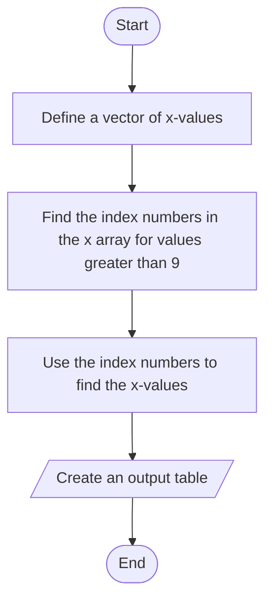

# 8.3 Logical Function — `find`

## `if`만 고집하지 말 것

MATLAB에는 `if` 계열 같은 전통적인 selection structure도 있고, 거의 같은 일을 하는 **logical function**들도 있다. 그 중심이 **`find`** 다. `find`는 selection structure와 loop를 **둘 다** 대신할 수 있는 경우가 많고, 논리 연산자와 함께 쓰면 자료를 분석하고 다루는 강력한 도구가 된다.

### HINT — Don't ignore `find` in favor of `if`

다른 언어를 먼저 배운 프로그래머는 이미 익숙한 `if`와 loop를 쓰느라 `find` 같은 logical function을 무시하곤 한다. 그러나 `find`는 코드를 **더 읽기 쉽고 더 빠르게** 만든다. 특히 `find`를 잘 쓰면 **중첩 loop**(loop 안의 loop 안의 loop…)를 피할 수 있다. 중첩 loop는 이해하기 어렵기로 악명 높고 logic error의 단골 원인이다.

---

## 8.3.1 `find`

`find`는 배열을 훑어서 **주어진 조건을 만족하는 원소가 어디 있는지**를 알려 준다.

### 돌려주는 것은 "값"이 아니라 "인덱스"

`height`는 해군사관학교(Naval Academy) 지원자들의 키(인치)다. 키가 **66인치 이상**이어야 자격이 있다.

[`example/ch08/ex0803_find_height.m`](../../example/ch08/ex0803_find_height.m):

```matlab
height = [63, 67, 65, 72, 69, 78, 75];

accept = find(height >= 66)     % 2 4 5 6 7
```

`find`는 조건을 만족하는 원소의 **인덱스 번호**를 돌려준다. 실제 키를 보려면 그 인덱스로 원래 배열을 다시 부른다.

```matlab
height(accept)                  % 67 72 69 78 75
```

> **[보강]** `find`를 빼고 조건만 쓰면 같은 길이의 logical 배열이 나온다. `find`는 그 logical 배열에서 **1이 있는 자리 번호**만 뽑아 주는 함수라고 보면 된다. 하나도 없으면 빈 배열(`1×0`)이 돌아온다.
>
> ```matlab
> height >= 66                    % 0 1 0 1 1 1 1
> find(height > 100)              % 1×0 empty double row vector
> isempty(find(height > 100))     % 1
> ```

---

### 더 복잡한 조건 — 논리 연산자와 함께

지원 조건이 둘로 늘었다고 하자.

- 나이 18세 이상 35세 **미만**
- 키 66인치 이상

| Height (inches) | Age (years) |
|---|---|
| 63 | 18 |
| 67 | 19 |
| 65 | 18 |
| 72 | 20 |
| 69 | 36 |
| 78 | 34 |
| 75 | 12 |

[`example/ch08/ex0803_find_applicants.m`](../../example/ch08/ex0803_find_applicants.m):

```matlab
% 1열 = 키(인치), 2열 = 나이(세)
applicants = [63, 18;
              67, 19;
              65, 18;
              72, 20;
              69, 36;
              78, 34;
              75, 12];

qualify = find(applicants(:,1) >= 66 & ...
               applicants(:,2) >= 18 & applicants(:,2) < 35)
```
```
qualify =
     2
     4
     6
```

세 조건을 `&`로 이었으므로 **셋 다** 참인 지원자만 남는다. 7명 중 3명이다. `applicants(:,1)`은 열 벡터이므로 결과 인덱스도 열 벡터다.

> **[보강]** 슬라이드 p30의 코드는 `applicants(:,2) <= 35`인데, 본문 조건은 "less than 35 years old"(35 **미만**)이다. 이 노트는 본문 조건대로 `< 35`로 썼다. 이 자료에는 35세 지원자가 없어서 둘 다 `2 4 6`이 나오지만, 35세가 있으면 결과가 갈린다. 시험에서 "미만/이하"를 코드로 옮기라고 하면 `<`와 `<=`를 구분할 것.

### `fprintf`로 읽기 좋게

[`example/ch08/ex0803_find_applicants.m`](../../example/ch08/ex0803_find_applicants.m) (계속):

```matlab
results = [qualify, applicants(qualify,1), applicants(qualify,2)]';
fprintf("Applicant #%d is %2.0f inches tall and %2.0f years old\n", results)
```
```
Applicant #2 is 67 inches tall and 19 years old
Applicant #4 is 72 inches tall and 20 years old
Applicant #6 is 78 inches tall and 34 years old
```

`[번호, 키, 나이]`를 열로 붙여 `3×3`을 만들고 **전치(`'`)** 한다. 그래야 지원자 한 명의 세 값이 **한 열**에 모여 `fprintf`가 열 순서로 읽을 때 짝이 맞는다(7.2.2).

---

### 2차원 배열 — single index와 `[row, col]`

`find`의 기본 출력은 **single-element indexing**(선형 인덱스)이다. 2차원 배열에서는 이 번호를 해석하기가 어려울 수 있다. MATLAB은 **열 우선**(column major)이므로, 번호는 **왼쪽 첫 열부터 위에서 아래로** 센다.

[`example/ch08/ex0803_find_2d.m`](../../example/ch08/ex0803_find_2d.m):

```matlab
temp = [ 95.3, 100.2, 98.6;
         97.4,  99.2, 98.9;
        100.1,  99.3, 97.0];

index = find(temp > 98.6);
index'                          % 3 4 5 6 8
```

번호를 하나씩 짚어 보면 이렇다.

```
         1열     2열     3열
1행  [1] 95.3  [4]100.2  [7] 98.6
2행  [2] 97.4  [5] 99.2  [8] 98.9
3행  [3]100.1  [6] 99.3  [9] 97.0
```

| 번호 | 위치 | 값 |
|---|---|---|
| 3 | 1열의 세 번째 | 100.1 |
| 4 | 2열의 첫 번째 | 100.2 |
| 5 | 2열의 두 번째 | 99.2 |
| 6 | 2열의 세 번째 | 99.3 |
| 8 | 3열의 두 번째 | 98.9 |

`98.6`(7번)은 `> 98.6`을 만족하지 않으므로 빠진다.

### Row-column indexing

출력 변수를 **두 개** 주면 `find`는 행 번호와 열 번호를 **따로** 돌려준다.

```matlab
[row, col] = find(temp > 98.6);
```
```
    index    row    col    temp 
    _____    ___    ___    _____
      3       3      1     100.1
      4       1      2     100.2
      5       2      2      99.2
      6       3      2      99.3
      8       2      3      98.9
```

출력 개수가 결과의 **의미**를 바꾼다. 출력 하나면 선형 인덱스, 둘이면 행·열이다.

> **[보강]** 두 형식은 `sub2ind`와 `ind2sub`로 서로 바꿀 수 있다. `find`에는 개수 옵션도 있다. `find(x > 15, 1)`은 **처음** 하나만, `find(x > 15, 1, "last")`는 **마지막** 하나만 돌려준다.
>
> ```matlab
> isequal(index, sub2ind(size(temp), row, col))   % 1
> ```

---

### Flowchart + Pseudocode로 계획한 `find` 예제



[`example/ch08/ex0803_find_flowchart.m`](../../example/ch08/ex0803_find_flowchart.m):

```matlab
% Define a vector of x-values
x = [1, 2, 3; 10, 5, 1; 12, 3, 2; 8, 3, 1]

% Find the index numbers where x > 9
index = find(x > 9)

% Use the index numbers to find the x-values greater than 9
% by plugging them into x
values = x(index)

% Create an output table
disp("Elements greater than 9")
disp(table(index, values, VariableNames=["Index Number", "X Value"]))
```
```
Elements greater than 9
    Index Number    X Value
    ____________    _______
         2            10   
         3            12   
```

`x`는 `4×3`이다. 10은 1열 2행(번호 2), 12는 1열 3행(번호 3)이다.

> 구문법: 슬라이드는 `table(index, values, 'VariableNames', ["Index Number", "X Value"])`로 쓴다. 이 옛 형식에서는 옵션 이름이 **작은따옴표여야** 한다.

> **[보강]** R2026a에서 옵션 이름을 큰따옴표로 `"VariableNames"`라고 쓰면 `모든 테이블 변수는 행 수가 동일해야 합니다.` 오류가 난다. `"VariableNames"`를 데이터 열로 오해하기 때문이다(7.2.4와 같은 함정). `VariableNames=` 형식을 쓰면 이 문제가 없다. 열 이름에 공백("Index Number")이 들어가도 R2019b 이후로는 허용된다.

---

## ⚠️ 함정

- **`find`는 값이 아니라 인덱스를 준다.** 값을 원하면 `x(find(...))`, 더 간단히는 `x(조건)`(8.4).
- **2차원 배열의 `find` 번호는 열 우선이다.** 행을 따라 세면 틀린다. `temp`에서 100.2는 2번이 아니라 4번이다.
- **출력 개수에 따라 결과의 뜻이 다르다.** `k = find(A)`는 선형 인덱스, `[r, c] = find(A)`는 행·열.
- **아무것도 없으면 빈 배열.** 오류가 아니므로 `isempty`로 확인해야 한다. 빈 배열을 `fprintf`에 넘기면 조용히 아무것도 안 찍힌다.
- **`applicants(:,2) >= 18 & applicants(:,2) < 35`를 `18 <= applicants(:,2) < 35`로 줄이면 안 된다.** 8.1의 `1 < x < 5` 함정과 같다.
- **`fprintf`에 표를 넘길 때는 전치를 잊지 말 것.** `results`를 전치하지 않으면 번호 세 개가 한 줄에 찍힌다.

---

## 연습문제

> **[보강]** 아래 연습문제와 그 해답은 슬라이드에 없다. 시험 대비용으로 추가한 것이다.

1. 학생 3명 × 과목 4개 점수 행렬 `scores = [85 92 58 77; 45 88 91 66; 73 59 80 95]`에서 60점 미만인 점수를 찾아 "학생 r, 과목 c: 점수" 형식으로 출력하시오. single index로 받으면 어떤 번호가 나오는지도 확인하시오.
2. 공을 초속 20 m로 던져 올렸을 때 `h = 20t − 4.9t²` (`t = 0:0.5:5`)이다. 높이가 처음으로 15 m를 넘는 시각과 마지막으로 넘는 시각을 `find`의 개수 옵션으로 구하고, 15 m를 넘는 측정 개수를 두 가지 방법으로 세시오.

해답: [solutions.md](solutions.md#83)
