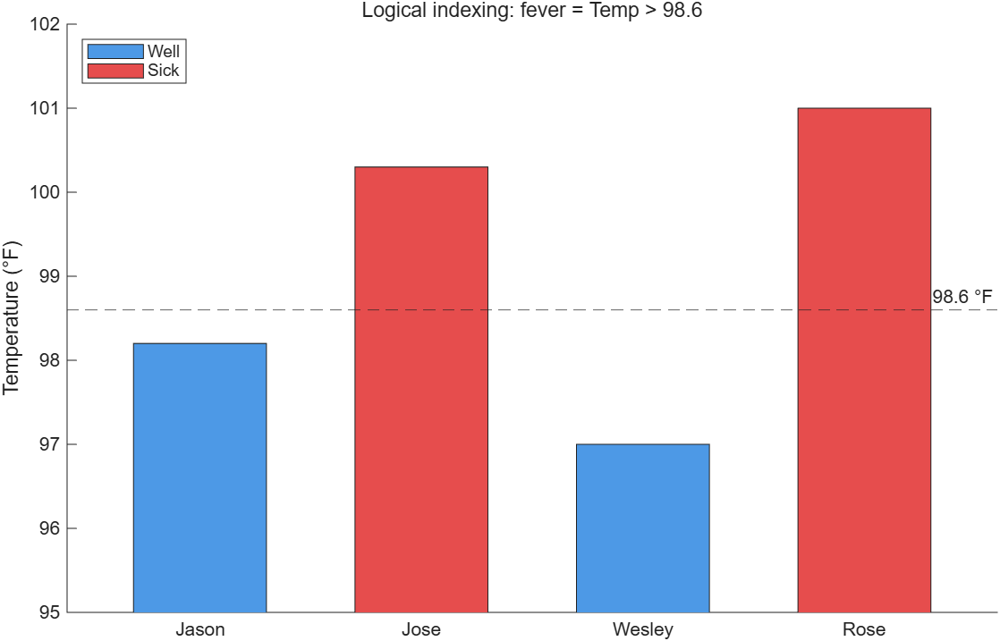

# 8.4 Logical Indexing

> 슬라이드에는 이 절의 번호가 없다(8.3 다음에 번호 없이 나오고 바로 8.5로 넘어간다). 이 노트에서는 8.4로 둔다. 학습목표(p.2)는 이 내용을 "8.3 Use logical indexing"이라고 부른다.

## `find`와 무엇이 다른가

- `find`는 조건을 만족하는 원소의 **인덱스**를 돌려준다.
- **logical indexing**도 목적은 같다. 조건에 따라 배열의 원소를 **고른다**. 다만 인덱스 번호 대신 **0과 1로 된 logical 배열**을 그대로 인덱스로 쓴다.

logical indexing은 `find`보다 구현이 간단한 경우가 많다. 대신 처음 배우는 사람에게는 의미가 덜 분명해 보일 수 있다.

---

## 환자 발열 예제 — 세 가지 방법

네 환자의 이름과 체온(°F)이다. 98.6°F보다 높으면 열이 있다고 본다.

[`example/ch08/ex0804_fever.m`](../../example/ch08/ex0804_fever.m):

```matlab
Patient_Names = ["Jason", "Jose", "Wesley", "Rose"];
Temp = [98.2, 100.3, 97, 101];
```

### ① `find`

```matlab
index = find(Temp > 98.6)               % 2 4
Patient_Names(index)                    % "Jose" "Rose"
```

`find`가 **인덱스 번호**(2, 4)를 돌려주고, 그 번호로 `Patient_Names`를 불러 결과를 얻는다.

### ② logical indexing

```matlab
fever = Temp > 98.6                     % 0 1 0 1  (1×4 logical)
Patient_Names(fever)                    % "Jose" "Rose"
```

비교가 **0과 1의 배열**을 돌려주고, 그 배열을 그대로 `Patient_Names`의 인덱스로 쓴다. 1인 자리만 뽑힌다.

### ③ 한 줄로

```matlab
Patient_Names(Temp > 98.6)              % "Jose" "Rose"
```

logical indexing은 한 단계로 줄일 수 있다. 비교식을 변수 이름의 괄호 안에 **직접** 넣어도 결과는 같다.

| | 중간 결과 | 크기 | 자료형 |
|---|---|---|---|
| `find(Temp > 98.6)` | `2 4` | 1×2 | double |
| `Temp > 98.6` | `0 1 0 1` | 1×4 (원본과 같다) | logical |

---

## 새 배열 만들기

logical 배열 `fever`로 **새 배열** `result`를 만들 수 있다.

```matlab
result(fever) = "Sick"
```
```
result = 
  1×4 string 배열
    <missing>    "Sick"    <missing>    "Sick"
```

`result`는 아직 없던 변수다. `fever`의 1인 자리(2, 4번)에 `"Sick"`을 넣으면 MATLAB이 길이 4짜리 string 배열을 만들고, **값을 주지 않은 1, 3번은 `<missing>`** 으로 채운다.

> **[보강]** 빈 자리를 무엇으로 채우는지는 자료형마다 다르다. 숫자 배열은 `0`, string 배열은 `<missing>`, char 배열은 공백이 아니라 널 문자 `char(0)`이다. `<missing>`은 `""`(빈 문자열)과 다르다. `ismissing(result)`로 확인한다. 이 예제를 여러 번 돌릴 때는 앞에서 `clear result`를 해 두지 않으면 이전 값이 남는다.

---

## 기존 배열의 값 바꾸기 — `~`로 나머지 채우기

빈 자리는 조건을 **만족하지 않는** 인덱스를 골라 채운다.

```matlab
result(~fever) = "Well"
```
```
result = 
  1×4 string 배열
    "Well"    "Sick"    "Well"    "Sick"
```

`~`(tilde)는 "not"이다. 이 줄은 "**`fever`가 1이 아닌** 원소 자리의 `result`에 `"Well"`을 넣어라"로 읽는다.

> **[보강]** `~fever`는 `fever == 0`과 같다. `fever`가 logical이므로 `~`가 0과 1을 뒤집는다. 숫자 배열에도 `~`를 쓸 수 있는데, 0이 아닌 모든 값이 0이 되고 0만 1이 된다(`~[3 0 -2]` → `0 1 0`).

---

## table로 정리

이 정보를 모두 담기 좋은 그릇은 의미 있는 열 이름을 단 **table**이다(7.2.4).

```matlab
T = ["Patients", "Temperature", "Diagnosis"];
disp(table(Patient_Names', Temp', result', VariableNames=T))
```
```
    Patients    Temperature    Diagnosis
    ________    ___________    _________
    "Jason"         98.2        "Well"  
    "Jose"         100.3        "Sick"  
    "Wesley"          97        "Well"  
    "Rose"           101        "Sick"  
```

세 배열이 모두 **행 벡터**이므로 `'`로 전치해 열 벡터로 넣었다. table의 입력은 열 벡터여야 한다.

> 구문법: 슬라이드는 `table(Patient_Names', Temp', result', 'VariableNames', T)`로 쓴다.

---

> **[보강]** logical indexing으로 그래프에서 조건별 색을 나누는 것도 흔한 쓰임새다.
>
> [`example/ch08/ex0804_fever_plot.m`](../../example/ch08/ex0804_fever_plot.m):
>
> ```matlab
> fever = Temp > 98.6;
> n = 1:numel(Temp);
> hold on
> bar(n(~fever), Temp(~fever), 0.3, FaceColor=[0.3 0.6 0.9])
> bar(n(fever),  Temp(fever),  0.3, FaceColor=[0.9 0.3 0.3])
> yline(98.6, "--", "98.6 °F")
> hold off
> ```
>
> 

---

## 요약에서 강조하는 점

- logical indexing은 기준을 써서 배열에서 **자료를 뽑거나**, 기존 배열의 **자료를 바꾸는** 또 하나의 방법이다.
- logical indexing은 같은 일을 logical function(`find`)으로 하는 것보다 **대개 계산 효율이 좋다**.

> **[보강]** 인덱스 번호를 만드는 중간 단계(`find`)가 없기 때문이다.

---

## ⚠️ 함정

- **logical 배열의 크기는 원본과 같아야 한다.** `Patient_Names([0 1 0 1])`처럼 **double** 0/1을 넣으면 "0번 원소"를 찾다가 오류가 난다. 비교식의 결과나 `logical(...)`이어야 한다.
- **`<missing>`은 `""`가 아니다.** 빈 자리를 채우지 않고 `result == "Sick"` 같은 비교를 하면 missing 자리는 `false`가 된다.
- **`clear` 없이 다시 돌리면 이전 `result`가 남는다.** 스크립트 맨 위의 `clear`가 중요한 이유다.
- **고르기와 지우기와 0 만들기는 다르다.** `x(x > 0)`은 짧아지고, `x(x < 0) = []`은 원본이 짧아지고, `x .* (x > 0)`은 길이가 그대로다.
- **table에 행 벡터를 넣지 말 것.** 오류 없이 1행짜리 엉뚱한 표가 나오거나 행 수 오류가 난다.

---

## 연습문제

> **[보강]** 아래 연습문제와 그 해답은 슬라이드에 없다. 시험 대비용으로 추가한 것이다.

1. `data = [4 -2 7 -5 0 3 -1]`에서 음수를 모두 0으로 바꾸고, 몇 개를 바꿨는지 출력하시오.
2. 점수 벡터 `[95 72 88 55 90 79 61]`에 logical indexing으로 학점(A ≥ 90, B ≥ 80, C ≥ 70, 그 외 F)을 매겨 table로 출력하시오. `if`를 쓰지 마시오.
3. `x = [3 -1 4 -1 5]`에 대해 `x(x > 0)`, `x .* (x > 0)`, `x(x < 0) = []`의 결과와 크기를 비교하시오.

해답: [solutions.md](solutions.md#84)
