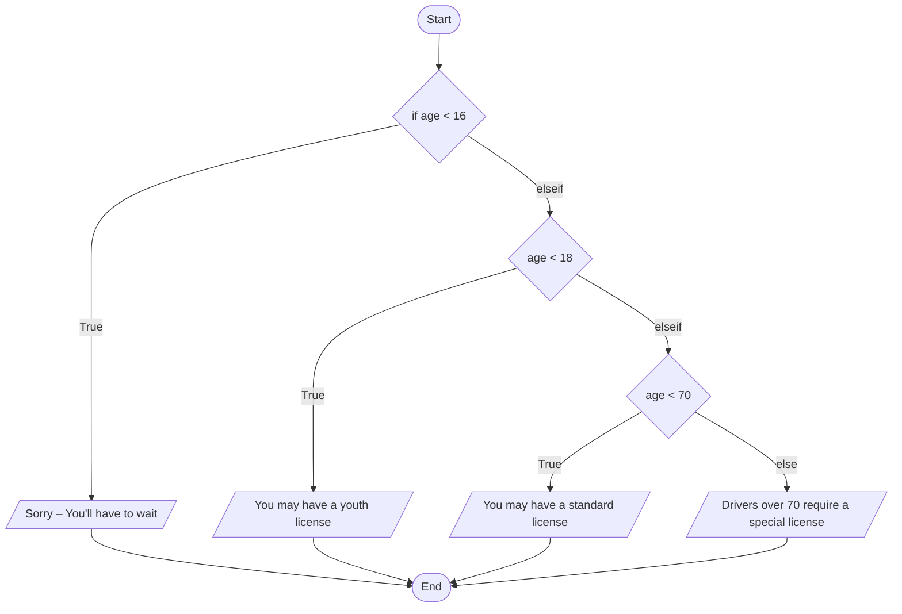

# 8.5.3 `elseif`

## 중첩 대신 `elseif`

여러 기준을 확인하려고 `if/else`를 **중첩**(nest)할 수 있다. 그러나 그러면 코드를 읽고 해석하기 어려워진다. `elseif` 구조는 중첩 없이 여러 기준을 정의하는 대안이다. **`elseif` 줄에는 비교식이 들어간다**(`else`와 다르다).

```matlab
if comparison
    code to execute if the comparison is true
elseif comparison
    code to execute if the comparison is true
elseif comparison
    code to execute if the comparison is true
else
    code to execute if all the comparisons are false
end
```

> **[보강]** 위에서부터 차례로 비교해서 **처음으로 참인 블록 하나만** 실행하고 `end` 뒤로 빠져나간다. 모두 거짓이면 `else` 블록을 실행한다. `else`는 생략할 수 있다.

---

## 예제 — 운전면허

[`example/ch08/ex0853_elseif_license.m`](../../example/ch08/ex0853_elseif_license.m):

```matlab
age = input("Enter your age: ")

if age < 16
    disp("Sorry - You'll have to wait")
elseif age < 18
    disp("You may have a youth license")
elseif age < 70
    disp("You may have a standard license")
else
    disp("Drivers over 70 require a special license")
end
```
```
Enter your age: 50
age =
    50
You may have a standard license
```

**5번째 줄(`elseif age < 18`)의 조건을 `age >= 16 & age < 18`로 쓸 필요가 없다.** `age`가 16 이상이 아니면 5번째 줄에 올 방법이 없기 때문이다. 앞의 `if age < 16`이 참이었다면 이미 첫 블록을 실행하고 빠져나갔다. 마찬가지로 `elseif age < 70`에 도달했다면 `age >= 18`은 이미 보장되어 있다.

> **[보강]** 경계값을 모두 넣어 보면 각 구간이 정확히 갈리는 것을 확인할 수 있다.
>
> ```
>  15 → Sorry - You'll have to wait
>  16 → You may have a youth license
>  17 → You may have a youth license
>  18 → You may have a standard license
>  69 → You may have a standard license
>  70 → Drivers over 70 require a special license
>  85 → Drivers over 70 require a special license
> ```
>
> 70세는 `age < 70`이 거짓이라 `else`로 간다. 메시지는 "over 70"(70 초과)인데 코드는 "70 이상"이다. 시험에서 경계값 하나를 물으면 **메시지가 아니라 부등호**를 보고 답한다.

---

## Flowchart로 보기

flowchart는 기준들을 눈으로 보기에 좋은 방법이다. 마름모(결정) 셋이 위에서 아래로 이어지고, 각 마름모의 **True** 쪽은 출력 후 곧장 End로 간다.



---

> **[보강]** 중첩 `if/else`와 `elseif`가 정말 같은 일을 하는지 나란히 놓고 확인한다.
>
> [`example/ch08/ex0853_nested_vs_elseif.m`](../../example/ch08/ex0853_nested_vs_elseif.m):
>
> ```matlab
> % 중첩: end 가 셋, 들여쓰기가 계속 깊어진다
> if age < 16
>     a = "wait";
> else
>     if age < 18
>         a = "youth";
>     else
>         if age < 70
>             a = "standard";
>         else
>             a = "special";
>         end
>     end
> end
>
> % elseif: end 하나, 한 층
> if age < 16
>     b = "wait";
> elseif age < 18
>     b = "youth";
> elseif age < 70
>     b = "standard";
> else
>     b = "special";
> end
> ```
> ```
> 중첩: youth, elseif: youth, 같은가? 1
> ```
>
> `elseif`(붙여 쓴다)와 `else if`(띄어 쓴다)는 다르다. `else if`는 `else` 블록 안에 새 `if`를 여는 **중첩**이라 `end`가 하나 더 필요하다.

---

## ⚠️ 함정

- **위에서 처음 참인 블록 하나만 실행된다.** 조건이 여러 개 참이어도 나머지는 보지 않는다.
- **조건 순서가 틀리면 뒤의 조건이 영원히 실행되지 않는다.** `if age < 70`을 맨 앞에 두면 17세도 "standard"가 된다(예제 파일 마지막 부분). 구간을 **좁은 쪽 → 넓은 쪽** 또는 한 방향으로 차례로 자르게 배치한다.
- **앞에서 배제된 범위를 다시 쓸 필요가 없다.** 써도 틀리지는 않지만, 경계를 두 번 써서 서로 어긋나게 만드는 실수(`age > 16` vs `age < 16` → 16이 빠짐)가 생긴다.
- **`elseif` ≠ `else if`.** 띄어 쓰면 중첩이 되어 `end`가 하나 더 필요하다. 빠뜨리면 구문 오류다.
- **`else`에는 조건이 없고 `elseif`에는 조건이 있다.**
- **"over 70" 같은 메시지와 실제 부등호를 구분할 것.** 경계값(70)이 어느 쪽인지는 코드가 정한다.

---

## 연습문제

> **[보강]** 아래 연습문제와 그 해답은 슬라이드에 없다. 시험 대비용으로 추가한 것이다.

1. 점수를 받아 A(90 이상), B(80 이상), C(70 이상), F(그 외)를 `elseif`로 매기시오. 100, 90, 89.9, 80, 79, 70, 69, 0을 넣어 경계를 확인하시오.
2. 다음 코드는 95점에 무슨 학점을 주는가? 왜 그런지 설명하고 고치시오.
   ```matlab
   if score >= 60
       g = "D";
   elseif score >= 70
       g = "C";
   elseif score >= 80
       g = "B";
   elseif score >= 90
       g = "A";
   else
       g = "F";
   end
   ```

해답: [solutions.md](solutions.md#853)
