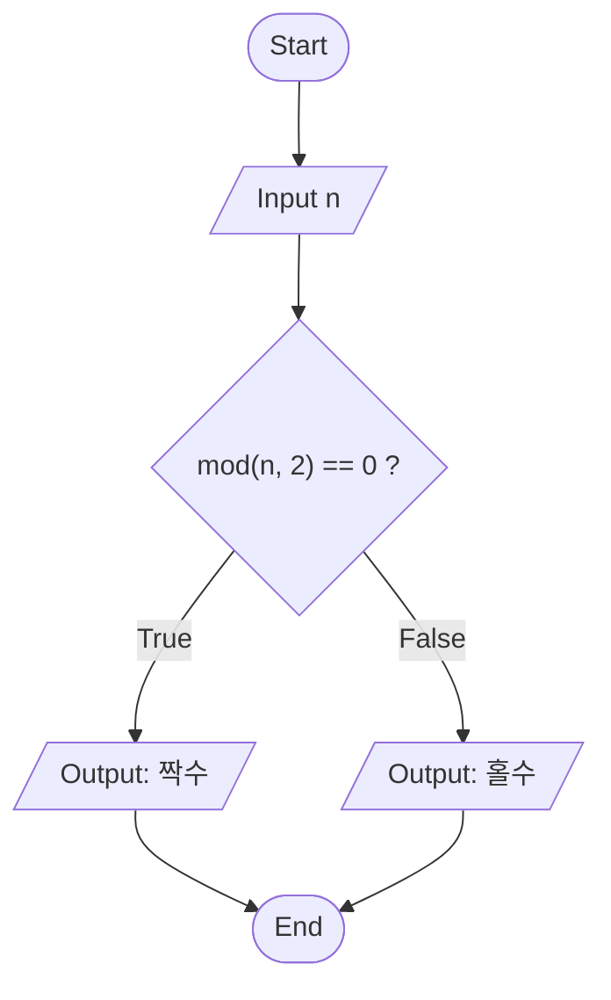

# Chapter 8 연습문제 해답

각 해답 코드는 `example/ch08/solXXYY_N.m`에 있다. 실행 결과는 R2026a `-batch`에서 얻은 것이다.

> **[보강]** 이 파일 전체가 슬라이드 밖 내용이다. 연습문제와 해답은 모두 시험 대비용으로 추가한 것이다.

---

## 8.1

### 1. 관계·논리 연산 결과 예측

[`sol0801_1.m`](../../example/ch08/sol0801_1.m)

```matlab
x = [3, -1, 0, 7, 2];
y = [1,  1, 0, 5, 9];

a = x >= y                  % 1 0 1 1 0
b = x ~= y & x > 0          % 1 0 0 1 1
c = xor(x > 0, y > 0)       % 0 1 0 0 0
d = ~x                      % 0 0 1 0 0
e = x & y                   % 1 1 0 1 1
```

- `c`의 셋째 자리: `x > 0`과 `y > 0`이 **둘 다 거짓**(0, 0)이므로 xor도 0이다. xor는 "다를 때" 참이다.
- `d = ~x`: 숫자에 `~`를 쓰면 **0인 자리만** 1이 된다.
- `e = x & y`: 논리 연산자는 숫자를 "0이 아니면 참"으로 읽는다. 음수 −1도 참이다.
- 다섯 결과 모두 `logical`이다.

### 2. 실수 비교는 허용오차로

[`sol0801_2.m`](../../example/ch08/sol0801_2.m)

```
0.1 + 0.2 = 0.30000000000000004441
0.3       = 0.29999999999999998890
```

0.1, 0.2, 0.3은 이진수로 정확히 나타낼 수 없어서 마지막 자리가 어긋난다. 그래서 `==`는 0이다.

```matlab
tol = 1e-12;
abs((0.1 + 0.2) - 0.3) < tol            % 1

t = 0:0.1:1;
find(t == 0.3)              % 1×0 empty  ← 화면엔 0.3000 이 보이는데 못 찾는다
find(abs(t - 0.3) < tol)    % 4
```

`0:0.1:1`도 0.1을 거듭 더해 만들므로 같은 문제가 생긴다. `find`, `if`, logical indexing 어디서든 실수를 `==`로 비교하지 않는다.

### 3. `1 < x < 5`

[`sol0801_3.m`](../../example/ch08/sol0801_3.m)

```
wrong = 1 < x < 5       → 1   (x = 10 인데!)
right = 1 < x & x < 5   → 0
```

왼쪽부터 계산된다.

1. `1 < 10` → `1` (logical)
2. `1 < 5` → `1`

첫 단계의 결과는 0 아니면 1이므로 둘째 단계 `(0 또는 1) < 5`는 **언제나 참**이다. `x = 0:7`로 확인하면 잘못된 식은 모든 자리가 1이고, 올바른 식은 2, 3, 4에서만 1이다.

```
     0     1     2     3     4     5     6     7    ← x
     1     1     1     1     1     1     1     1    ← 1 < x < 5
     0     0     1     1     1     0     0     0    ← 1 < x & x < 5
```

---

## 8.2

### 1. 섭씨 → 화씨 표

[`sol0802_1.m`](../../example/ch08/sol0802_1.m)

pseudocode 여섯 줄을 먼저 `%%` 주석으로 쓰고 그 사이를 채운다.

```matlab
%% Define a vector of Celsius values
C = 0:20:100;
%% Convert Celsius to Fahrenheit
F = 9/5 * C + 32;
%% Combine the vectors into a chart (행으로 쌓는다)
chart = [C; F];
%% Create a chart title
disp("Temperature Conversion Table")
%% Create column headings
disp("      °C       °F")
%% Display the chart
fprintf("%8.0f %8.1f\n", chart)
```
```
Temperature Conversion Table
      °C       °F
       0     32.0
      20     68.0
      40    104.0
      60    140.0
      80    176.0
     100    212.0
```

### 2. 짝수/홀수 flowchart

[`sol0802_2.m`](../../example/ch08/sol0802_2.m)



입력(평행사변형) → 결정(마름모) → 출력 둘(평행사변형) → 끝(타원). 결정이 있으므로 코드에 `if/else`가 필요하다.

```matlab
if mod(n, 2) == 0
    fprintf("%d 는 짝수\n", n);
else
    fprintf("%d 는 홀수\n", n);
end
```
```
정수를 입력하시오: 7
7 는 홀수
```

배열에서 짝수만 고를 때는 `if`가 아니라 logical indexing이다: `v(mod(v, 2) == 0)` → `[2 4 6 8 10]`.

---

## 8.3

### 1. 60점 미만 찾기

[`sol0803_1.m`](../../example/ch08/sol0803_1.m)

```matlab
[r, c] = find(scores < 60);
fprintf("학생 %d, 과목 %d: %d 점\n", [r, c, scores(scores < 60)]');
```
```
학생 2, 과목 1: 45 점
학생 3, 과목 2: 59 점
학생 1, 과목 3: 58 점
```

출력이 **열 순서**(과목 1 → 2 → 3)로 나온다. `find`가 열 우선으로 훑기 때문이다. `scores(scores < 60)`도 같은 순서라 `r`, `c`와 짝이 맞는다.

single index로 받으면 `2 6 7`이다. 행이 3개이므로 2 = (2행, 1열), 6 = (3행, 2열), 7 = (1행, 3열).

### 2. 처음/마지막으로 15 m를 넘는 시각

[`sol0803_2.m`](../../example/ch08/sol0803_2.m)

```matlab
first = find(h > 15, 1)               % 3
last  = find(h > 15, 1, "last");
[numel(find(h > 15)), sum(h > 15)]    % 5 5
```
```
처음 15 m 초과: t = 1.0 s, h = 15.10 m
마지막 15 m 초과: t = 3.0 s
```

- `find(조건, 1)`은 **처음 하나만** 찾고 멈춘다. 긴 배열에서 빠르다.
- 개수는 `numel(find(...))`보다 `sum(...)`이 간단하다. logical 1을 더하면 개수가 된다.

---

## 8.4

### 1. 음수를 0으로

[`sol0804_1.m`](../../example/ch08/sol0804_1.m)

```matlab
neg = data < 0;
n = sum(neg);
data(neg) = 0
```
```
data =
     4     0     7     0     0     3     0
3 개를 0 으로 바꿨다
```

바꾼 **뒤에** `sum(data < 0)`을 세면 0이 나온다. 개수는 바꾸기 **전에** 세어 둔다.

### 2. logical indexing으로 학점

[`sol0804_2.m`](../../example/ch08/sol0804_2.m)

```matlab
grade = strings(size(score));
grade(score >= 90)                 = "A";
grade(score >= 80 & score < 90)    = "B";
grade(score >= 70 & score < 80)    = "C";
grade(score < 70)                  = "F";
```
```
    Score    Grade
    _____    _____
     95       "A" 
     72       "C" 
     88       "B" 
     55       "F" 
     90       "A" 
     79       "C" 
     61       "F" 
```

`strings(size(score))`로 먼저 `""`를 채워 두면 `<missing>`이 생기지 않는다. 구간마다 양쪽 경계를 다 쓰는 대신 **낮은 기준부터 덮어쓰는** 방법도 있다(`"F"`로 채우고 `≥70`은 C, `≥80`은 B, `≥90`은 A). 이때는 순서가 중요하다. `elseif`(8.5.3)와 반대로 **넓은 조건을 먼저** 쓴다.

### 3. 고르기 / 0 만들기 / 지우기

[`sol0804_3.m`](../../example/ch08/sol0804_3.m)

| 코드 | 결과 | 크기 |
|---|---|---|
| `a = x(x > 0)` | `3 4 5` | 1×3 |
| `b = x .* (x > 0)` | `3 0 4 0 5` | 1×5 |
| `c(c < 0) = []` | `3 4 5` | 1×3 (원본이 줄었다) |

`b`는 logical을 숫자처럼 곱한 것이다. 원래 자리를 유지해야 할 때(시간축에 맞춘 신호 등) 쓴다.

---

## 8.5.1

### 1. 압력 경고

[`sol0851_1.m`](../../example/ch08/sol0851_1.m)

```matlab
p = [80, 95, 130, 90];
if p > limit
    disp("이 줄은 실행되지 않는다 (모든 원소가 넘어야 참)")
end
if any(p > limit)
    fprintf("경고: %d 번째 측정값 %g 이 한계를 넘었다\n", [find(p > limit); p(p > limit)]);
end
```
```
경고: 압력 120 이 한계 100 를 넘었다
경고: 3 번째 측정값 130 이 한계를 넘었다
```

`if p > limit`은 `all`처럼 동작하므로 배열에서는 거의 실행되지 않는다. "하나라도"는 `any`로 명시한다.

### 2. `if`가 참으로 보는 것

[`sol0851_2.m`](../../example/ch08/sol0851_2.m)

```
if []       → 거짓
if 'abc'    → 참
if [1 2 0]  → 거짓
if -0.5     → 참
if 0        → 거짓
if ""       → 오류: string에서 logical(으)로 변환될 수 없습니다.
if NaN      → 오류: NaN 값을 논리형으로 변환할 수 없습니다.
```

- 빈 배열은 거짓이다. "모든 원소가 참"이라는 규칙으로는 참이어야 할 것 같지만, MATLAB은 빈 배열을 거짓으로 정했다.
- `'abc'`는 글자 코드 `[97 98 99]`이므로 모두 0이 아니어서 참.
- `""`(string)과 `NaN`은 참/거짓으로 바꿀 수 없어 **오류**다. 시험에서 "오류" 선택지가 있다면 이 둘이다.

---

## 8.5.2

### 1. 음수면 `sqrt` 대신 메시지

[`sol0852_1.m`](../../example/ch08/sol0852_1.m)

```
sqrt(16) = 4
-9: 음수의 제곱근은 실수가 아니다
ans =
   0.0000 + 3.0000i
```

검사 없이 `sqrt(-9)`를 하면 오류가 아니라 `3i`가 나온다. `log`와 마찬가지로 MATLAB은 복소수를 기본으로 지원하므로, 실수 결과만 원한다면 직접 막아야 한다.

### 2. `abs` 없이 절댓값

[`sol0852_2.m`](../../example/ch08/sol0852_2.m)

스칼라 −7은 `if x < 0` → `y = -x` → 7. 맞다.

배열 `[-7 3 -2 0]`은:

```
y =
    -7     3    -2     0     ← 그대로!
```

`x < 0`이 `1 0 1 0`이라 "전부 참"이 아니므로 `else`(`y = x`)로 갔다. **원소마다 다른 일**을 해야 하므로 logical indexing을 쓴다.

```matlab
y = x;
y(x < 0) = -x(x < 0)        % 7 3 2 0
isequal(y, abs(x))          % 1
```

---

## 8.5.3

### 1. `elseif`로 학점, 경계값

[`sol0853_1.m`](../../example/ch08/sol0853_1.m)

```
100.0 → A
 90.0 → A
 89.9 → B
 80.0 → B
 79.0 → C
 70.0 → C
 69.0 → F
  0.0 → F
```

`elseif score >= 80`에 왔다면 `score < 90`은 이미 보장되어 있으므로 쓰지 않는다.

### 2. 순서가 틀린 `elseif`

[`sol0853_2.m`](../../example/ch08/sol0853_2.m)

```
틀린 순서: 95 → D
고친 순서: 95 → A
```

95는 첫 조건 `score >= 60`에서 이미 참이라 D를 받고 빠져나간다. 뒤의 `>= 70`, `>= 80`, `>= 90`은 **60 이상인 값이 절대 도달하지 못하는** 죽은 코드가 된다. `>=` 비교로 구간을 자를 때는 **높은 기준부터** 쓴다(`<` 비교라면 낮은 기준부터. 8.5.3 운전면허 예제가 그렇다).

---

## 8.5.4

### 1. 월 → 날짜 수

[`sol0854_1.m`](../../example/ch08/sol0854_1.m)

```matlab
switch month
    case {1, 3, 5, 7, 8, 10, 12}
        days = 31;
    case {4, 6, 9, 11}
        days = 30;
    case 2
        if mod(year, 4) == 0 && (mod(year, 100) ~= 0 || mod(year, 400) == 0)
            days = 29;
        else
            days = 28;
        end
    otherwise
        days = NaN;
end
```
```
2024 년  1 월: 31 일
2024 년  2 월: 29 일
2024 년  4 월: 30 일
2024 년 13 월: NaN 일
```

- 여러 값은 **중괄호**로 묶는다.
- `case` 안에 `if`를 넣을 수 있다(중첩). 윤년 조건은 스칼라이므로 `&&`, `||`를 썼다.

### 2. 단위 변환

[`sol0854_2.m`](../../example/ch08/sol0854_2.m)

```matlab
switch lower(u)
    case "km"
        m = value * 1000;
    case "mi"
        m = value * 1609.344;
    case "ft"
        m = value * 0.3048;
    otherwise
        error("모르는 단위: %s", u);
end
```
```
3 km = 3000.00 m
3 MI = 4828.03 m
3 Ft = 0.91 m
모르는 단위: yard
```

- `lower`가 대소문자를 맞춘다. char를 넣으면 char, string을 넣으면 string이 나온다.
- `'km'`(char)이 `case "km"`(string)에 맞는다. R2026a의 `switch`는 char/string을 섞어도 내용으로 비교한다.
- `otherwise`에서 `error`를 내면 잘못된 입력이 조용히 지나가지 않는다.

---

## 8.5.5

### 1. 도형 메뉴

[`sol0855_1.m`](../../example/ch08/sol0855_1.m)

```matlab
choice = menu("도형을 고르시오", shapes);
switch choice
    case 1
        A = pi * a^2;
    case 2
        A = a^2;
    case 3
        A = sqrt(3)/4 * a^2;
end
fprintf("%s, a = %g → 넓이 %.4f\n", shapes(choice), a, A);
```
```
Circle, a = 2 → 넓이 12.5664
```

`menu`가 번호를 주므로 `shapes(choice)`로 이름을 되찾을 수 있다.

### 2. 창을 닫으면

[`sol0855_2.m`](../../example/ch08/sol0855_2.m)

```
선택하지 않았다 (menu 가 0 을 돌려줬다)
list(0): 배열 인덱스는 양의 정수이거나 논리값이어야 합니다.
```

`otherwise`가 없으면 0은 아무 `case`에도 걸리지 않아 **아무것도 출력되지 않는다**. 사용자는 프로그램이 끝났는지 고장났는지 알 수 없다. 또 연습문제 1처럼 `shapes(choice)`로 인덱싱하면 0에서 오류가 난다. 슬라이드의 "`otherwise`가 필요 없다"는 **버튼을 누른 경우에만** 맞는 말이다.
